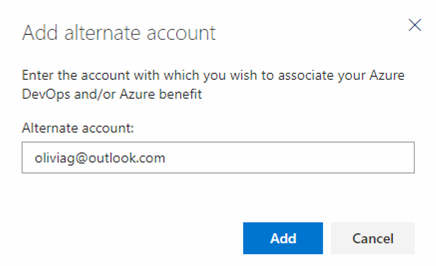
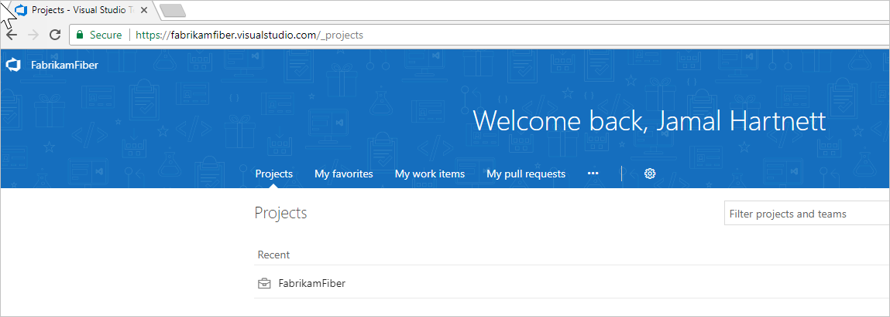

# Identities for Visual Studio subscribers
When you activate your Visual Studio subscription, we link the identity (or login) that you used during activation with the Visual Studio subscription. This way, we can recognize you on the [Visual Studio subscriber portal](https://my.visualstudio.com?wt.mc_id=o~msft~docs), in Azure DevOps, and in Azure.

In Azure DevOps, we check your Visual Studio subscription status each time you log in, and grant you features automatically within each organization in which you are a member.
Because these features are included as a subscriber benefit, it's free to add you as a member in any Azure DevOps organization when using an identity that is linked to your Visual Studio subscription.

In Azure, we check your Visual Studio subscription status when you activate your [monthly Azure DevTest individual credit](https://azure.microsoft.com/pricing/member-offers/credit-for-visual-studio-subscribers/)
that is a subscriber benefit.

Within the [Visual Studio subscriber portal](https://my.visualstudio.com?wt.mc_id=o~msft~docs), you may be able to add an **alternate identity** -- in addition to the identity you used during activation. We allow you to add an alternate identity if you used a Microsoft account to activate your subscription. This way you can also add a work or school account (which you use when logging into Visual Studio, Office 365, or your corporate or school network), allowing you to access Azure DevOps using both your personal account and your work or school account.

## Add an alternate account to your subscription
Adding an alternate account to your Visual Studio subscription allows you to access the subscription benefits, like Azure DevOps and Azure, with a different identity than that which the subscription is assigned to. In the past, this functionality was available only if your Visual Studio (VS) subscription was assigned to a Microsoft Account (MSA). We have extended this functionality for work or school accounts in Azure Active Directory (Azure AD).

This doesn’t provide a copy of subscription to the other account; it only provides the ability to access the two benefits with the alternate account.

For all subscriptions, you can add a "work or school account" so you can use that account with your benefits that require a login (VS IDE, Azure DevOps, and Azure).

### Add the alternate account
1. Sign in to the Visual Studio subscriber portal with your Microsoft account (https://my.visualstudio.com).
2. Click on the **Subscriptions** tab.
3. Choose **Add alternate account**.
4. Add your work or school account.
    > [!div class="mx-imgBorder"]
    > 

5. Use your work or school account to sign in to Azure DevOps (https://{youraccount}.visualstudio.com).
    > [!div class="mx-imgBorder"]
    > 

Your alternate account is added to the Visual Studio subscription, allowing both identities to utilize the benefits of the subscription that require you to sign in with the alternate account (IDE, Azure DevOps, and Azure).

## FAQ

### Q:  Why doesn't Azure DevOps recognize me as a Visual Studio subscriber?

A: Azure DevOps should automatically recognize your subscription when you sign in using your primary or alternate identity. If not, you can try a few things:

* Check that you have an active Visual Studio subscription that includes [Azure DevOps](vs-azure-devops.md#eligibility) as a benefit.

* Confirm that you're using a login/identity that is either the primary or alternate identity for your Visual Studio subscription.

* Visit the [Visual Studio subscriber portal](https://my.visualstudio.com?wt.mc_id=o~msft~docs) at least once before you sign in to Azure DevOps.

If Azure DevOps still doesn't recognize your subscription, contact [Azure DevOps support](https://azure.microsoft.com/support/devops/).
