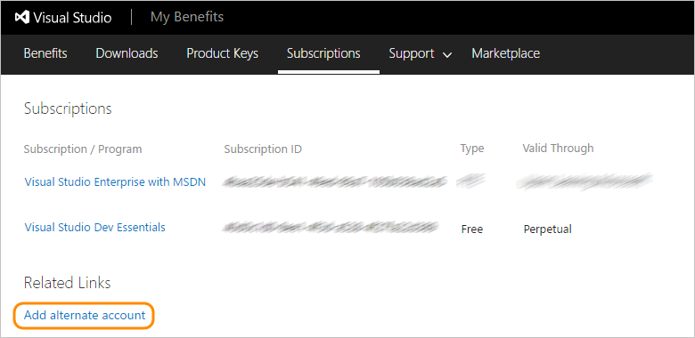

# Identities for Visual Studio subscribers

When you activate your Visual Studio subscription, we link the identity (or login) that you used during activation with the Visual Studio subscription. This way,
we can recognize you on the [Visual Studio subscriber portal](https://my.visualstudio.com?wt.mc_id=o~msft~docs), in VSTS, and in Azure.

In VSTS, we check your Visual Studio subscription status each time you log in, and grant you features automatically within each account in which you are a member. 
Because these features are included as a subscriber benefit, it's free to add you as a member in any VSTS account when using an identity that is linked to your Visual Studio subscription.

In Azure, we check your Visual Studio subscription status when you activate your [monthly Azure credit](https://azure.microsoft.com/pricing/member-offers/credit-for-visual-studio-subscribers/) 
that is a subscriber benefit.

Within the [Visual Studio subscriber portal](https://my.visualstudio.com?wt.mc_id=o~msft~docs), you may be able to add an **alternate identity**--in addition to the identity you used during
activation. Today we allow you to add an alternate identity if you used a Microsoft account to activate your subscription. This way you can also add a
work or school account (which you use when logging into Visual Studio, Office 365, or your corporate or school network), allowing you to access VSTS using both
your personal account and your work or school account.

## How to add an alternate identity to your Visual Studio subscription

1. Sign in to the [Visual Studio subscriber portal](https://my.visualstudio.com?wt.mc_id=o~msft~docs).

  > If you're asked to choose "personal account"
  > or "work or school account", choose "personal account" (your Microsoft account).
  >
  > Sometimes you need to choose because your Microsoft account and your work or school
  > account share the same email address. Although both identities use the same email address,
  > they're still separate identities with different profiles, security settings, and permissions.
  >
  > Starting March 30, 2018 you will no longer be able to create a Microsoft account using an email
  > that uses a domain that is managed in Azure Active Directory. You can still sign in using this
  > email as a work account.

2. Go to the **Subscriptions** tab.

  

3. Under **Related Links**, go to **Add alternate account**.

  

4. Enter your work or school account and choose **Add**.

  

5. Use your work or school account to sign in to your VSTS account (```https://{youraccount}.visualstudio.com```). 
There may be a slight delay for the information to propagate, so check again 15 minutes later. 

## FAQ

### Q:  Why doesn't VSTS recognize me as a Visual Studio subscriber?
A: VSTS should automatically recognize your subscription when you sign in using your primary or alternate identity. If not, you can try a few things:

* Check that you have an active Visual Studio subscription that [includes VSTS as a benefit](vs-vsts.md).

* Confirm that you're using a login/identity that is either the primary or alternate identity for your Visual Studio subscription.

* Visit the [Visual Studio subscriber portal](https://my.visualstudio.com?wt.mc_id=o~msft~docs) at least once before you sign in to VSTS.

If VSTS still doesn't recognize your subscription, [contact support](https://www.visualstudio.com/team-services/support/)

