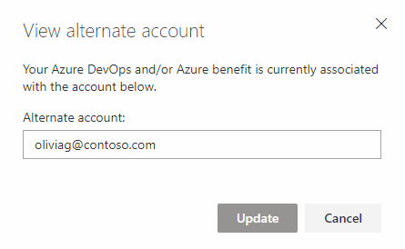

# Identities for Visual Studio subscribers
When you activate your Visual Studio subscription, we link the identity (or login) that you used during activation with the Visual Studio subscription. This way, we can recognize you on the [Visual Studio subscriber portal](https://my.visualstudio.com?wt.mc_id=o~msft~docs), in Azure DevOps, and in Azure.

In Azure DevOps, we check your Visual Studio subscription status each time you log in, and grant you features automatically within each organization in which you are a member.
Because these features are included as a subscriber benefit, it's free to add you as a member in any Azure DevOps organization when using an identity that is linked to your Visual Studio subscription.

In Azure, we check your Visual Studio subscription status when you activate your [monthly Azure DevTest individual credit](https://azure.microsoft.com/pricing/member-offers/credit-for-visual-studio-subscribers/)
that is a subscriber benefit.

Within the [Visual Studio subscriber portal](https://my.visualstudio.com?wt.mc_id=o~msft~docs), you may be able to add an **alternate identity** -- in addition to the identity you used during activation. We allow you to add an alternate identity if you used a Microsoft account to activate your subscription. This way you can also add a work or school account (which you use when logging into Visual Studio, Microsoft 365, or your corporate or school network), allowing you to access Azure DevOps using both your personal account and your work or school account.

## Add an alternate account to your subscription
Adding an alternate account to your Visual Studio subscription allows you to access certain subscription benefits, like Azure DevOps and Azure, or sign in to the Visual Studio IDE with a different identity than that to which the subscription is assigned. In the past, this functionality was available only if your Visual Studio (VS) subscription was assigned to a Microsoft Account (MSA). We have extended this functionality for work or school accounts in Azure Active Directory (Azure AD).

> [!NOTE]
> An alternate ID only allows you to use that second ID to activate Azure credits and Azure DevOps, and to sign in to the Visual Studio IDE.  It cannot be used to sign in to the subscription portal at <https://my.visualstudio.com>.  You still need to use the ID to which the subscription is assigned to sign in to the portal. 

For all subscriptions, you can add a "work or school account" so you can use that account with your benefits that require a login (VS IDE, Azure DevOps, and Azure).

### Add the alternate account
1. Sign in to the Visual Studio subscriber portal with your Microsoft account (https://my.visualstudio.com).
2. Select the **Subscriptions** tab.
3. Choose **Add alternate account**.
4. Add your work or school account.
    > [!div class="mx-imgBorder"]
    > 

5. Use your work or school account to sign in to Azure DevOps (https://{youraccount}.visualstudio.com).

Your alternate account is added to the Visual Studio subscription, allowing both identities to utilize the benefits of the subscription that require you to sign in with the alternate account (IDE, Azure DevOps, and Azure).

## FAQ

### Q:  Why doesn't Azure DevOps recognize me as a Visual Studio subscriber?

A: Azure DevOps should automatically recognize your subscription when you sign in using your primary or alternate identity. If not, you can try a few things:

* Check that you have an active Visual Studio subscription that includes [Azure DevOps](vs-azure-devops.md#eligibility) as a benefit.

* Confirm that you're using a login/identity that is either the primary or alternate identity for your Visual Studio subscription.  Many people, for example, will also have a Visual Studio Dev Essentials membership associated with a different sign-in ID.  Attempting to sign in to other subscriptions with that ID will fail unless those subscriptions are associated with that email address.

* Visit the [Visual Studio subscriber portal](https://my.visualstudio.com?wt.mc_id=o~msft~docs) at least once before you sign in to Azure DevOps.

If Azure DevOps still doesn't recognize your subscription, contact [Azure DevOps support](https://azure.microsoft.com/support/devops/).

## Resources
[Visual Studio subscriptions support](https://aka.ms/vssubscriberhelp)

## See also
- [Visual Studio documentation](/visualstudio/)
- [Azure DevOps documentation](/azure/devops/)
- [Azure documentation](/azure/)
- [Microsoft 365 documentation](/microsoft-365/)

## Next steps 
For more information about using Azure, Azure DevOps or Visual Studio IDE, check out these resources:
- [Azure DevTest offer / credits](/azure/devtest/offer/)
- [Azure DevOps](vs-azure-devops.md)
- [Visual Studio](vs-ide-benefit.md)