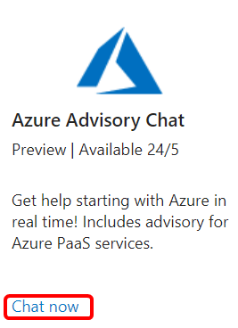
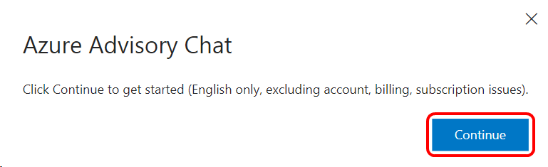
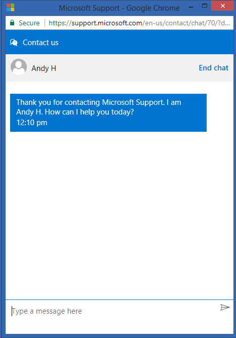

# Azure Advisory Chat

Get help starting with Azure in real time! Includes advisory for Azure PaaS services.  The Azure Advisory Chat benefit is available in Visual Studio Enterprise Standard and annual cloud subscriptions.

## Activation Steps

Using the Azure Advisory Chat is easy.
1. Sign in to [https://my.visualstudio.com/benefits](https://my.visualstudio.com/benefits?wt.mc_id=o~msft~docs).
2. Locate the Azure Advisory Chat tile in the Support section, and click **Chat now**.
    > [!div class="mx-imgBorder"]
    > 

3. You'll see a notification that the service is currently offered in English only with the exception of support for account, billing, and subscription issues.  Click **Continue**.
    > [!div class="mx-imgBorder"]
    > 

4. That's all there is to it.  A chat window will open, and you'll see a status letting you know where you are in the queue.  Your chat will be answered by the next available expert.
    > [!div class="mx-imgBorder"]
    > 

## Eligibility

|                                                      Subscription Level                                                      |     Channels      |    Benefit    | Renewable? |
|------------------------------------------------------------------------------------------------------------------------------|-------------------|---------------|------------|
|                                      Visual Studio Enterprise (Standard)                                       | VL, Azure, Retail |   One year    |    Yes     |
| Visual Studio Professional (Standard,monthly cloud) Visual Studio Enterprise (monthly cloud, NFR1) |        All        | Not available |     No     |
|                                          Visual Studio Test Professional (Standard)                                          |        All        | Not available |     No     |
|                                                  MSDN Platforms (Standard)                                                   |        All        | Not available |     No     |

1  *Includes:  Not for Resale (NFR), Most Valuable Professional (MVP), Regional Director (RD), Visual Studio Industry Partner (VSIP), BizSpark, Imagine, MCT*

> [!NOTE]
> Microsoft no longer offers Visual Studio Professional Annual subscriptions and Visual Studio Enterprise Annual subscriptions in Cloud Subscriptions. There will be no change to existing customers experience and ability to renew, increase, decrease, or cancel their subscriptions. New customers are encouraged to go to [https://visualstudio.microsoft.com/vs/pricing/](https://visualstudio.microsoft.com/vs/pricing/) to explore different options to purchase Visual Studio.

Not sure which subscription you're using?  Connect to [https://my.visualstudio.com/subscriptions](https://my.visualstudio.com/subscriptions?wt.mc_id=o~msft~docs) to see all the subscriptions assigned to your email address. If you don't see all your subscriptions, you may have one or more assigned to a different email address.  You'll need to sign in with that email address to see those subscriptions.

## Frequently asked questions

### Q:  What is the difference between Azure Advisory Chat and Azure Advisor?
- A:  The Azure Advisory Chat is a real-time chat service to assist with questions about Azure. [Azure Advisor](/azure/advisor/advisor-overview) is a personalized cloud consultant that helps you follow best practices to optimize your Azure deployments. It analyzes your resource configuration and usage telemetry and then recommends solutions that can help you improve the cost effectiveness, performance, high availability, and security of your Azure resources.

## Support Resources
- For assistance with sales, subscriptions, accounts and billing for Visual Studio Subscriptions, contact Visual Studio [Subscriptions Support](https://visualstudio.microsoft.com/subscriptions/support/).
- Have a question about Visual Studio IDE, Azure DevOps Services or other Visual Studio products or services?  Visit [Visual Studio Support](https://visualstudio.microsoft.com/support/).