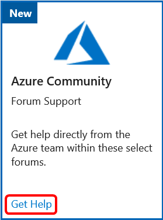
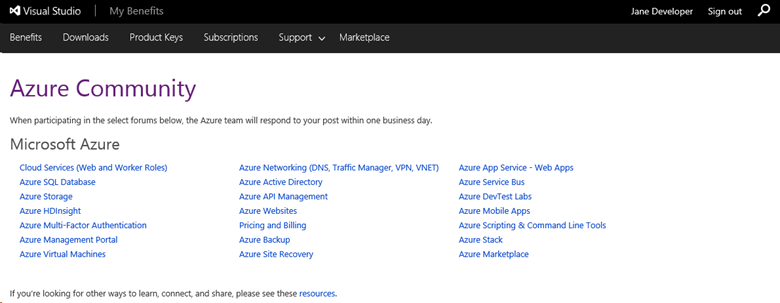
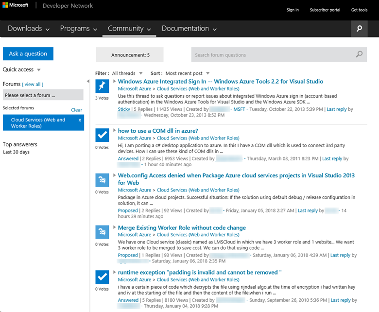

# Azure Community Support forum in Visual Studio subscriptions
Get help directly from the Azure team within select support forums via Azure Community.  The Azure Community benefit provides you with access to a collection of forums focused on Azure-related topics.

## Available topics

|                                       |                                                    |                                      |
|---------------------------------------|----------------------------------------------------|--------------------------------------|
| [Cloud Services (Web and Worker Roles)](https://social.msdn.microsoft.com/Forums/home?forum=windowsazuredevelopment&filter=alltypes&sort=lastpostdesc) | [Azure Networking (DNS, Traffic Manager, VPN, VNET)](https://social.msdn.microsoft.com/Forums/home?forum=WAVirtualMachinesVirtualNetwork&filter=alltypes&sort=lastpostdesc) | [Azure App Service - Web Apps](https://social.msdn.microsoft.com/forums/home?forum=windowsazurewebsitespreview&filter=alltypes&sort=lastpostdesc)         |
| [Azure SQL Database](https://social.msdn.microsoft.com/Forums/home?forum=ssdsgetstarted&filter=alltypes&sort=lastpostdesc)                    | [Azure Active Directory](https://social.msdn.microsoft.com/forums/home?forum=WindowsAzureAD&filter=alltypes&sort=lastpostdesc)                             | [Azure Service Bus](https://social.msdn.microsoft.com/forums/home?forum=servbus&filter=alltypes&sort=lastpostdesc)                    |
| [Azure Storage](https://social.msdn.microsoft.com/Forums/home?forum=windowsazuredata&filter=alltypes&sort=lastpostdesc)                         | [Azure API Management](https://social.msdn.microsoft.com/Forums/home?forum=azureapimgmt&filter=alltypes&sort=lastpostdesc)                               | [Azure DevTest Labs](https://social.msdn.microsoft.com/forums/home?forum=AzureDevTestLabs&filter=alltypes&sort=lastpostdesc)                   |
| [Azure HDInsight](https://social.msdn.microsoft.com/Forums/azure/home?forum=hdinsight&filter=alltypes&sort=lastpostdesc)                       | [Azure Websites](https://social.msdn.microsoft.com/Forums/home?forum=windowsazurewebsitespreview&filter=alltypes&sort=lastpostdesc)                                     | [Azure Mobile Apps](https://social.msdn.microsoft.com/forums/home?forum=azuremobile&filter=alltypes&sort=lastpostdesc)                    |
| [Azure Multi-Factor Authentication](https://social.msdn.microsoft.com/Forums/azure/home?forum=windowsazureactiveauthentication&filter=alltypes&sort=lastpostdesc)     | [Pricing and Billing](https://social.msdn.microsoft.com/Forums/azure/home?forum=windowsazurepurchasing&filter=alltypes&sort=lastpostdesc)                                | [Azure Scripting & Command Line Tools](https://social.msdn.microsoft.com/forums/home?forum=azurescripting&filter=alltypes&sort=lastpostdesc) |
| [Azure Management Portal](https://social.msdn.microsoft.com/Forums/home?forum=windowsazuremanagement&filter=alltypes&sort=lastpostdesc)               | [Azure Backup](https://social.msdn.microsoft.com/forums/home?forum=windowsazureonlinebackup&filter=alltypes&sort=lastpostdesc)                                       | [Azure Stack](https://social.msdn.microsoft.com/forums/home?forum=AzureStack&filter=alltypes&sort=lastpostdesc)                          |
| [Azure Virtual Machines](https://social.msdn.microsoft.com/Forums/home?forum=WAVirtualMachinesforWindows&filter=alltypes&sort=lastpostdesc)                | [Azure Site Recovery](https://social.msdn.microsoft.com/forums/home?forum=hypervrecovmgr&filter=alltypes&sort=lastpostdesc)                                | [Azure Marketplace](https://social.msdn.microsoft.com/forums/home?forum=DataMarket&filter=alltypes&sort=lastpostdesc)                    |

## Get started
Getting started with Azure Community is easy.
1. Sign in to [https://my.visualstudio.com/benefits](https://my.visualstudio.com/benefits?wt.mc_id=o~msft~docs).

2. Locate the Azure Community tile in the Support section, and click the **Get Help** link.
    > [!div class="mx-imgBorder"]
    >

3. You'll see a list of the available forums.  Simply click on the forum of your choice.
    > [!div class="mx-imgBorder"]
    > 

4. Within the forum, you can view topics and responses, search for answers to your question, or post a new question.
    > [!div class="mx-imgBorder"]
    > 

## Eligibility
Availability of the Azure Community benefit depends on your subscription level as shown below:

|                                          Subscription Level                                           |     Channels      |    Benefit    | Renewable? |
|-------------------------------------------------------------------------------------------------------|-------------------|---------------|------------|
|                           Visual Studio Enterprise (Standard)                           | VL, Azure, Retail |   One year    |    Yes     |
|                           Visual Studio Enterprise with GitHub Enterprise                           | VL, Azure, Retail |   One year    |    Yes     |
|                          Visual Studio Professional (Standard)                          | VL, Azure, Retail |   One year    |    Yes     |
|                          Visual Studio Professional with GitHub Enterprise                          | VL, Azure, Retail |   One year    |    Yes     |
|                              Visual Studio Test Professional (Standard)                               |    VL, Retail     |   One year    |    Yes     |
|                                       MSDN Platforms (Standard)                                       |    VL, Retail     |   One year    |    Yes     |
| Visual Studio Enterprise (monthly cloud), Visual Studio Professional (monthly cloud), NFR1 |        All        | Not available |     No     |

1  *Includes:  Not for Resale (NFR), Microsoft FTE, Most Valuable Professional (MVP), Regional Director (RD), Visual Studio Industry Partner (VSIP), BizSpark, Imagine, Microsoft Certified Trainer (MCT)*

> [!NOTE]
> Microsoft no longer offers Visual Studio Professional Annual subscriptions and Visual Studio Enterprise Annual subscriptions in Cloud Subscriptions. There will be no change to existing customers experience and ability to renew, increase, decrease, or cancel their subscriptions. New customers are encouraged to go to [https://visualstudio.microsoft.com/vs/pricing/](https://visualstudio.microsoft.com/vs/pricing/) to explore different options to purchase Visual Studio.

Not sure which subscription you're using?  Connect to [https://my.visualstudio.com/subscriptions](https://my.visualstudio.com/subscriptions?wt.mc_id=o~msft~docs) to see all the subscriptions assigned to your email address. If you don't see all your subscriptions, you may have one or more assigned to a different email address.  You'll need to sign in with that email address to see those subscriptions.

## Support Resources
- For other Azure Community resources, please visit the Azure Community [Support page](https://azure.microsoft.com/support/forums/).
- [Azure documentation](/azure/).
- Need assistance with sales, subscriptions, accounts and billing for Visual Studio Subscriptions?  Contact Visual Studio [Subscriptions Support](https://visualstudio.microsoft.com/subscriptions/support/).
- Have a question about Visual Studio IDE, Azure DevOps Services or other Visual Studio products or services?  Visit [Visual Studio Support](https://visualstudio.microsoft.com/support/).

## Next steps
Did you know that many Visual Studio subscriptions come with Azure DevTest individual credit?  Learn how to [activate](vs-azure.md) yours.