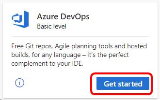

# Azure DevOps for Visual Studio subscribers
As an active Visual Studio subscriber, you can use a range of features in Azure DevOps that are included with your subscription. You'll be able to use these same features in each Azure DevOps organization in which you are a member, whether you created the organization or were added by someone else.

## Sign in

   > [!div class="mx-imgBorder"]
   > 

   
When you sign in to Azure DevOps using either the identity that you used for activating your Visual Studio subscription or your [alternate identity](vs-alternate-identity.md), we recognize this automatically.  This way you can also add a work or school account (which you use when logging into Visual Studio, Microsoft 365, or your corporate or school network), allowing you to access Azure DevOps using both your personal account and your work or school account.

[Sign up for a free Azure DevOps organization](https://visualstudio.microsoft.com/team-services/)

## Eligibility
| Subscription Level                                                 |     Channels                                            | Benefit                                                          | Renewable?    |
|--------------------------------------------------------------------|---------------------------------------------------------|------------------------------------------------------------------|---------------|
| Visual Studio Enterprise (Standard, monthly cloud)   | VL, Azure, Retail,  selected NFR1  | Azure Boards & Repos (Basic2), Azure Test Plans, self-hosted parallel jobs |  Yes          |
| Visual Studio Enterprise subscription with GitHub Enterprise   | VL| Azure Boards & Repos (Basic2), Azure Test Plans, self-hosted parallel jobs |  Yes          |
| Visual Studio Professional (Standard, monthly cloud) | VL, Azure, Retail                                        | Azure Boards & Repos (Basic2)                                                             |  Yes          |
| Visual Studio Professional subscription with GitHub Enterprise | VL| Azure Boards & Repos (Basic2)                                                             |  Yes          |
| Visual Studio Test Professional (Standard)                         | VL, Retail                                              | Azure Boards & Repos (Basic2), Azure Test Plans                                              |  Yes          |
| MSDN Platforms (Standard)                                          | VL, Retail                                              | Azure Boards & Repos (Basic2), Azure Test Plans                                             |  Yes          |
||

1  *Includes:  Not for Resale (NFR), Most Valuable Professional (MVP), Regional Director (RD), Visual Studio Industry Partner (VSIP), Microsoft Partner Network (Enterprise), BizSpark, MCT Software & Services Developer, FTE.
  Excludes: MCT Software & Services, Imagine.*

2 *Basic plan includes defining release pipelines and multi-stage continuous deployment (CD) pipelines, and using approvals and gates to control deployments; when the Free access to Pipelines Preview feature is enabled, Stakeholders gain access to all Azure Pipelines features. *

> [!NOTE]
> Microsoft no longer offers Visual Studio Professional Annual subscriptions and Visual Studio Enterprise Annual subscriptions in Cloud Subscriptions. There will be no change to existing customers experience and ability to renew, increase, decrease, or cancel their subscriptions. New customers are encouraged to go to [https://visualstudio.microsoft.com/vs/pricing/](https://visualstudio.microsoft.com/vs/pricing/) to explore different options to purchase Visual Studio.

Not sure which subscription you're using?  Connect to [https://my.visualstudio.com/subscriptions](https://my.visualstudio.com/subscriptions?wt.mc_id=o~msft~docs) to see all the subscriptions assigned to you.
If you don't see all your subscriptions, you may have one or more assigned to a different email address.  You'll need to sign in with that email address to see those subscriptions.

## Frequently asked questions
### Q: As a Visual Studio Enterprise subscriber, do I get additional parallel jobs for TFS and Azure Pipelines?
A:  Yes. Visual Studio Enterprise subscribers get one parallel job in Team Foundation Server 2017 or later and one self-hosted parallel job in each Azure DevOps Services organization where they are a member.

## Support resources
- For assistance with sales, subscriptions, accounts and billing for Visual Studio Subscriptions, see Visual Studio [Subscriptions support](https://aka.ms/vssubscriberhelp).
- Have a question about Visual Studio IDE, Azure DevOps, or other Visual Studio products or services?  Visit [Visual Studio support](https://visualstudio.microsoft.com/support/).
- [Azure DevOps documentation](/azure/devops/).

## See also
- [Visual Studio documentation](/visualstudio/)
- [Azure DevOps documentation](/azure/devops/)
- [Azure documentation](/azure/)
- [Microsoft 365 documentation](/microsoft-365/)

## Next steps
Learn more about Azure DevOps features:
- [Azure Boards & Repos (Basic Plan)](https://azure.microsoft.com/services/devops/compare-features/)
- [Azure Test Plans](https://marketplace.visualstudio.com/items?itemName=ms.vss-testmanager-web)
- [Azure Artifacts](https://marketplace.visualstudio.com/items?itemName=ms.feed)

Learn how to activate your [Azure DevTest individual credit](/azure/devtest/offer/quickstart-individual-credit).