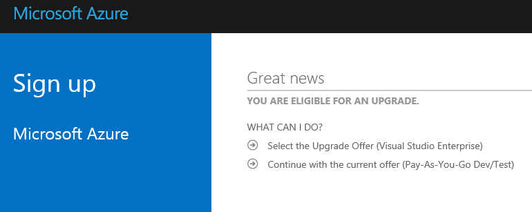
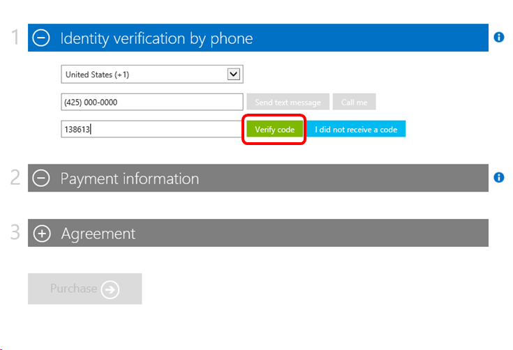
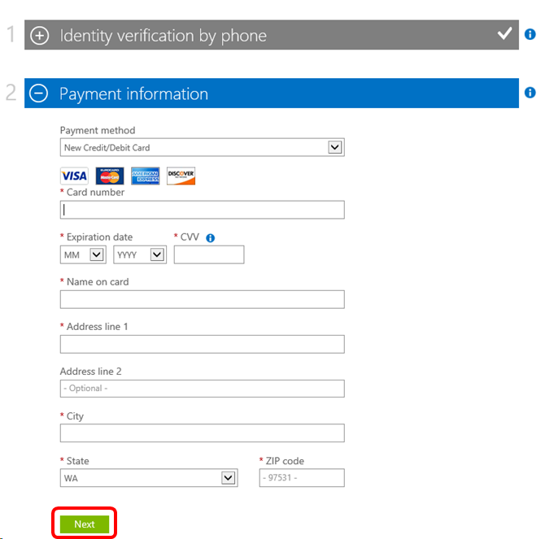
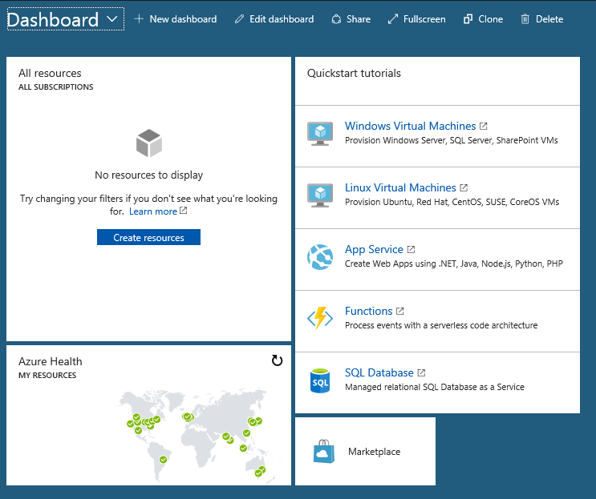

# Setting up an Azure Dev/Test Pay-As-You-Go subscription
Collaborate with your team in the cloud.  Create multiple Dev and Test Pay-As-You-Go subscriptions, enabling collaboration with other subscribers while also providing isolation between teams and environments.  You receive exclusive discounted hourly rates for dev/test and cloud use rights for your subscription software on Azure.

1. To use your Azure Pay-As-You-Go subscription benefit, sign in to [https://my.visualstudio.com/benefits](https://my.visualstudio.com/benefits?wt.mc_id=o~msft~docs) and click on the **Activate** link at the bottom of the benefit tile.
   > [!div class="mx-imgBorder"]
   > 

2. If you have already activated an Azure account as part of your subscription benefits (for example, if you have an Enterprise subscription and activated your $150 monthly Azure credit), skip to step 5.

3. On the Microsoft Azure Sign up page, you’ll have the option to either set up the Pay-As-You-Go Dev/Test offer (PAYG), or upgrade to the Visual Studio Enterprise offer.  Click **Continue with the current offer (Pay-As-You-Go Dev/Test)** if you don’t wish to upgrade.
   > [!div class="mx-imgBorder"]
   > 

4. To verify your identity, enter a phone number, and choose “Send text message” or “Call me”.  Enter the code you receive.  Click **Verify code**.
   > [!div class="mx-imgBorder"]
   > 

5. Next, please provide the billing information for your account and click **Next**.  (This will be the credit card that is charged for all your Azure purchases.)
   > [!div class="mx-imgBorder"]
   > 

6. In the Agreement section, click on the check box to accept the subscription agreement, offer details and privacy statement, then click **Purchase**.

7. On the **Welcome to Microsoft Azure** page you’ll have the option to buy a support plan, or get started using your subscription.

8. If you choose to get started using your subscription, you’ll see the [Microsoft Azure portal](https://portal.azure.com) and, if it’s your first visit, you’ll be offered a quick tour of some of the features.  Once you’ve completed or opted out of the tour, you’ll see the Dashboard.  You’re ready to start using Azure!
   > [!div class="mx-imgBorder"]
   > 
