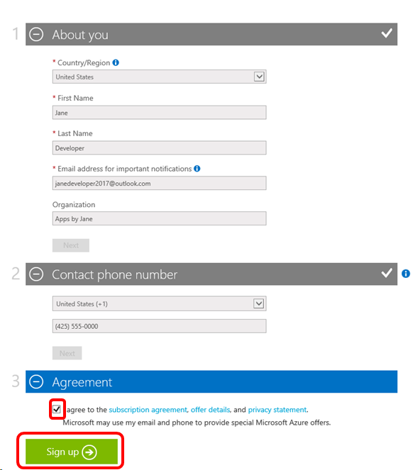
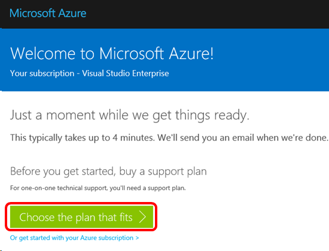
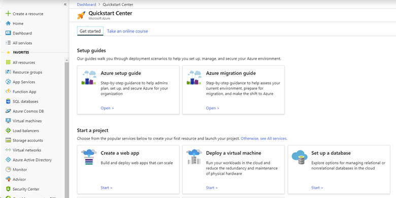

# Use Microsoft Azure in Visual Studio subscriptions
As a Visual Studio subscriber, you can use Microsoft Azure at no extra charge.  With your [monthly Azure DevTest individual credit](https://azure.microsoft.com/pricing/member-offers/msdn-benefits-details/), Azure is your personal sandbox for dev/test.  You can provision virtual machines, cloud services, and other Azure resources.  Credit amounts vary by subscription level.

## Activation Steps
1. Sign in to [https://my.visualstudio.com/benefits](https://my.visualstudio.com/benefits?wt.mc_id=o~msft~docs).

2. Locate the Azure tile in the Tools section on the Benefits page and click **Activate** link at the bottom of the benefit tile.
   > [!div class="mx-imgBorder"]
   > 

3. If you don't have an existing Azure subscription, you'll be asked to fill in the required information to create your Azure subscription, click the checkbox to accept the terms & conditions, and click **Sign up**:
   > [!div class="mx-imgBorder"]
   > 
If you have an existing subscription, click the check box to accept the agreement, and click **Sign up**.

4. When your account is ready, you’ll have the option to choose an Azure support plan (sold separately), or get started with your Azure subscription.
   > [!div class="mx-imgBorder"]
   > 

5. The Azure Dashboard Quickstart Center will load.  
   > [!div class="mx-imgBorder"]
   >  

6. Bookmark the [Azure Portal](https://portal.azure.com) for easy access in the future.

## Eligibility
|                 Subscription Level / Program                 |           Benefit           |                         Renewable?                          |
|--------------------------------------------------------------|-----------------------------|-------------------------------------------------------------|
|              Visual Studio Enterprise Standard               |     $150 monthly credit     |                             Yes                             |
|              Visual Studio Enterprise with GitHub Enterprise               |     $150 monthly credit     |                             Yes                             |
|               Visual Studio Enterprise monthly               |        Not available        |                                                             |
|             Visual Studio Professional Standard              |     $50 monthly credit      |                             Yes
|              Visual Studio Professional with GitHub Enterprise              |     $150 monthly credit     |                             Yes                             |
|              Visual Studio Professional monthly              |        Not available        |                                                             |
|                    Visual Studio Test Pro                    |     $50 monthly credit      |                             Yes                             |
|                        MSDN Platforms                        |     $100 monthly credit     |                             Yes                             |
|               Visual Studio Enterprise - NFR\*               |     $150 monthly credit     |                             Yes                             |
|                Visual Studio Enterprise - FTE                |     $150 monthly credit     |                             Yes                             |
|     Visual Studio Enterprise - Microsoft Partner Network     |     $150 monthly credit     |                             Yes                             |
|    Visual Studio Professional - Microsoft Partner Network    |        Not available        |                                                             |
|        Visual Studio Enterprise – Imagine (Standard)         |        Not available        |                                                             |
|         Visual Studio Enterprise – Imagine (Premium)         |        Not available        |                                                             |
|             Visual Studio Enterprise – BizSpark              |     $150 monthly credit     |                             Yes                             |
|      Visual Studio Enterprise – MCT Software & Services      |     $100 monthly credit     |                             Yes                             |
| Visual Studio Enterprise – MCT Software & Services Developer |     $150 monthly credit     |                             Yes                             |

*Includes Not for Resale (NFR), Most Valuable Professional (MVP), Regional Director (RD), Visual Studio Industry Partner (VSIP)

> [!NOTE]
> Microsoft no longer offers Visual Studio Professional Annual subscriptions and Visual Studio Enterprise Annual subscriptions in Cloud Subscriptions. There will be no change to existing customers experience and ability to renew, increase, decrease, or cancel their subscriptions. New customers are encouraged to go to [https://visualstudio.microsoft.com/vs/pricing/](https://visualstudio.microsoft.com/vs/pricing/) to explore different options to purchase Visual Studio.

Not sure which subscription you're using?  Connect to [https://my.visualstudio.com/subscriptions](https://my.visualstudio.com/subscriptions?wt.mc_id=o~msft~docs) to see all the subscriptions assigned to your email address. If you don't see all your subscriptions, you may have one or more assigned to a different email address.  You'll need to sign in with that email address to see those subscriptions.

## Frequently asked questions
### Q: How do I submit a technical support incident from within the Azure portal?
A:  Submitting a support incident from the Azure portal is a three-step process.
1. Activate your technical support benefit, and obtain your Contract ID Access ID.
2. Link your support contract to your Azure subscription.
3. Submit a support incident.

Please visit the [Technical support](vs-tech-support.md) documentation for complete details.

### Q: How owns the intellectual property I create using my Azure DevTest individual credit?
A:  Intellectual property produced by an employee created on resources provided by that company is thereby intellectual property of the company providing the resource. So, if you received your Visual Studio subscription through your employer, their intellectual property policies would apply. 

### Q: I’ve received a message stating that my access to Azure will end soon.  What can I do to continue using Azure?
A:  You’re receiving this email because you use the Azure benefit associated with your Visual Studio subscription, and that subscription has expired or been removed.  To continue to use Azure, you have several options:

**Recommended action:**

To continue using your Visual Studio Azure DevTest individual credit and discounts, take one of the following steps:

If someone in your team or organization purchases subscriptions on your behalf, contact your organization’s Visual Studio administrator and request a Visual Studio subscription that entitles you to the Azure DevTest individual credit amount you need.   Please request the administrator to assign the new subscription to the same user ID that your previous subscription was assigned to, so that you don’t have to worry about transferring your Azure subscription.

If you can purchase a subscription directly, please do one of the following:
1. Purchase an annual Visual Studio [Enterprise](https://marketplace.visualstudio.com/items?itemName=ms.vs-enterprise-annual) or [Professional](https://marketplace.visualstudio.com/items?itemName=ms.vs-professional-annual) cloud subscription through the Visual Studio Marketplace.
2. Take advantage of a 50% or higher discount by renewing your current subscription through the [Microsoft Store](https://www.microsoft.com/en-us/search/result.aspx?q=visual+studio+subscription).

Compare all the [subscriptions and their benefits](https://visualstudio.microsoft.com/vs/pricing/).

If you have another active Visual Studio subscription at the **same** subscription level under a Microsoft account, you can link it to this Azure benefit by adding an [alternate account](manage-vs-subscriptions.md#linking-my-subscription-to-existing-azure-devops-services-or-azure-subscriptions) in the Visual Studio subscription portal. If this doesn’t work, you can also try [transferring your Azure benefit](/azure/billing/billing-subscription-transfer/) to the active Visual Studio subscription.

If you have another active Visual Studio subscription at a **different** subscription level and under a Microsoft account, contact [Azure support](https://portal.azure.com/#blade/Microsoft_Azure_Support/HelpAndSupportBlade) for assistance.

If your subscription has a spending limit and you take no action before it expires, the Azure subscription(s) your Azure subscription will be disabled. To convert it to a pay-as-you-go offer and continue to use it, add a payment instrument and [remove your spending limit](/azure/billing/billing-spending-limit/).

If you prefer not to continue this Visual Studio Azure subscription, you may transfer your resources such as virtual machines and databases to another Azure subscription and [cancel](https://azure.microsoft.com/support/cancel-account/) this subscription any time.

If you believe you’ve received this email in error, please contact [Azure customer support](https://portal.azure.com/#blade/Microsoft_Azure_Support/HelpAndSupportBlade).

## Support Resources
- Need help with Azure?  Check out these resources:
  - Technical Support: [https://azure.microsoft.com/support/options/](https://azure.microsoft.com/support/options/)
  - [Azure documentation](/azure/)
- For assistance with sales, subscriptions, accounts and billing for Visual Studio Subscriptions, contact Visual Studio [Subscriptions Support](https://visualstudio.microsoft.com/subscriptions/support/).
- Have a question about Visual Studio IDE, Azure DevOps Services or other Visual Studio products or services?  Visit [Visual Studio Support](https://visualstudio.microsoft.com/support/).

## Next steps
For more information about Microsoft tools and services, check out the documentation for:
- [Azure](/azure/)
- [Azure DevOps](/azure/devops/)
- [Visual Studio IDE](/visualstudio/)