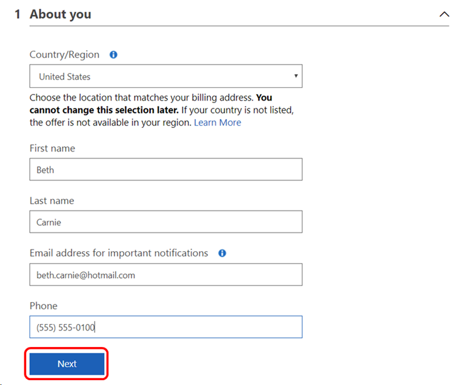
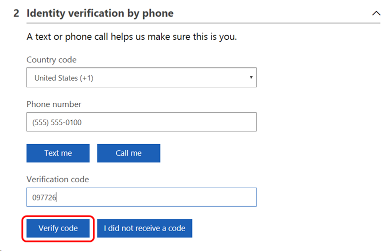
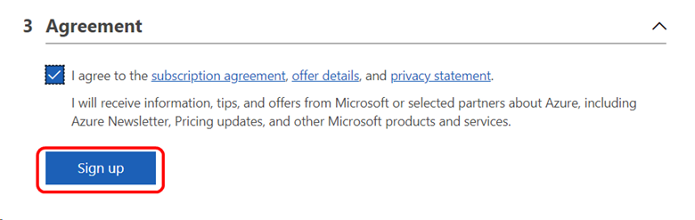
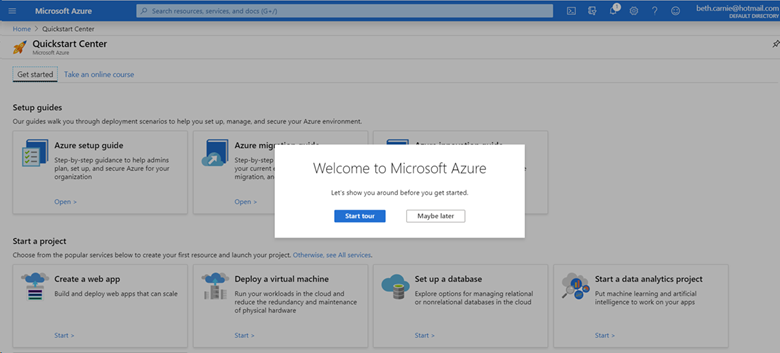

# Use Microsoft Azure in Visual Studio subscriptions
As a Visual Studio subscriber, you can use Microsoft Azure at no extra charge.  With your [monthly Azure DevTest individual credit](https://azure.microsoft.com/pricing/member-offers/msdn-benefits-details/), Azure is your personal sandbox for dev/test.  You can provision virtual machines, cloud services, and other Azure resources.  Credit amounts vary by subscription level.

## Activation steps
1. Sign in to [https://my.visualstudio.com/benefits](https://my.visualstudio.com/benefits?wt.mc_id=o~msft~docs).

2. Locate the Azure tile in the Tools section on the Benefits page and select **Activate** link at the bottom of the benefit tile.
   > [!div class="mx-imgBorder"]
   > 

3. If you don't have an existing Azure subscription, you'll be asked to fill in the required information to create your Azure subscription.  The first step is to provide your personal information and then select **Next**.
   > [!div class="mx-imgBorder"]
   > 

4. Next, you'll need to verify your identity using a simple verification code. Provide your phone number, and choose whether you'd like to receive the code by text or phone.  Enter the code you receive, and select **Verify code**.   
   > [!div class="mx-imgBorder"]
   > 

5. For the final step, select the checkbox to accept the terms, then select **Sign up**.  That's all there is to it!
   > [!div class="mx-imgBorder"]
   > 

0. The Azure Dashboard Quickstart Center will load.  
   > [!div class="mx-imgBorder"]
   >  

0. Bookmark the [Azure portal](https://portal.azure.com) for easy access in the future.

## Maintain a subscription to use monthly credits
If your Visual Studio subscription expires or is removed, all the subscription benefits, including the monthly Azure dev/test individual credit are no longer available. To continue using Azure with a monthly credit, you will need to renew your subscription, purchase a new subscription, and/or transfer your Azure resources to a different Azure subscription that includes the Azure dev/test individual credit.  

> [!IMPORTANT]
> You must transfer your resources to another Azure subscription before your current Azure subscription is disabled or you will lose access to your data.  

There are several ways to continue using a monthly credit for Azure.  To save your Azure resources, you will need to [transfer your resources](/azure/azure-resource-manager/management/move-resource-group-and-subscription) to another Azure subscription, regardless of the action you choose below. 

- **If you purchase your Visual Studio subscription directly**, purchase a new subscription or renew your subscription through Microsoft Store.  
    - [Visual Studio Enterprise](https://www.microsoft.com/p/visual-studio-enterprise-subscription/dg7gmgf0dst4?activetab=pivot%3aoverviewtab)
    - [Visual Studio Professional](https://www.microsoft.com/p/visual-studio-professional-subscription/dg7gmgf0dst3?activetab=pivot%3aoverviewtab)
    - [Visual Studio Test Professional](https://www.microsoft.com/p/visual-studio-test-professional-subscription/dg7gmgf0dst6?activetab=pivot%3aoverviewtab)
- **If someone in your organization purchases subscriptions for your organization**, [contact your Visual Studio subscription admin](./contact-my-admin.md) and request a subscription that provides the monthly credit that you need.  
- **If you have another active Visual Studio subscription** at the same subscription level, you can use it to set up a new Azure credit subscription.  

Use the Eligibility table below to determine how many credits are included with each subscription type.  

## Convert your Azure subscription to Pay-As-You-Go

If you no longer need a Visual Studio subscription or credit but you want to continue using your Azure resources, [transfer your resources](/azure/azure-resource-manager/management/move-resource-group-and-subscription) to another Azure subscription, or convert your Azure subscription to pay-as-you-go pricing by [removing your spending limit](/azure/cost-management-billing/manage/spending-limit#remove-the-spending-limit-in-azure-portal). 

If you don’t take one of these actions, your Azure subscription will be disabled and deleted 30 days after receiving the email notification.  

## Have a question?
If you have questions about transferring resources, removing spending limits, or other Azure topics, you can [submit an Azure support request](https://portal.azure.com/#blade/Microsoft_Azure_Support/HelpAndSupportBlade/overview) in the Azure portal. 

## Eligibility
|                 Subscription Level / Program                 |           Benefit           |                         Renewable?                          |
|--------------------------------------------------------------|-----------------------------|-------------------------------------------------------------|
|              Visual Studio Enterprise Standard               |     $150 monthly credit     |                             Yes                             |
|              Visual Studio Enterprise subscription with GitHub Enterprise               |     $150 monthly credit     |                             Yes                             |
|               Visual Studio Enterprise monthly               |        Not available        |                                                             |
|             Visual Studio Professional Standard              |     $50 monthly credit      |                             Yes
|              Visual Studio Professional subscription with GitHub Enterprise              |     $50 monthly credit     |                             Yes                             |
|              Visual Studio Professional monthly              |        Not available        |                                                             |
|                    Visual Studio Test Pro                    |     $50 monthly credit      |                             Yes                             |
|                        MSDN Platforms                        |     $100 monthly credit     |                             Yes                             |
|               Visual Studio Enterprise - NFR1                 |     $150 monthly credit     |                             Yes                             |
|                Visual Studio Enterprise - FTE                |     $150 monthly credit     |                             Yes                             |
|     Visual Studio Enterprise - Microsoft Partner Network     |     $150 monthly credit     |                             Yes                             |
|    Visual Studio Professional - Microsoft Partner Network    |        Not available        |                                                             |
|        Visual Studio Enterprise – Imagine (Standard)         |        Not available        |                                                             |
|         Visual Studio Enterprise – Imagine (Premium)         |        Not available        |                                                             |
|             Visual Studio Enterprise – BizSpark              |     $150 monthly credit     |                             Yes                             |
|      Visual Studio Enterprise – MCT Software & Services      |     $100 monthly credit     |                             Yes                             |
| Visual Studio Enterprise – MCT Software & Services Developer |     $150 monthly credit     |                             Yes                             |

1  *Includes: Not for Resale (NFR), Most Valuable Professional (MVP), Regional Director (RD), Visual Studio Industry Partner (VSIP)
Excludes:  NFR Basic*

> [!NOTE]
> Microsoft no longer offers Visual Studio Professional Annual subscriptions and Visual Studio Enterprise Annual subscriptions in Cloud Subscriptions. There will be no change to existing customers experience and ability to renew, increase, decrease, or cancel their subscriptions. New customers are encouraged to go to [https://visualstudio.microsoft.com/vs/pricing/](https://visualstudio.microsoft.com/vs/pricing/) to explore different options to purchase Visual Studio.

Not sure which subscription you're using?  Connect to [https://my.visualstudio.com/subscriptions](https://my.visualstudio.com/subscriptions?wt.mc_id=o~msft~docs) to see all the subscriptions assigned to your email address. If you don't see all your subscriptions, you may have one or more assigned to a different email address.  You'll need to sign in with that email address to see those subscriptions.

## Frequently asked questions
### Q: How do I submit a technical support incident from within the Azure portal?
A:  Submitting a support incident from the Azure portal is a three-step process.
1. Activate your technical support benefit, and obtain your Contract ID Access ID.
2. Link your support contract to your Azure subscription.
3. Submit a support incident.

Please visit the [Technical support](vs-tech-support.md) documentation for complete details.

### Q: Who owns the intellectual property I create using my Azure DevTest individual credit?
A:  Intellectual property produced by an employee created on resources provided by that company is thereby intellectual property of the company providing the resource. So, if you received your Visual Studio subscription through your employer, their intellectual property policies would apply. 

## Support resources
- Need help with Azure?  Check out these resources:
  - Technical Support: [https://azure.microsoft.com/support/options/](https://azure.microsoft.com/support/options/)
  - [Azure Tips & Tricks](https://microsoft.github.io/AzureTipsAndTricks/ "Azure Tips & Tricks") 
- For assistance with sales, subscriptions, accounts and billing for Visual Studio Subscriptions, contact Visual Studio [Subscriptions Support](https://aka.ms/vssubscriberhelp).
- Have a question about Visual Studio IDE, Azure DevOps Services or other Visual Studio products or services?  Visit [Visual Studio Support](https://visualstudio.microsoft.com/support/).

## See also
- [Visual Studio documentation](/visualstudio/)
- [Azure DevOps documentation](/azure/devops/)
- [Azure documentation](/azure/)
- [Microsoft 365 documentation](/microsoft-365/)

## Next steps
For more information about Microsoft tools and services, check out the documentation for:
- [Azure](/azure/)
- [Azure DevOps](/azure/devops/)
- [Visual Studio IDE](/visualstudio/)