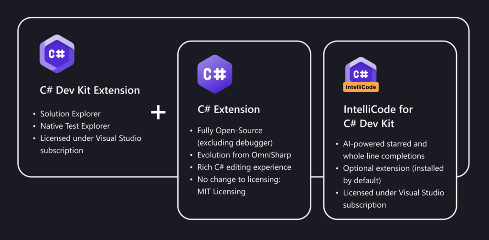

# C# Dev Kit for Visual Studio Code

The [C# Dev Kit](https://marketplace.visualstudio.com/items?itemName=ms-dotnettools.csdevkit) is a new Visual Studio Code extension that brings an improved editor-first C# development experience to Linux, macOS, and Windows.

The C# Dev Kit is designed to enhance your C# productivity when you’re working in Visual Studio Code. It works together with the [C# extension](https://marketplace.visualstudio.com/items?itemName=ms-dotnettools.csharp), which is updated to be powered by a new fully open-source Language Server Protocol (LSP) host, creating a performant, extensible, and flexible tooling environment that easily integrates new experiences into C# for VS Code. 

## What is C# Dev Kit?

C# Dev Kit borrows some familiar concepts from Visual Studio to bring a more productive and reliable C# experience to VS Code. This approach ensures a great experience whether you're quickly editing a C# file, learning C#, or debugging a backend API. The C# Dev Kit consists of a set of VS Code extensions that work together to provide a rich C# editing experience, AI-powered development, solution management, and integrated testing. As shown in the following graphic, C# Dev Kit consists of:

+ The [C# extension](https://marketplace.visualstudio.com/items?itemName=ms-dotnettools.csharp), which provides base language services support and continues to be maintained independent of this effort.
+ [C# Dev Kit extension](https://marketplace.visualstudio.com/items?itemName=ms-dotnettools.csdevkit), which builds from the foundations of Visual Studio to provide solution management, templates, and test discovery/debugging.
+ The [IntelliCode for C# Dev Kit extension](https://marketplace.visualstudio.com/items?itemName=ms-dotnettools.vscodeintellicode-csharp) (optional), which brings AI-powered development to the editor.

   > [!div class="mx-imgBorder"]
   > 

## Install the C# Dev Kit

To learn more about the C# Dev Kit and to install it, check out these resources:
+ Visit the [C# Dev Kit page](https://marketplace.visualstudio.com/items?itemName=ms-dotnettools.csdevkit) on the Visual Studio Marketplace for information about the features, Q&A, ratings and reviews, and to install it. 
+ For information about the features and capabilities of the C# Dev Kit, see the blog post [Announcing C# Dev Kit for Visual Studio Code](https://devblogs.microsoft.com/visualstudio/announcing-csharp-dev-kit-for-visual-studio-code/).
+ The [C# Dev Kit FAQ](https://code.visualstudio.com/docs/csharp/cs-dev-kit-faq#_who-can-use-c-dev-kit) provides answers to common questions about the kit.

## Eligibility

C# Dev Kit builds on the same foundations as Visual Studio for some of its functionality, it uses the same license model as Visual Studio. This means it's free for individuals, as well as academia and open-source development, the same terms that apply to Visual Studio Community. For organizations, the C# Dev Kit is included with Visual Studio Professional and Enterprise subscriptions (as noted below), as well as GitHub Codespaces. **For full terms and details see the [license terms](https://marketplace.visualstudio.com/items/ms-dotnettools.csdevkit/license)** 

| Subscription  |  Channels  | Benefit  | Renewable?    |
|---------------------|------------|----------|---------------|
| Visual Studio Enterprise (Standard)   | VL, Retail| Available |  N/A  |
| Visual Studio Enterprise subscription with GitHub Enterprise   | VL | Available |  N/A |
| Visual Studio Professional (Standard) | VL, Retail      | Available |  N/A  |
| Visual Studio Professional subscription with GitHub Enterprise | VL | Available |  N/A |
| Visual Studio Enterprise NFR\* | NFR | Available | N/A |
| Visual Studio Test Professional (Standard) | VL, Retail | Not available  |  N/A  |
| MSDN Platforms (Standard) | VL, Retail | Not available  |  N/A  |
| Visual Studio Enterprise, Visual Studio Professional (monthly cloud) | Azure | Available | N/A |
|GitHub Codespaces | Any | Available | N/A |

\* *Includes:  Not for Resale (NFR), Visual Studio Industry Partner (VSIP), FTE, BizSpark, Imagine, Imagine Premium, Microsoft Cloud Partner Program, Most Valuable Professional (MVP), Regional Director (RD), MCT Software & Services Developer, MCT Software & Services.*

> [!NOTE]
> Microsoft no longer offers Visual Studio Professional Annual subscriptions and Visual Studio Enterprise Annual subscriptions in Cloud Subscriptions. There will be no change to existing customers experience and ability to renew, increase, decrease, or cancel their subscriptions. New customers are encouraged to go to [https://visualstudio.microsoft.com/vs/pricing/](https://visualstudio.microsoft.com/vs/pricing/) to explore different options to purchase Visual Studio.

Not sure which subscription you're using? Connect to [https://my.visualstudio.com/subscriptions](https://my.visualstudio.com/subscriptions?wt.mc_id=o~msft~docs) to see all the subscriptions assigned to your email address. If you don't see all your subscriptions, you might have one or more assigned to a different email address. You need to sign in with that email address to see those subscriptions.