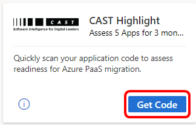
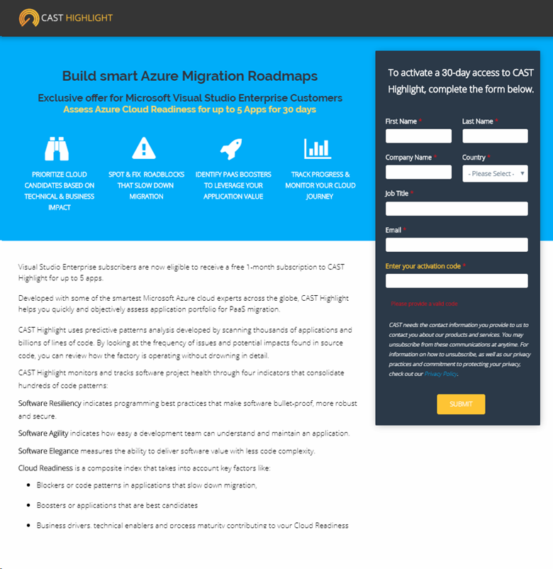

# The CAST Highlight benefit in Visual Studio subscriptions
Developers need critical insights on their software when migrating to the cloud. With CAST Highlight, Visual Studio subscribers can rapidly scan their application source code to identify the cloud readiness of their applications for migration to Azure and monitor progress of their app both during and after a migration.

- Visual Studio Enterprise subscribers can get a free, full feature three-month subscription to CAST Highlight that allows users to assess up to five apps.
- Visual Studio Professional subscribers can get a similar subscription that allows assessing of one app for three months.

## Activation steps
1. Sign in to [https://my.visualstudio.com/benefits](https://my.visualstudio.com/benefits?wt.mc_id=o~msft~docs).

2. Locate the CAST Highlight benefit tile in the "Tools" category, and click on **Get Code**.

   > [!div class="mx-imgBorder"]
   > 

0. You will see a message letting you know your code has been retrieved successfully.  Click **Activate**. (If you do not choose to activate now, you can always come back to the CAST Highlight tile in the subscription portal.  The "Get Code" link will change to "Activate", and clicking it will resume the activation process.)

0. You'll be redirected to the CAST Highlight page where you can explore the features of your subscription.  When you're ready to create your account, simply provide your contact information in the web form and click **Submit**.

    > [!div class="mx-imgBorder"]
    > 

   > [!NOTE]
   > Activations of the CAST Highlight benefit are limited to ten per organization.  If your organization's ten activations have already been consumed, you will be unable to activate the CAST Highlight benefit and you'll receive an email with further information.

0. After you submit your information, you'll see a page confirming receipt of your request.

0. The CAST team will evaluate your request, and will contact you to finalize creation of your account.

0. You will also receive the following email from CAST, confirming the receipt of your request.  (This example shows the email received by Enterprise subscribers.)

   > *Thank you for your request to activate the 30 day access to CAST Highlight - an exclusive offer for Microsoft Visual Studio Enterprise customers!*
   >
   > *We are currently reviewing your request for activation and access to CAST Highlight. You will hear back from me in no more than 48 hours.*
   >
   > *Best,*
   > *Greg*

Upon approval of your request, you'll receive a second email confirming successful creation of your account, and asking you to click on the activation link to complete the activation process.

   > *We have successfully verified and validated your request to access CAST Highlight. Welcome aboard!*
   >
   > *There is one last step that is needed from your end to complete the activation. You will have received an email from noreply@casthighlight.com with an activation link. Check your spam box if you do not see the email.*
   >
   > *Please click the activation link provided in the email and complete your activation process.*
   >
   > *Once activated, you will have a 30 day access to the CAST Highlight platform and can onboard up to 5 applications. Please note that this is an exclusive offer available to Microsoft Visual Studio Enterprise customers only.*
   >
   > *I will be in touch to ensure that everything moves smoothly for you. In the meantime, here’s some useful content to get you started:*
   >
   > - [CAST Highlight - CloudReadiness Demo](https://www.youtube.com/watch?v=wFUpAzn1Iu8&feature=youtu.be)
   > - [Getting Started Guide (PDF)](https://casthighlight.com/Getting-Started-Guide.pdf)
   > - Video Tutorial - [Configure your Portfolio](https://www.youtube.com/watch?v=MDm8ln4vuGE)
   > - Video Tutorial - [Onboard your apps](https://www.youtube.com/watch?v=x-7Dsn3Rmw4)
   >
   > *Best,*
   > *Greg*

   > [!NOTE]
   > Be sure to click on the activation link in the email you receive.  Otherwise, you will not be able to access your CAST Highlight subscription. If you don't see the email in your inbox, be sure to check your spam folders.

## Eligibility
| Subscription Level                                                 |     Channels                                            | Benefit                                                          | Renewable?    |
|--------------------------------------------------------------------|---------------------------------------------------------|------------------------------------------------------------------|---------------|
| Visual Studio Enterprise (Standard)   | VL, Azure, Retail, | Assess 5 apps for three months|  No.  Available to new subscribers only          |
| Visual Studio Enterprise subscription with GitHub Enterprise  | VL | Assess 5 apps for three months|  No.  Available to new subscribers only          |
| Visual Studio Professional (Standard) | VL, Azure, Retail                                       | Assess 1 app for three months                                                             |  No.  Available to new subscribers only                  |
| Visual Studio Professional subscription with GitHub Enterprise | VL                                       | Assess 1 app for three months                                                            |  No.  Available to new subscribers only                  |
| Visual Studio Test Professional (Standard)                         | VL, Retail                                              | Not available                                             |  N/A           |
| MSDN Platforms (Standard)                                          | VL, Retail                                              | Not available                                              |  N/A          |
| Visual Studio Enterprise (Standard)  | NFR1 |Not available  | N/A |
| Visual Studio Enterprise, Visual Studio Professional (monthly cloud) | Azure | Not available | N/A |

1  *Includes:  Not for Resale (NFR), FTE, Most Valuable Professional (MVP), Regional Director (RD), Microsoft Partner Network (MPN), Visual Studio Industry Partner (VSIP), Microsoft Certified Trainer, BizSpark, Imagine, NFR Basic*

> [!NOTE]
> Microsoft no longer offers Visual Studio Professional Annual subscriptions and Visual Studio Enterprise Annual subscriptions in Cloud Subscriptions. There will be no change to existing customers experience and ability to renew, increase, decrease, or cancel their subscriptions. New customers are encouraged to go to [https://visualstudio.microsoft.com/vs/pricing/](https://visualstudio.microsoft.com/vs/pricing/) to explore different options to purchase Visual Studio.

Not sure which subscription you're using?  Connect to [https://my.visualstudio.com/subscriptions](https://my.visualstudio.com/subscriptions?wt.mc_id=o~msft~docs) to see all the subscriptions assigned to your email address. If you don't see all your subscriptions, you may have one or more assigned to a different email address.  You'll need to sign in with that email address to see those subscriptions.

## Support resources
- Need help with using CAST Highlight?  Check out these resources:
  - [Submit a support request](https://casthighlight.com/support/)
  - [Getting Started Guide (PDF)](https://casthighlight.com/Getting-Started-Guide.pdf)

- For assistance with sales, subscriptions, accounts and billing for Visual Studio Subscriptions, see Visual Studio [Subscriptions support](https://aka.ms/vssubscriberhelp).
- Have a question about Visual Studio IDE, Azure DevOps Services or other Visual Studio products or services?  Visit [Visual Studio Support](https://visualstudio.microsoft.com/support/).

## See also
- [Visual Studio documentation](/visualstudio/)
- [Azure DevOps documentation](/azure/devops/)
- [Azure documentation](/azure/)
- [Microsoft 365 documentation](/microsoft-365/)

## Next steps
If you haven't already activated the Azure DevTest individual credit benefit that comes with your subscription, visit [https://my.visualstudio.com/benefits](https://my.visualstudio.com/benefits?wt.mc_id=o~msft~docs) and click on the Azure tile in the Tools category to set up your Azure subscription and redeem your Azure DevTest individual credit.

And don't forget to check out the demo, user's guide, and tutorial videos mentioned in Greg's email.