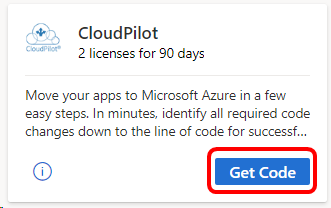
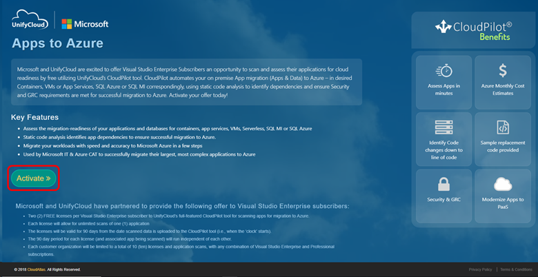
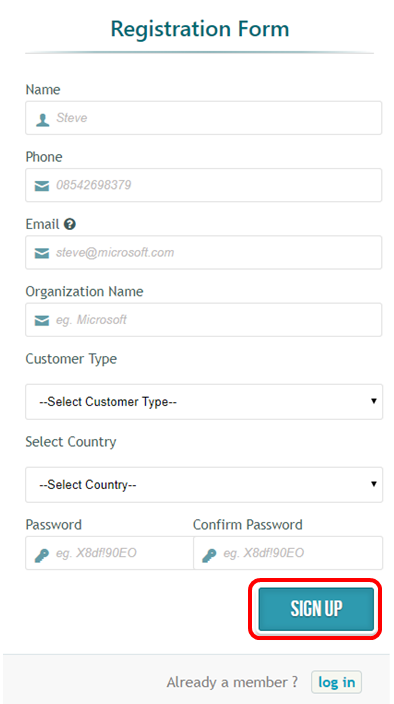
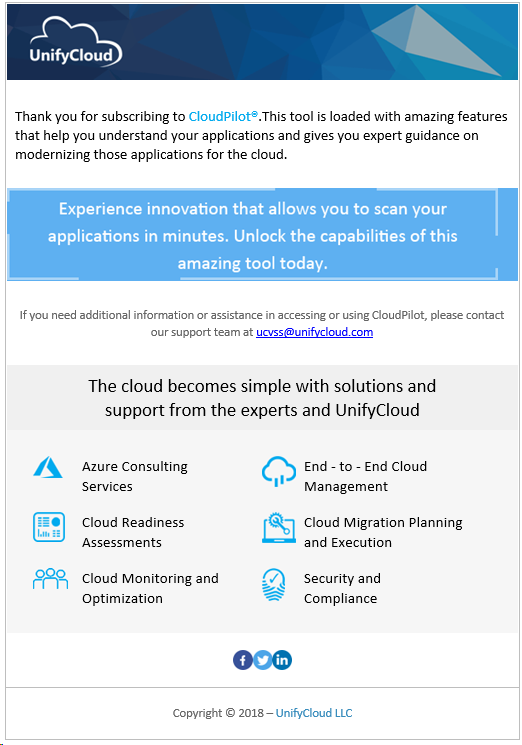

# The CloudPilot benefit in Visual Studio subscriptions
Move your apps to Microsoft Azure in a few easy steps. In minutes, identify all required code changes down to the line of code for successful migration to: Containers, VMs, App Services, SQL Azure, and/or SQL MI. Then, migrate apps to Azure using wizards leveraging ASR, DMA, and DMS.

## Overview
CloudPilot, by UnifyCloud, is designed to help developers quickly and easily move applications to Azure.  In a fraction of time a manual assessment would take, CloudPilot accurately determines Azure PaaS & IaaS migration costs and provides detailed recommendations, down to the line of code, on what code changes need to be made for the application to run in the Cloud. CloudPilot assists in the initial assessment of the Cloud migration effort and in development planning, in the re-factoring process by offering detailed code-level changes for the Cloud, and in the final testing against enterprise technology controls and policies.

## Activation steps
1. Sign in to [https://my.visualstudio.com/benefits](https://my.visualstudio.com/benefits?wt.mc_id=o~msft~docs).

2. Locate the CloudPilot benefit tile in the "Tools" category, and click on **Get Code**.

   > [!div class="mx-imgBorder"]
   > 

0. You will see a message letting you know your code has been retrieved successfully.  Click **Activate**, at which point you'll be redirected to the CloudPilot page where you can continue the activation process.  (If you do not choose to activate now, you can always come back to the CloudPilot tile in the subscription portal.  The "Get Code" link will change to "Activate", and clicking it will take you to the next step in the activation process.)

0. Check out the benefits of CloudPilot for your development efforts.  When you're ready, click the **Activate** button.

   > [!div class="mx-imgBorder"]
   > 

0. To create your account and activate your CloudPilot subscription, fill out the contact information in the web form, and click **SIGN UP**.

   > [!div class="mx-imgBorder"]
   > 

   > [!NOTE]
   > Activations of the CloudPilot benefit are limited to ten per organization, redeemed from any combination of Visual Studio Enterprise or Visual Studio Professional subscriptions.  If your organization's ten activations have already been consumed, you will be unable to activate the CloudPilot benefit and you'll receive an email from UnifyCloud with further information.

0. Next, you'll see a product page designed to familiarize you with CloudPilot.  Click the **Navigate to CloudPilot** in the upper right corner to go to the CloudPilot portal.

    > [!div class="mx-imgBorder"]
    > 

0. That's it!  You'll see the CloudPilot portal, and you'll be ready to start using your CloudPilot subscription to move your applications to Microsoft Azure.

0. As soon as your account is successfully created, you will receive an email from UnifyCloud VSS Support confirming the successful creation of your account.

    > [!div class="mx-imgBorder"]
    > 

## Eligibility

| Subscription Level                                                 |     Channels                                            | Benefit                                                          | Renewable?    |
|--------------------------------------------------------------------|---------------------------------------------------------|------------------------------------------------------------------|---------------|
| Visual Studio Enterprise (Standard)   | VL, Azure, Retail, | 2 licenses, 90 days, unlimited scans       |  No.  Available to new subscribers only          |
| Visual Studio Enterprise with GitHub Enterprise   | VL | 2 licenses, 90 days, unlimited scans       |  No.  Available to new subscribers only          |
| Visual Studio Professional (Standard) | VL, Azure, Retail                                       | 1 license, 30 days, one scan                                                            |  No.  Available to new subscribers only           |
| Visual Studio Professional with GitHub Enterprise | VL | 1 license, 30 days, one scan                                                            |  No.  Available to new subscribers only           |
| Visual Studio Test Professional (Standard)                         | VL, Retail                                              | Not available                                             |  N/A           |
| MSDN Platforms (Standard)                                          | VL, Retail                                              | Not available                                              |  N/A          |
| Visual Studio Enterprise (Standard)  | NFR1 |Not available  | N/A |
| Visual Studio Enterprise, Visual Studio Professional (monthly cloud) | Azure | Not available | N/A |

1  *Includes:  Not for Resale (NFR), FTE, Most Valuable Professional (MVP), Regional Director (RD), Microsoft Partner Network (MPN), Visual Studio Industry Partner (VSIP), Microsoft Certified Trainer, BizSpark, Imagine*

> [!NOTE]
> Microsoft no longer offers Visual Studio Professional Annual subscriptions and Visual Studio Enterprise Annual subscriptions in Cloud Subscriptions. There will be no change to existing customers experience and ability to renew, increase, decrease, or cancel their subscriptions. New customers are encouraged to go to [https://visualstudio.microsoft.com/vs/pricing/](https://visualstudio.microsoft.com/vs/pricing/) to explore different options to purchase Visual Studio.

Not sure which subscription you're using?  Connect to [https://my.visualstudio.com/subscriptions](https://my.visualstudio.com/subscriptions?wt.mc_id=o~msft~docs) to see all the subscriptions assigned to your email address. If you don't see all your subscriptions, you may have one or more assigned to a different email address.  You'll need to sign in with that email address to see those subscriptions.

## Support resources
- Need help with using CloudPilot?  Check out these resources:
  - [Contact UnifyCloud](https://www.unifycloud.com/contacts/) for inquiries about UnifyCloud products.
  - [CloudPilot User Manual](https://www.cloudatlasinc.com/cloudpilot/doc/CloudPilot-User-Manual.pdf )
  - [Submit a support request](https://support.datacamp.com/hc/requests/new)

- For assistance with sales, subscriptions, accounts and billing for Visual Studio Subscriptions, contact Visual Studio [Subscriptions Support](https://visualstudio.microsoft.com/subscriptions/support/).
- Have a question about Visual Studio IDE, Azure DevOps Services or other Visual Studio products or services?  Visit [Visual Studio Support](https://visualstudio.microsoft.com/support/).

## Next steps

If you haven't already activated the Azure DevTest individual credit benefit that comes with your subscription, visit [https://my.visualstudio.com/benefits](https://my.visualstudio.com/benefits?wt.mc_id=o~msft~docs) and click on the Azure tile in the Tools category to set up your Azure subscription and redeem your Azure DevTest individual credit.
