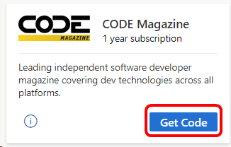
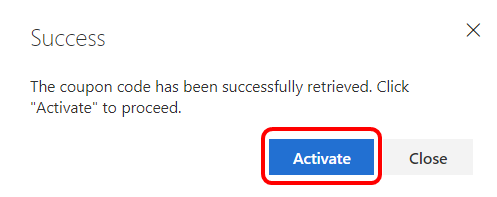
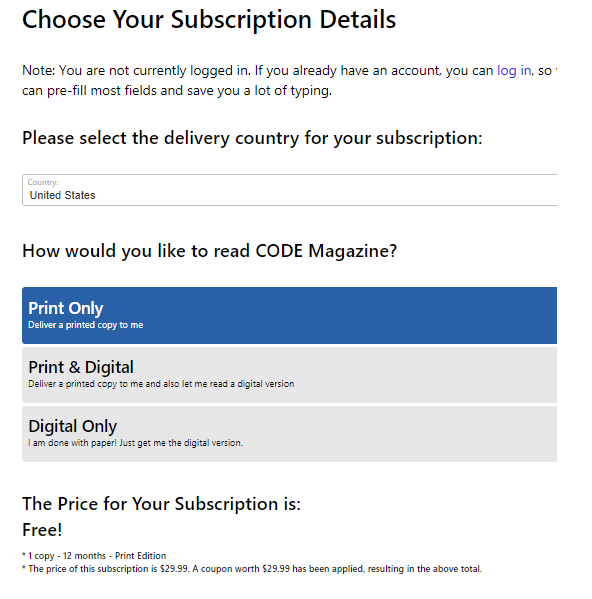
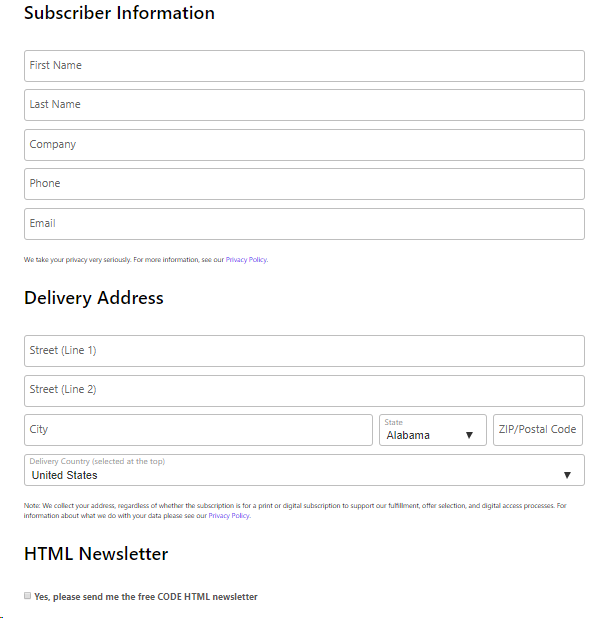

# CODE Magazine included in Visual Studio subscriptions

CODE Magazine is a leading independent software developer magazine covering dev technologies across all platforms.  Selected Visual Studio subscriptions are eligible to receive a one-year subscription to either the printed or digital editions of the magazine.

## Activation steps
The process to set up your CODE Magazine subscription is simple.  Just follow these steps:

1. Visit [https://my.visualstudio.com/benefits](https://my.visualstudio.com/benefits?wt.mc_id=o~msft~docs)
2. Locate the CODE Magazine tile in the Professional Development or Education section of your portal, and click **Get Code**.
   > [!div class="mx-imgBorder"]
   > 
3. You'll see a message that your code has been retrieved.  Click **Activate** to continue.  (If you're not ready to activate, that's okay.  You can always go back to the tile to activate.  The "Get Code" link will read "Activate" after you retrieve your code.)
   > [!div class="mx-imgBorder"]
   > 
4. You'll be redirected to the CODE Magazine landing page. Select your country/region and choose how you'd like to receive the magazine. 
   > [!NOTE]
   > Visual Studio Dev Essentials members have access to the digital subscription only. 
5. Based on your selections, you'll see a note showing the price of your subscription along with the amount of the coupon that's been applied.
   > [!NOTE]
   > For print subscriptions:
   > - Subscribers outside the United States may incur shipping charges. 
   > - Please allow several weeks for the delivery of your first printed edition.
      > [!div class="mx-imgBorder"]
      > 
6. Next, you'll need to provide your subscriber information and a delivery address.  (The delivery address is required even for digital subscriptions, as it supports fulfillment, offer selection, and digital access processes.)
7. If you live outside of the United States and chose to receive a printed magazine subscription, you may be asked to provide a billing address and payment information to cover the costs of shipping. 
8. You can opt in to CODE HTML Newsletter by clicking on the check box.
   > [!div class="mx-imgBorder"]
   > 
9. Click **Place Order** to complete your subscription.  
After you complete your subscription order, you'll see a confirmation page, including a link you can use to see which issues you've received: https://codemag.com/my/fulfillment. 

## Eligibility
| Subscription Level                                                 |     Channels                                            | Benefit                                                          | Renewable?    |
|--------------------------------------------------------------------|---------------------------------------------------------|------------------------------------------------------------------|---------------|
| Visual Studio Enterprise (Standard)   | VL, Azure, Retail| Available       |  No          |
| Visual Studio Enterprise subscription with GitHub Enterprise   | VL| Available       |  No          |
| Visual Studio Professional (Standard) | VL, Azure, Retail                                       | Available                                                            |  No          |
| Visual Studio Professional subscription with GitHub Enterprise | VL                                      | Available                                                            |  No          |
| Visual Studio Test Professional (Standard)                         | VL, Retail                                              | Available                                             |  No          |
| MSDN Platforms (Standard)                                          | VL, Retail                                              | Available                                              |  No          |
| Visual Studio Enterprise, Visual Studio Professional (monthly cloud) | Azure | Not available | N/A |
| Visual Studio Enterprise NFR1 | NFR | Not available | N/A |

1  *Includes:  Not for Resale (NFR), Visual Studio Industry Partner (VSIP), FTE, BizSpark, Imagine, Imagine Premium, Microsoft Partner Network (MPN), Most Valuable Professional (MVP), Regional Director (RD), MCT Software & Services Developer, MCT Software & Services.  

> [!NOTE]
> Microsoft no longer offers Visual Studio Professional Annual subscriptions and Visual Studio Enterprise Annual subscriptions in Cloud Subscriptions. There will be no change to existing customers experience and ability to renew, increase, decrease, or cancel their subscriptions. New customers are encouraged to go to [https://visualstudio.microsoft.com/vs/pricing/](https://visualstudio.microsoft.com/vs/pricing/) to explore different options to purchase Visual Studio.

Not sure which subscription you're using?  Connect to [https://my.visualstudio.com/subscriptions](https://my.visualstudio.com/subscriptions?wt.mc_id=o~msft~docs) to see all the subscriptions assigned to your email address. If you don't see all your subscriptions, you may have one or more assigned to a different email address.  You'll need to sign in with that email address to see those subscriptions.

## Frequently asked questions
### Q: If the subscription is free, why am I being asked for a credit card?  
A: It is cost-prohibitive to send free printed copies internationally.  Subscribers who choose the print edition of CODE magazine and reside outside of the United States will be charged a fee for shipping. To avoid shipping charges, choose the digital version of the magazine. 

### Q: Why do I need to provide a delivery address for a digital subscription?
A:  CODE Magazine collects your address, regardless of whether the subscription is for a print or digital subscription to support fulfillment, offer selection, and digital access processes.  For more information about what CODE Magazine does with your data, please see their [Privacy Policy](https://www.codemag.com/Home/Privacy).

## Support resources
- Have questions about your CODE Magazine subscription?  Contact [CODE Magazine](https://www.codemag.com/contact) via email or phone, or submit an online support request.
- For assistance with sales, subscriptions, accounts and billing for Visual Studio Subscriptions, contact [Visual Studio subscriptions support](https://my.visualstudio.com/gethelp).
- Have a question about Visual Studio IDE, Azure DevOps Services or other Visual Studio products or services?  Visit [Visual Studio Support](https://visualstudio.microsoft.com/support/).

## See also
- [Visual Studio documentation](/visualstudio/)
- [Azure DevOps documentation](/azure/devops/)
- [Azure documentation](/azure/)
- [Microsoft 365 documentation](/microsoft-365/)

## Next steps
Check out the rest of the great benefits included with your subscription. Visit [https://my.visualstudio.com/benefits](https://my.visualstudio.com/benefits?wt.mc_id=o~msft~docs).

If you haven't already activated the Azure DevTest individual credit benefit that comes with your subscription, visit [https://my.visualstudio.com/benefits](https://my.visualstudio.com/benefits?wt.mc_id=o~msft~docs) and click on the Azure tile in the Tools category to set up your Azure subscription and redeem your Azure DevTest individual credit.