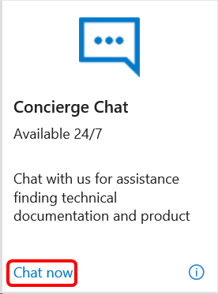
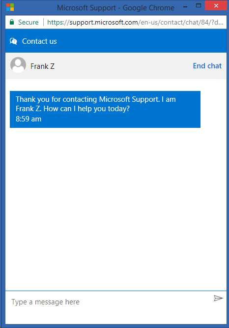

# Concierge Chat in Visual Studio subscriptions

The Concierge Chat service provides assistance finding product information and technical documentation and helps with using your Visual Studio subscription benefits.

The service is available 24/7, and is currently offered in English only (for questions other than accounts, billing, and subscriptions).

## Activation steps

Getting help via the Concierge Chat service is easy.
1. Sign in to [https://my.visualstudio.com/benefits](https://my.visualstudio.com/benefits?wt.mc_id=o~msft~docs).

2. Locate the Concierge Chat tile in the Support section of the benefits page and select on **Chat now**.
    > [!div class="mx-imgBorder"]
    > 

3. Select **Continue**.

4. A chat window opens, and you see a counter showing your position in the queue.

5. When an agent is available, the chat starts.
    > [!div class="mx-imgBorder"]
    > 

## Eligibility

| Subscription Level | Channels | Benefit  | Renewable?  |
|--------------------|----------|----------|-------------|
| Visual Studio Enterprise (Standard)   | VL, Azure, Retail,  selected NFR\* | Available |  Yes |
| Visual Studio Enterprise subscription with GitHub Enterprise | VL| Available |  Yes |
| Visual Studio Professional (Standard) | VL, Azure, Retail  | Available |  Yes |
| Visual Studio Professional subscription with GitHub Enterprise | VL | Available |  Yes |
| Visual Studio Test Professional (Standard) | VL, Retail | Available |  Yes |
| MSDN Platforms (Standard) | VL, Retail | Available |  Yes |
| Visual Studio Enterprise (monthly cloud), Visual Studio Professional (monthly cloud) | Azure | Not available | N/A |

\*  *Includes:  Not for Resale (NFR), Visual Studio Industry Partner (VSIP), Microsoft Certified Trainer, BizSpark.  Excludes:  FTE, Most Valuable Professional (MVP), Regional Director (RD), Microsoft Cloud Partner Program, Imagine.  Excludes:  NFR Basic*

> [!NOTE]
> Microsoft no longer offers Visual Studio Professional Annual subscriptions and Visual Studio Enterprise Annual subscriptions in Cloud Subscriptions. There will be no change to existing customers experience and ability to renew, increase, decrease, or cancel their subscriptions. New customers are encouraged to go to [https://visualstudio.microsoft.com/vs/pricing/](https://visualstudio.microsoft.com/vs/pricing/) to explore different options to purchase Visual Studio.

Not sure which subscription you're using?  Connect to [https://my.visualstudio.com/subscriptions](https://my.visualstudio.com/subscriptions?wt.mc_id=o~msft~docs) to see all the subscriptions assigned to your email address. If you don't see all your subscriptions, you may have one or more assigned to a different email address.  You need to sign in with that email address to see those subscriptions.

## Frequently asked questions

### Q:  Is the chat service available in multiple languages?

   A: Assistance with accounts, billing and subscriptions issues is available in multiple languages.  Assistance with locating product information and technical documentation is available in English.

## Support resources

+ For assistance with sales, subscriptions, accounts and billing for Visual Studio Subscriptions, contact [Visual Studio subscriptions support](https://my.visualstudio.com/gethelp).
+ Have a question about Visual Studio IDE, Azure DevOps Services or other Visual Studio products or services?  Visit [Visual Studio Support](https://visualstudio.microsoft.com/support/).

## See also

+ [Visual Studio documentation](/visualstudio/)
+ [Azure DevOps documentation](/azure/devops/)
+ [Azure documentation](/azure/)
+ [Microsoft 365 documentation](/microsoft-365/)

## Next steps

For more information about Microsoft tools and services, check out the documentation for:
+ [Azure](/azure/)
+ [Azure DevOps](/azure/devops/)
+ [Visual Studio IDE](/visualstudio/)

If you haven't already activated the Azure DevTest individual credit benefit that comes with your subscription, visit [https://my.visualstudio.com/benefits](https://my.visualstudio.com/benefits?wt.mc_id=o~msft~docs).  Select the Azure tile in the Tools category to set up your Azure subscription and redeem your Azure DevTest individual credit.