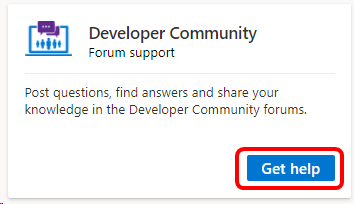

# Developer Community support forum in Visual Studio subscriptions
Post questions, find answers and share your knowledge in the Developer Community forums.

## Access the Developer Community
Connecting to the Developer Community is simple.
1. Sign in to the Visual Studio subscriptions portal at <https://my.visualstudio.com/benefits>
0. Find the **Developer Community** in the Support section, and click **Get help**.
(You can also point your browser directly to <https://developercommunity.visualstudio.com/>.)

   > [!div class="mx-imgBorder"]
   > 

You can search for answers, or view content in product areas such as:
- Visual Studio
- Visual Studio for Mac
- .NET
- C++
- Azure DevOps
- Azure DevOps Server (TFS)

Within each area, you'll find updates, problem reports, discussion of new features, and more. You can also report problems and request new features.  

## Eligibility
The Developer Community is freely available.  No subscription is required. 

## Support Resources
- Need assistance with sales, subscriptions, accounts and billing for Visual Studio Subscriptions?  Contact [Visual Studio subscriptions support](https://my.visualstudio.com/gethelp).
- Have a question about Visual Studio IDE, Azure DevOps Services or other Visual Studio products or services?  Visit [Visual Studio Support](https://visualstudio.microsoft.com/support/).

## See also
- [Visual Studio documentation](/visualstudio/)
- [Azure DevOps documentation](/azure/devops/)
- [Azure documentation](/azure/)
- [Microsoft 365 documentation](/microsoft-365/)

## Next steps
Check out the other support resources available, including:
- [Concierge Chat](vs-concierge-chat.md)
- [Microsoft Q&A](vs-microsoft-qa.md)
- [Microsoft Tech Community](vs-microsoft-tech-community.md)
- [Azure Community](vs-azure-community.md)
