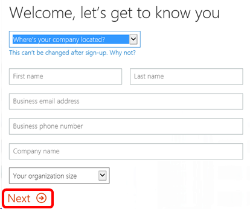
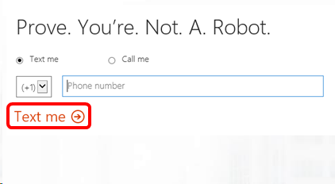
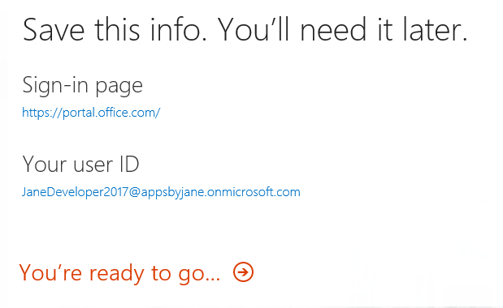

# Enterprise Mobility + Security (EMS) in Visual Studio Subscriptions

Visual Studio Enterprise annual cloud and standard subscriptions include Enterprise Mobility + Security (EMS).  Secure and manage your identities, devices, apps and data with EMS - Azure Active Directory, Microsoft Intune, Azure Information Protection, Microsoft Advanced Threat Analytics, and Microsoft Cloud App Security.

> [!NOTE]
> If you purchase a multi-year subscription through volume licensing, the EMS benefit is currently only available in the first year.

## Activation Steps

To use EMS, you’ll need to set up an account or sign in using an existing account.

1. Sign in to [https://my.visualstudio.com/benefits](https://my.visualstudio.com/benefits?wt.mc_id=o~msft~docs).

2. Locate the Enterprise Mobility & Security tile in the Tools section and click on the **Get Code** link at the bottom of the tile.   You’ll receive a notification that the code was successfully retrieved.  Click **Activate**.
   > [!div class="mx-imgBorder"]
   > 

3. On the Enterprise Mobility + Security E5 page, you can either sign in with an existing subscription or create a new one.  To create a new one, complete the information requested  and click **Next**.
   > [!div class="mx-imgBorder"]
   > 

4. Create your user ID and password.  Click **Create my account** to continue.
   > [!div class="mx-imgBorder"]
   > 

5. Next, provide a phone number to receive a verification code by phone or text.  Enter the code and click **Next**.
   > [!div class="mx-imgBorder"]
   > 

6. The next page will display your sign-in page and user ID.  Save that information for later use.  Click **You’re ready to go…**
   > [!div class="mx-imgBorder"]
   > 

7. EMS requires access to the Microsoft [Azure Portal](https://azure.microsoft.com).  Follow the three steps on the EMS landing page to activate your Azure subscription, add users and configure EMS.

## Eligibility

| Subscription Level                                                 |     Channels                                            | Benefit                                                          | Renewable?    |
|--------------------------------------------------------------------|---------------------------------------------------------|------------------------------------------------------------------|---------------|
| Visual Studio Enterprise (Standard)   | VL, Azure, Retail,  selected NFR1 | Available       |  Yes          |
| Visual Studio Professional (Standard2) | VL, Azure, Retail                                       | Available                                                            |  Yes          |
| Visual Studio Test Professional (Standard)                         | VL, Retail                                              | Not available                                             |  N/A          |
| MSDN Platforms (Standard)                                          | VL, Retail                                              | Not available                                              |  N/A          |
| Visual Studio Enterprise, Visual Studio Professional (monthly cloud) | Azure | Not available | N/A |

1  *Includes:  Not for Resale (NFR), Visual Studio Industry Partner (VSIP), Microsoft Partner Network (MPN), FTE, MCT Software & Services Developer, BizSpark.  Excludes: Most Valuable Professional (MVP), Regional Director (RD), MCT Software & Services, Imagine, Microsoft Partner Network (Professional).*

2 *Excludes Microsoft Partner Network (Professional)*

> [!NOTE]
> Microsoft no longer offers Visual Studio Professional Annual subscriptions and Visual Studio Enterprise Annual subscriptions in Cloud Subscriptions. There will be no change to existing customers experience and ability to renew, increase, decrease, or cancel their subscriptions. New customers are encouraged to go to [https://visualstudio.microsoft.com/vs/pricing/](https://visualstudio.microsoft.com/vs/pricing/) to explore different options to purchase Visual Studio.

Not sure which subscription you're using?  Connect to [https://my.visualstudio.com/subscriptions](https://my.visualstudio.com/subscriptions?wt.mc_id=o~msft~docs) to see all the subscriptions assigned to your email address. If you don't see all your subscriptions, you may have one or more assigned to a different email address.  You'll need to sign in with that email address to see those subscriptions.

## Support resources
- Need help with EMS?  Check out the online [EMS documentation](/enterprise-mobility-security/).
- For technical support with any component of EMS, please visit the [EMS Support FAQ](https://docs.microsoft.com/enterprise-mobility-security/solutions/ems-support-faq) to find the right support for your question.
- For assistance with sales, subscriptions, accounts and billing for Visual Studio Subscriptions, contact Visual Studio [Subscriptions Support](https://visualstudio.microsoft.com/subscriptions/support/).
- Have a question about Visual Studio IDE, Azure DevOps Services or other Visual Studio products or services?  Visit [Visual Studio Support](https://visualstudio.microsoft.com/support/).