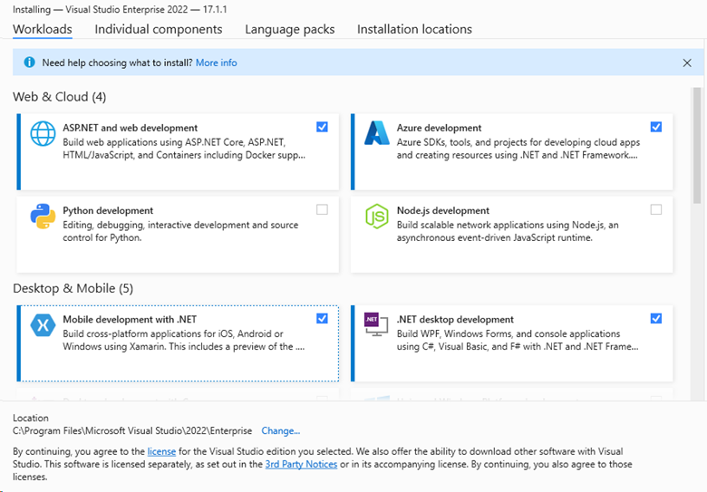
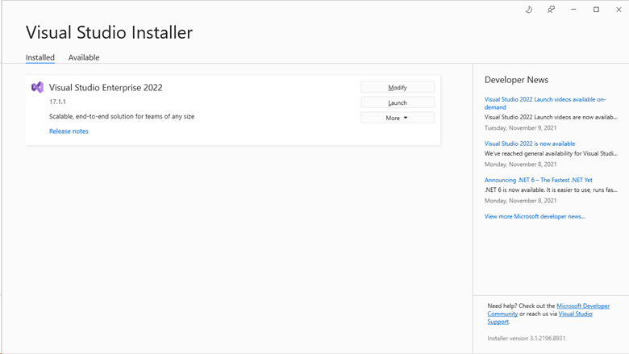
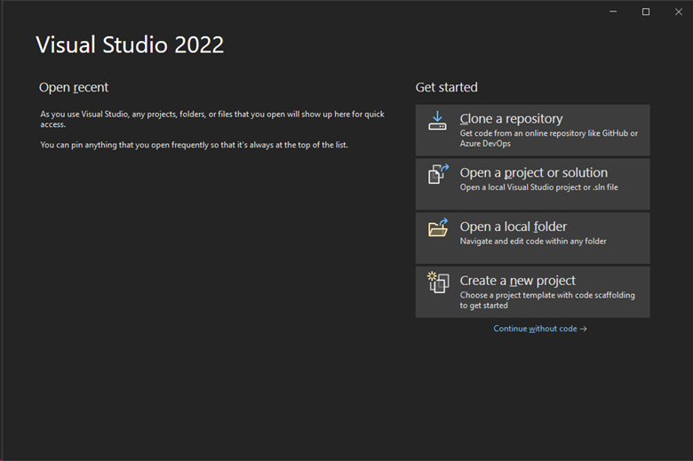

# The Visual Studio IDE

As a Visual Studio subscriber, you have access to the Visual Studio integrated development environment (IDE). Your IDE version depends on the level of your subscription. The benefit appears as a tile in the **Tools** category on the **Benefits included in my subscription** page of the [Visual Studio subscription portal](https://my.visualstudio.com/benefits?wt.mc_id=o~msft~docs).

## Download and install the IDE

Here's how to download and install the IDE for your version of Visual Studio. We used Visual Studio Enterprise in this example.

1. Sign in to the [Visual Studio Subscriptions](https://my.visualstudio.com/benefits?wt.mc_id=o~msft~docs) portal.

1. Select the **Tools** tab, look for the Visual Studio IDE tile, and then select the **Download** button below it. You can also download the IDE from the [Downloads](https://my.visualstudio.com/downloads?wt.mc_id=o~msft~docs) page.

   

   You’re redirected to the **Downloads** page for Visual Studio, where you can download the IDE and obtain a product key to activate it. Alternatively, you can claim a product key by selecting **Get Key**, or you can claim a key later on the [Your Product Keys](https://my.visualstudio.com/productkeys) page.

1. On the **Downloads** page, select the **Details** tab, and then do the following:

   a. Select your architecture: **x86** or **x64**. 
   b. Select your language preference. 
   c. Select **Download**.

   

1. Select the downloaded installer package and then, at the prompt, select **Run**.

1. On the **User Account Control** pane, select **Yes**.

1. Select **Continue** to accept the license terms.

1. When the installer starts, select the **Workloads**, **Individual components**, and **Language packs** tabs to choose your customization options.

   

1. Select **Install**.

   When the installation is complete, you can either modify the installation or start Visual Studio. 

1. To start Visual Studio, select **Launch**. If multiple versions are installed, they're listed on the **Visual Studio Installer** pane.

   

1. Sign in with the account associated with your Visual Studio subscription.

1. Choose your preferred theme, and then select **Start Visual Studio**.

   Visual Studio opens. You're ready to start using it right away!

   

## Eligibility

| Subscription level | Channels | Benefit | Renewable? |
| --- | --- | --- | --- |
| Visual Studio Enterprise (Standard, monthly cloud) | VL, Azure, Retail, selected NFR\* | Available | Yes |
| Visual Studio Enterprise subscription with GitHub Enterprise | VL | Available | Yes |
| Visual Studio Professional (Standard, monthly cloud) | VL, Azure, Retail | Available | Yes |
| Visual Studio Professional subscription with GitHub Enterprise | VL | Available | Yes |
| Visual Studio Test Professional (Standard) | All | Not available | N/A |
| MSDN Platforms (Standard) | All | Not available | N/A |

\* Includes the following subscriptions: *Not for Resale (NFR), NFR Basic, Visual Studio Industry Partner (VSIP), Microsoft Cloud Partner Program, FTE, MCT Software & Services Developer, Imagine, Most Valuable Professional (MVP), Regional Director (RD)*.

> [!NOTE]
> Microsoft no longer offers Visual Studio Professional annual subscriptions and Visual Studio Enterprise annual subscriptions in cloud subscriptions. If you're a current customer, there is no change to your ability to renew, increase, decrease, or cancel your subscription. If you're a new customer, we encourage you to go to the [Buy Visual Studio](https://visualstudio.microsoft.com/vs/pricing/) page to explore the various purchase options.

Not sure which subscription you're using? Go to the [Your Subscriptions](https://my.visualstudio.com/subscriptions?wt.mc_id=o~msft~docs) page to see all the subscriptions that are assigned to your email address. If you don't see all your subscriptions, one or more might be assigned to a different email address. You need to sign in with that other email address to view those subscriptions.

> [!IMPORTANT]
> Visual Studio for Mac was retired on August 31, 2024 in accordance with [Microsoft’s Modern Lifecycle Policy](https://learn.microsoft.com/lifecycle/policies/modern).
>
> [Learn more about support timelines and alternatives](/visualstudio/mac/what-happened-to-vs-for-mac).

## Support resources

If you have questions about Visual Studio or need technical assistance, check the resources in the following sections.

### Visual Studio IDE technical support

For Visual Studio IDE technical issues or questions, contact [Visual Studio technical support](https://visualstudio.microsoft.com/vs/support/). Before you use the limited Visual Studio [technical support incidents](vs-tech-support.md) that might be included with your Visual Studio subscription, we suggest trying some other online resources:

+ For installation problems, see the step-by-step guidance in [Troubleshoot Visual Studio installation and upgrade issues](https://learn.microsoft.com/visualstudio/install/troubleshooting-installation-issues). 

 You can also try the [installation chat](https://visualstudio.microsoft.com/vs/support/#talktous) (English only) support option.

+ Review tutorials, troubleshooting guides, and helpful resources within [Visual Studio IDE documentation](https://learn.microsoft.com/visualstudio/ide/).

+ Search the online [Developer Community](https://developercommunity.visualstudio.com/), and get expert answers via a community-supported forum. 
 
 You can search keywords, read, vote, and comment, all without logging in. If you don’t find what you need with a search, you can suggest a feature or report a problem from the navigation menu. 
  
 To submit a feature request, you need to sign in to fill out and post the report. To report a problem or bug, you need to have a running instance of Visual Studio.

+ Search the [Stack Overflow public Q&A site](https://stackoverflow.com/questions/tagged/visual-studio?tab=Newest) for answers to already-asked questions that are tagged with *\[visual-studio]*, or sign up for an account and ask a new question.

### Technical support incidents

If you exhaust the preceding options and still don’t have an answer, open a Visual Studio technical support ticket. To do so, go to the Benefits page on the [Visual Studio Subscriptions portal](https://my.visualstudio.com/Benefits), select the **Support** tab, and then select the **Technical Support** benefit tile. For more information, see [Technical Support benefit](vs-tech-support.md). 

> [!NOTE]
> Technical support is not available with all subscriptions. To learn what's included with your subscription, see [Compare Visual Studio subscription benefits](https://visualstudio.microsoft.com/vs/benefits/#azure?cat=visual-studio-enterprise-subscription).

### Visual Studio subscription support
For assistance with sales, subscriptions, accounts, and billing, contact [Visual Studio subscription support](https://my.visualstudio.com/gethelp).

## See also

+ [Visual Studio documentation](/visualstudio/)
+ [Azure DevOps Services documentation](/azure/devops/)
+ [Azure documentation](/azure/)
+ [Microsoft 365 documentation](/microsoft-365/)

## Next steps

After you install Visual Studio, be sure to activate these important benefits:

+ [Azure DevOps](vs-azure-devops.md)
+ [Azure DevTest offer/credits](/azure/devtest/offer/)
+ [Windows Developer account](vs-windows-dev.md)
