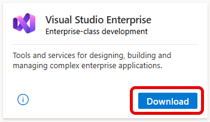
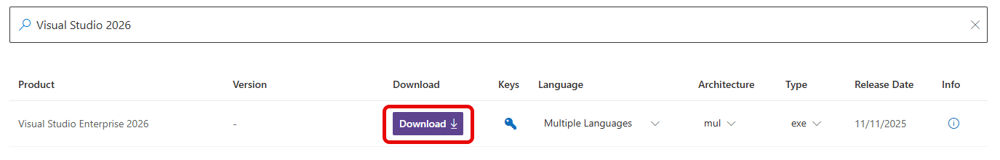
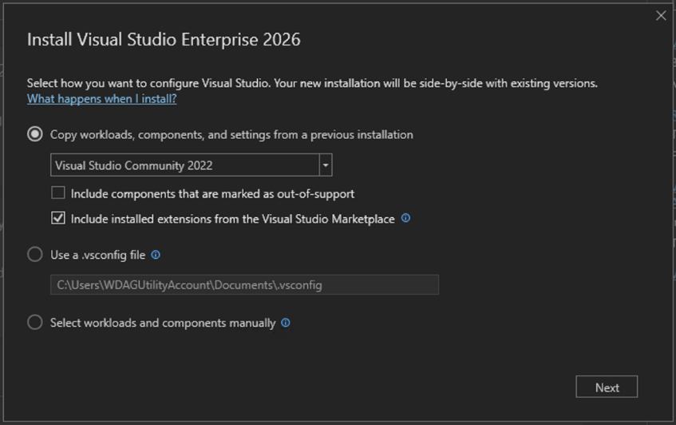
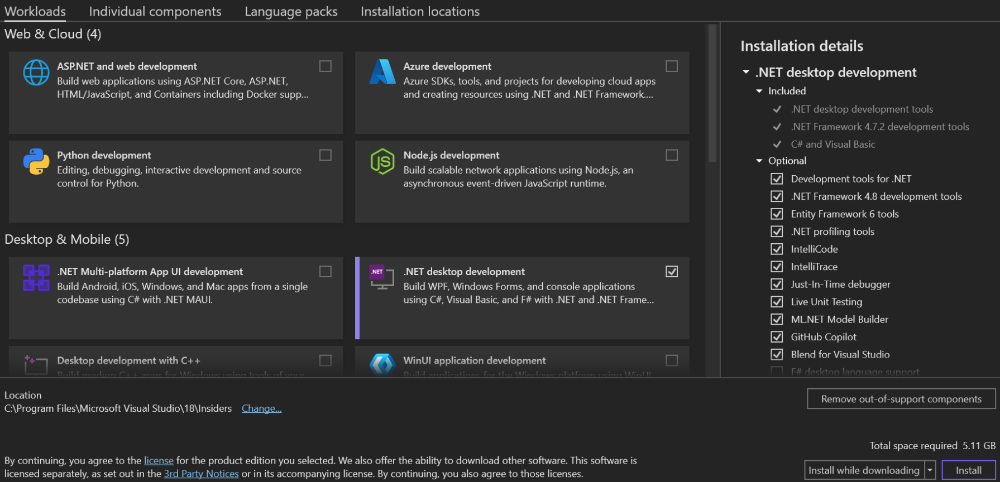
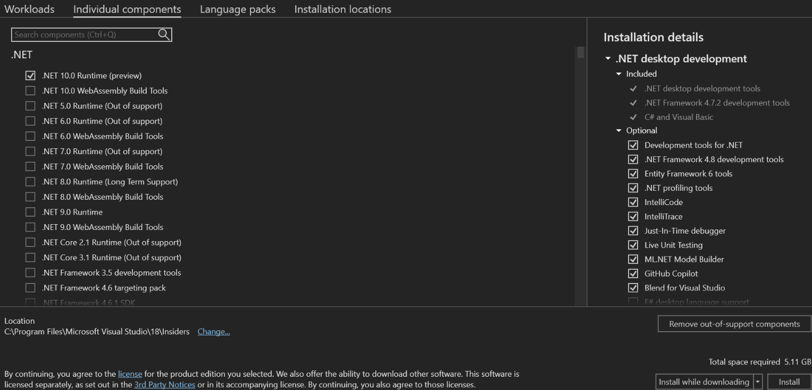
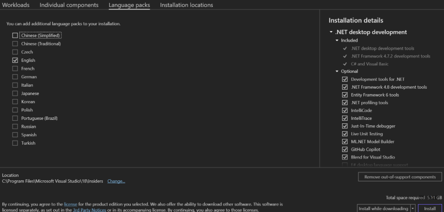
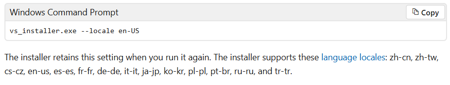

# The Visual Studio IDE

As a Visual Studio subscriber, you have access to the Visual Studio integrated development environment (IDE). Your IDE version depends on the level of your subscription. The benefit appears as a tile in the **Tools** category on the **Benefits included in my subscription** page of the [Visual Studio subscription portal](https://my.visualstudio.com/benefits?wt.mc_id=o~msft~docs).

## Download and install the IDE

Here's how to download and install the IDE for your version of Visual Studio. We used Visual Studio Enterprise in this example.

1. Sign in to the [Visual Studio Subscriptions](https://my.visualstudio.com/benefits?wt.mc_id=o~msft~docs) portal.

1. Select the **Tools** tab, look for the Visual Studio IDE tile, and then select the **Download** button below it. You can also download the IDE from the [Downloads](https://my.visualstudio.com/downloads?wt.mc_id=o~msft~docs) page.

   

   Product Key isn't available for all levels of subscriptions as the primary channel for authentication to the IDE should be your sign in.

1. On the **Downloads** page, select your architecture: **x86** or **x64** and language preference if applicable then select **Download**.

   

1. Select the downloaded installer package and then, at the prompt, select **Run**.

1. If you see a **User Account Control** pane, select **Yes**.

1. Select **Continue** to accept the license terms.

1. If you have other versions of Visual Studio installed, the installer gives you flexible options to move forward without losing your previous environment. You can migrate a previous Visual Studio 2022 configuration to copy workloads, SDKs, toolsets, and components, start a new install with the workloads and components you select, or [import your configuration](https://learn.microsoft.com/visualstudio/install/import-export-installation-configurations?view=visualstudio) from an exported `.vsconfig` file. 

   

Visual Studio Installer Opens. You can also install any product that's listed on the [Visual Studio Installer Available tab](https://learn.microsoft.com/visualstudio/install/install-visual-studio-versions-side-by-side?view=visualstudio#install-different-editions-of-the-same-major-visual-studio-version-side-by-side).

8. Select how to configure your Visual Studio installation. When you install Visual Studio 2026 or later, the installer provides options to copy previous Visual Studio environments. There are a few ways to configure the installation:

   + **Manually chose workloads and components**
        Start from scratch and manually choose the workloads and components you want to install.
   + **Migrate my configuration from this product version**
        Chose an existing Visual Studio instance (2022 or later) to copy workload, SDKs, toolsets, settings, and extensions into the new Visual Studio environment.
   + **Import my configuration from a `.vsconfig` file**
        Use a previously exported file. Importing a `.vsconfig` file helps standardize development environments across multiple machines. Learn more: [Importing and exporting installation configurations](https://learn.microsoft.com/visualstudio/install/import-export-installation-configurations?view=visualstudio).

> [!NOTE]
> Only [Marketplace](https://marketplace.visualstudio.com/items?itemName=ms.feed) **extensions** from a previous Visual Studio installation can be copied into Visual Studio. **Settings** are imported via a `.vssettings` file. Some **out-of-support workloads and components** are no longer supported in Visual Studio. The installer allows you to include or remove workloads and components during setup. 
>
> Out-of-support components might not function correctly in the new version. It's recommended to review these carefully before proceeding with installation.

9. When the installer starts, select the **Workloads** tabs to choose your customization options.

   

1. Select **Install**. 

1. Next, a status screen that shows the progress of your Visual Studio installation appears.  

> [!TIP]
> At any time after installation, you can install workloads or components that didn't get installed previously. If Visual Studio opens, go to **Tools > Get Tools and Features**, which opens the Visual Studio Installer. Or open the **Visual Studio Installer** from the **Start** menu. From there, choose the workloads or components to install. Then choose **Modify**.

12. Choose individual components (optional). If you don't want to use the Workloads feature to customize the Visual Studio installation, or to add more components than a workload install, individual components from the **Individual components** tab can be installed by following the prompts.
 
    

1. By default, the installer program tries to match the language of the operating system when it runs for the first time. To install Visual Studio in a chosen language, go to the **Language packs** tab from the Visual Studio Installer, and then follow the prompts. This step is optional. 
 
    

    The default language can be changed by running the installer at a command prompt. For example, you can force the installer to run in English by using the following command:

    

14. Select the installation location (optional). You can reduce the installation footprint of Visual Studio on your system drive. For more information, see [Select installation locations](https://learn.microsoft.com/visualstudio/install/change-installation-locations?view=visualstudio).

    

> [!IMPORTANT]
> A different drive for the **Visual Studio IDE** or the **Download cache** can be chosen only when initially installing Visual Studio. If changing drives are necessary, Visual Studio must be uninstalled and reinstalled.
>
> If Visual Studio was installed on the computer before, the user won't be able to change the **Shared components, tools, and SDKs** path. It appears dimmed. This location is shared by all installations of Visual Studio. 

15. To start Visual Studio, select **Launch**. If multiple versions are installed, they're listed on the **Visual Studio Installer** pane.

1. Sign in with the account associated with your Visual Studio subscription.

   Visual Studio opens. You're ready to start using it right away!

## Eligibility

| Subscription level | Channels | Benefit | Renewable? |
| --- | --- | --- | --- |
| Visual Studio Enterprise (Standard, monthly cloud) | VL, Azure, Retail, selected NFR\* | Available | Yes |
| Visual Studio Enterprise subscription with GitHub Enterprise | VL | Available | Yes |
| Visual Studio Professional (Standard, monthly cloud) | VL, Azure, Retail | Available | Yes |
| Visual Studio Professional subscription with GitHub Enterprise | VL | Available | Yes |
| Visual Studio Test Professional (Standard) | All | Not available | N/A |
| MSDN Platforms (Standard) | All | Not available | N/A |

\* Includes the following subscriptions: *Not for Resale (NFR), NFR Basic, Visual Studio Industry Partner (VSIP), Microsoft Cloud Partner Program, FTE, MCT Software & Services Developer, Imagine, Most Valuable Professional (MVP), Regional Director (RD)*.

> [!NOTE]
> Microsoft no longer offers Visual Studio Professional annual subscriptions and Visual Studio Enterprise annual subscriptions in cloud subscriptions. If you're a current customer, there's no change to your ability to renew, increase, decrease, or cancel your subscription. If you're a new customer, we encourage you to go to the [Buy Visual Studio](https://visualstudio.microsoft.com/vs/pricing/) page to explore the various purchase options.

Not sure which subscription you're using? Go to the [Your Subscriptions](https://my.visualstudio.com/subscriptions?wt.mc_id=o~msft~docs) page to see all the subscriptions that are assigned to your email address. If you don't see all your subscriptions, one or more might be assigned to a different email address. You need to sign in with that other email address to view those subscriptions.

> [!IMPORTANT]
> Visual Studio for Mac was retired on August 31, 2024 in accordance with [Microsoft’s Modern Lifecycle Policy](https://learn.microsoft.com/lifecycle/policies/modern).
>
> [Learn more about support timelines and alternatives](/visualstudio/mac/what-happened-to-vs-for-mac).

## Support resources

If you have questions about Visual Studio or need technical assistance, check the resources in the following sections.

### Visual Studio IDE technical support

For Visual Studio IDE technical issues or questions, contact [Visual Studio technical support](https://visualstudio.microsoft.com/vs/support/). Before you use the limited Visual Studio [technical support incidents](vs-tech-support.md) that might be included with your Visual Studio subscription, we suggest trying some other online resources:

+ For installation problems, see the step-by-step guidance in [Troubleshoot Visual Studio installation and upgrade issues](https://learn.microsoft.com/visualstudio/install/troubleshooting-installation-issues). 

 You can also try the [installation chat](https://visualstudio.microsoft.com/vs/support/#talktous) (English only) support option.

+ Review tutorials, troubleshooting guides, and helpful resources within [Visual Studio IDE documentation](https://learn.microsoft.com/visualstudio/ide/).

+ Search the online [Developer Community](https://developercommunity.visualstudio.com/), and get expert answers via a community-supported forum. 
 
 You can search keywords, read, vote, and comment, all without logging in. If you don’t find what you need with a search, you can suggest a feature or report a problem from the navigation menu. 
  
 To submit a feature request, you need to sign in to fill out and post the report. To report a problem or bug, you need to have a running instance of Visual Studio.

+ Search the [Stack Overflow public Q&A site](https://stackoverflow.com/questions/tagged/visual-studio?tab=Newest) for answers to already-asked questions that are tagged with *\[visual-studio]*, or sign up for an account and ask a new question.

### Technical support incidents

If you exhaust the preceding options and still don’t have an answer, open a Visual Studio technical support ticket. To do so, go to the Benefits page on the [Visual Studio Subscriptions portal](https://my.visualstudio.com/Benefits), select the **Support** tab, and then select the **Technical Support** benefit tile. For more information, see [Technical Support benefit](vs-tech-support.md). 

> [!NOTE]
> Technical support isn't available with all subscriptions. To learn what's included with your subscription, see [Compare Visual Studio subscription benefits](https://visualstudio.microsoft.com/vs/benefits/#azure?cat=visual-studio-enterprise-subscription).

### Visual Studio subscription support
For assistance with sales, subscriptions, accounts, and billing, contact [Visual Studio subscription support](https://my.visualstudio.com/gethelp).

## See also

+ [Visual Studio documentation](/visualstudio/)
+ [Azure DevOps Services documentation](/azure/devops/)
+ [Azure documentation](/azure/)
+ [Microsoft 365 documentation](/microsoft-365/)

## Next steps

After you install Visual Studio, be sure to activate these important benefits:

+ [Azure DevOps](vs-azure-devops.md)
+ [Azure DevTest offer/credits](/azure/devtest/offer/)
+ [Windows Developer account](vs-windows-dev.md)
