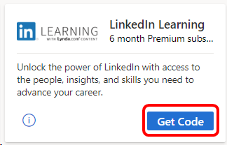
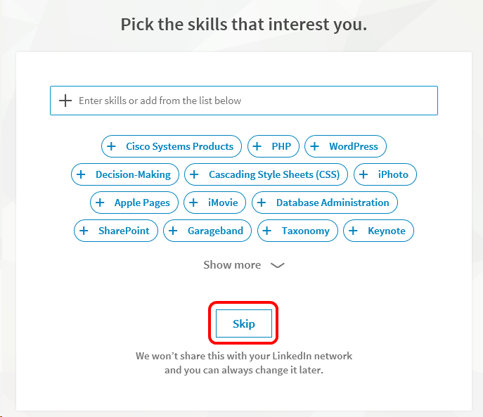
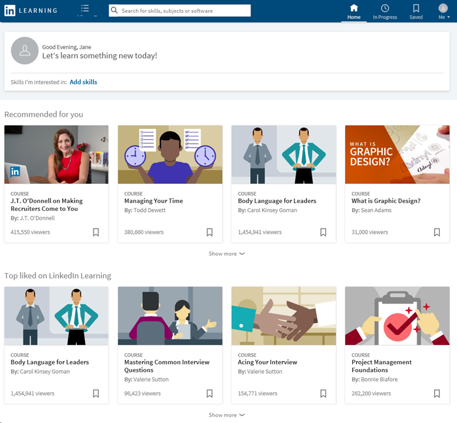

# The LinkedIn Learning benefit in Visual Studio subscriptions

Unlock the power of LinkedIn with access to the people, insights, and skills you need to advance your career. Learn the most in-demand business, tech, and creative skills from industry experts.

Selected Visual Studio subscriptions include a subscription to LinkedIn Premium, which includes LinkedIn Learning. The length of your Premium subscription depends on the type of Visual Studio subscription you have.

You need to have a LinkedIn account to take advantage of your LinkedIn Learning benefit. If you don't have one already, you have a chance to create one before you activate your Premium subscription.

> [!IMPORTANT]
> These offer can't be combined with other LinkedIn Learning offers. No more than two of these offers might be claimed in a single calendar year, regardless of source.

## Activation steps

To activate your LinkedIn Premium subscription and LinkedIn Learning benefit:
1. Sign in to [https://my.visualstudio.com/benefits](https://my.visualstudio.com/benefits?wt.mc_id=o~msft~docs).

0. Locate the LinkedIn Learning tile in the Education category, and select the **Get code** link.
   > [!div class="mx-imgBorder"]
   > 

0. If you already have a LinkedIn account, enter your username and password, and then select **Sign in**. Skip to [this step](#activate-your-offer) to activate your offer. If you don't have an account, follow the steps in the next section to create one. 

### Create a LinkedIn account

1. If you don’t already have a LinkedIn account, select **Join now**.

0. Enter your personal information, choose a username and password, and select **Join now**.

0. Specify your country/region and ZIP code, then select **Next**.

0. Next, you provide some information about yourself for your profile. Indicate whether you’re a student, and provide your most recent job title, company, and industry.

0. In this step, you have the chance to identify areas of interest to you. To expedite the account creation process, select **Not sure yet.  I’m open!** (You can identify areas of interest later.)

0. When you provided your email address, you were sent a message containing a confirmation code. The message is from “LinkedIn Messages.” Enter the code from the message and select **Verify**. If you don’t find it in your inbox, check your junk mail folders.  

0. If you would like to import your contacts from the email account you entered earlier, you can do that now. Otherwise, select **Skip**. (If you choose to skip this step, you're asked to confirm your choice. Select **Yes**.)

0. Job alerts allow you to be notified of jobs in your area that might be a good fit for you. You can choose to set a job alert now, or skip this step to continue creating your account.

0. Based on the preferences and personal information you’ve provided thus far, you see a selection of recommended connections to start building your network. You can choose to add connections, or skip this step.

0. To add a photo to your profile, select **Upload photo**. Otherwise, you can skip this step. (You can always add a photo later.)

0. You can download the LinkedIn App to your phone to have access to your network anywhere. You can send a link to your phone, or download directly from the App Store or Google Play. You can also select **Next** to skip this step now, and download the app later.

### Activate your offer

1. Now that you’ve either signed in to your LinkedIn account or created a new one, you’re ready to activate your Premium subscription. Select **Activate your offer**.
   > [!div class="mx-imgBorder"]
   > 

0. You can begin exploring skills that interest you. Choose from the list of recommendations, search for other skills, or select **Skip** to continue without choosing skills.
   > [!div class="mx-imgBorder"]
   > 

0. You’ve successfully activated your Premium subscription offer and can now begin using LinkedIn Learning and all the other benefits of Premium!
   > [!div class="mx-imgBorder"]
   > 

> [!NOTE]
> This offer isn't included in Visual Studio Dev Essentials memberships.

## Eligibility

| Subscription Level | Channels | Benefit | Renewable? |
|--------------------|----------|---------|------------|
| Visual Studio Enterprise (Standard)   | VL, Azure, Retail\* | Six months |  No.  Available to new subscribers only |
| Visual Studio Enterprise subscription with GitHub Enterprise   | VL | Six months |  No.  Available to new subscribers only |
| Visual Studio Professional (Standard) | VL, Azure, Retail | Three months | No.  Available to new subscribers only |
| Visual Studio Professional subscription with GitHub Enterprise | VL | Three months | No.  Available to new subscribers only |
| Visual Studio Test Professional (Standard) | VL, Retail | Not available |  NA |
| MSDN Platforms (Standard) | VL, Retail | Not available | NA |
| Visual Studio Enterprise, Visual Studio Professional (monthly cloud) | Azure | Not available | NA |

\*  *Excludes: NFR, NFR Basic, Visual Studio Industry Partner, Microsoft Cloud Partner Program, FTE, MCT Software & Services Developer, Imagine, Most Valuable Professional (MVP), Regional Director (RD).*

> [!NOTE]
> Microsoft no longer offers Visual Studio Professional Annual subscriptions and Visual Studio Enterprise Annual subscriptions in Cloud Subscriptions. There will be no change to existing customers experience and ability to renew, increase, decrease, or cancel their subscriptions. New customers are encouraged to go to [https://visualstudio.microsoft.com/vs/pricing/](https://visualstudio.microsoft.com/vs/pricing/) to explore different options to purchase Visual Studio.

Not sure which subscription you're using? Connect to [https://my.visualstudio.com/subscriptions](https://my.visualstudio.com/subscriptions?wt.mc_id=o~msft~docs) to see all the subscriptions assigned to your email address. If you don't see all your subscriptions, you might have one or more assigned to a different email address. You need to sign in with that email address to see those subscriptions.

## Frequently asked questions

### Q: If I renew my subscription, does my LinkedIn Learning benefit also renew?

A:  No, the LinkedIn Learning offer is available to new subscribers only.

## Support resources

+ Need help with LinkedIn Learning? Check out these resources:
  + Help with [using LinkedIn Learning](https://www.linkedin.com/help/learning).
  + Help with general questions about [LinkedIn](https://www.linkedin.com/help/linkedin) such as creating accounts and profiles, and maintaining your network.
+ For assistance with sales, subscriptions, accounts, and billing for Visual Studio Subscriptions, contact [Visual Studio subscriptions support](https://my.visualstudio.com/gethelp).
+ Have a question about Visual Studio IDE, Azure DevOps Services, or other Visual Studio products or services? Visit [Visual Studio Support](https://visualstudio.microsoft.com/support/).

## See also

+ [Visual Studio documentation](/visualstudio/)
+ [Azure DevOps documentation](/azure/devops/)
+ [Azure documentation](/azure/)
+ [Microsoft 365 documentation](/microsoft-365/)

## Next steps

+ Check out the rest of the great benefits included with your subscription. Visit [https://my.visualstudio.com/benefits](https://my.visualstudio.com/benefits?wt.mc_id=o~msft~docs).
+ Activate the Azure DevTest individual credit benefit that comes with most subscriptions. Visit [https://my.visualstudio.com/benefits](https://my.visualstudio.com/benefits?wt.mc_id=o~msft~docs) and select on the Azure tile in the Tools category to redeem your Azure DevTest individual credit.