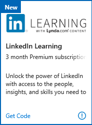

# The LinkedIn Learning benefit in Visual Studio subscriptions

Unlock the power of LinkedIn with access to the people, insights, and skills you need to advance your career.  Learn the most in-demand business, tech and creative skills from industry experts.

Selected Visual Studio subscriptions include a subscription to LinkedIn Premium, which includes LinkedIn Learning.  The length of your Premium subscription depends on the type of Visual Studio subscription you have.
You will need to have a LinkedIn account to take advantage of your LinkedIn Learning benefit.  If you don't have one already, you'll have a chance to create one before you activate your Premium subscription.

## Activation steps
To activate your LinkedIn Premium subscription and LinkedIn Learning benefit:
1. Sign in to [https://my.visualstudio.com/benefits](https://my.visualstudio.com/benefits?wt.mc_id=o~msft~docs).

2. Locate the LinkedIn Learning tile in the Education category, and click the **Get code** link.
   > [!div class="mx-imgBorder"]
   > 

3. If you already have a LinkedIn account and you’re signed in automatically, you’ll immediately be taken to the LinkedIn Learning benefit activation page.  If you have a LinkedIn account but you’re not automatically signed in, simply enter your username and password, and then click **Sign in**.  Please skip to [this step](#activate-your-offer) to activate your offer.

### Create a LinkedIn account
4. If you don’t already have a LinkedIn account, click **Join now**.

5. Enter your personal information, choose a username and password, and click **Join now**.

6. Specify your country and ZIP code, then click **Next**.

7. Next, you’ll provide some information about yourself for your profile.  Indicate whether you’re a student, and provide your most recent job title, company, and industry.

8. In this step, you’ll have the chance to identify areas of interest to you.  To expedite the account creation process, click **Not sure yet.  I’m open!**  (You can identify areas of interest later.)

9. When you provided your email address, you were sent a message containing a confirmation code.  The message is from “Linkedin Messages”.  If you don’t find it in your inbox, please check your junk mail folders.  Enter the code from the message and click **Verify**.

10. If you would like to import your contacts from the email account you entered earlier, you can do that now.  Otherwise, click **Skip**. (If you choose to skip this step, you’ll be asked to confirm your choice.  Click **Yes**.)

11. Job alerts allow you to be notified of jobs in your area that may be a good fit for you.  You can choose to set a job alert now, or skip this step to continue creating your account.

12. Based on the preferences and personal information you’ve provided thus far, you’ll see a selection of recommended connections to start building your network.  You can choose to add connections, or skip this step.

13. To add a photo to your profile, click **Upload photo**.  Otherwise, you can skip this step.  (You can always add a photo later.)

14. You can download the LinkedIn App to your phone to have access to your network anywhere.  You can send a link to your phone, or download directly from the App Store or Google Play.  You can also click **Next** to skip this step now, and download the app later.

### Activate your offer
15. Now that you’ve either signed in to your LinkedIn account or created a new one, you’re ready to activate your Premium subscription and begin enjoying LinkedIn Learning.  Click **Activate your offer**.
   > [!div class="mx-imgBorder"]
   > 

16. You can begin exploring skills that interest you.  Choose from the list of recommendations, search for other skills, or click **Skip** to continue without choosing skills.
   > [!div class="mx-imgBorder"]
   > 

17. You’ve successfully activated your Premium subscription offer and can now begin using LinkedIn Learning and all the other benefits of Premium!
   > [!div class="mx-imgBorder"]
   > 

## Eligibility

| Subscription Level                                                 |     Channels                                            | Benefit                                                          | Renewable?    |
|--------------------------------------------------------------------|---------------------------------------------------------|------------------------------------------------------------------|---------------|
| Visual Studio Enterprise (Standard)   | VL, Azure, Retail,  selected NFR1 | 6 months       |  No.  Available to new subscribers only          |
| Visual Studio Enterprise with GitHub Enterprise   | VL | 6 months       |  No.  Available to new subscribers only          |
| Visual Studio Professional (Standard) | VL, Azure, Retail                                       | 3 months                                                            |No.  Available to new subscribers only         |
| Visual Studio Professional with GitHub Enterprise | VL | 3 months      | No.  Available to new subscribers only         |
| Visual Studio Test Professional (Standard)                         | VL, Retail                                              | 3 months                                             |  No.  Available to new subscribers only         |
| MSDN Platforms (Standard)                                          | VL, Retail                                              | 3 months                                              | No.  Available to new subscribers only         |
| Visual Studio Enterprise, Visual Studio Professional (monthly cloud) | Azure                                       | Not available                                                           |NA|

1  *Includes:  Not for Resale (NFR), Visual Studio Industry Partner (VSIP).  Excludes:  Microsoft Partner Network (MPN), FTE, MCT Software & Services Developer, BizSpark, Imagine, Most Valuable Professional (MVP), Regional Director (RD).  MCT Software & Services.*

> [!NOTE]
> Microsoft no longer offers Visual Studio Professional Annual subscriptions and Visual Studio Enterprise Annual subscriptions in Cloud Subscriptions. There will be no change to existing customers experience and ability to renew, increase, decrease, or cancel their subscriptions. New customers are encouraged to go to [https://visualstudio.microsoft.com/vs/pricing/](https://visualstudio.microsoft.com/vs/pricing/) to explore different options to purchase Visual Studio.

Not sure which subscription you're using?  Connect to [https://my.visualstudio.com/subscriptions](https://my.visualstudio.com/subscriptions?wt.mc_id=o~msft~docs) to see all the subscriptions assigned to your email address. If you don't see all your subscriptions, you may have one or more assigned to a different email address.  You'll need to sign in with that email address to see those subscriptions.

## Frequently asked questions
### Q: If I renew my subscription, does my LinkedIn Learning benefit also renew?
A:  No, the LinkedIn Learning offer is available to new subscribers only.

## Support resources
- Need help with LinkedIn Learning?  Check out these resources:
  - Help with [using LinkedIn Learning](https://www.linkedin.com/help/learning).
  - Help with general questions about [LinkedIn](https://www.linkedin.com/help/linkedin) such as creating accounts and profiles, and maintaining your network.
- For assistance with sales, subscriptions, accounts and billing for Visual Studio Subscriptions, contact Visual Studio [Subscriptions Support](https://visualstudio.microsoft.com/subscriptions/support/).
- Have a question about Visual Studio IDE, Azure DevOps Services or other Visual Studio products or services?  Visit [Visual Studio Support](https://visualstudio.microsoft.com/support/).

## Next steps
Check out the rest of the great benefits included with your subscription. Visit [https://my.visualstudio.com/benefits](https://my.visualstudio.com/benefits?wt.mc_id=o~msft~docs).

If you haven't already activated the Azure DevTest individual credit benefit that comes with your subscription, visit [https://my.visualstudio.com/benefits](https://my.visualstudio.com/benefits?wt.mc_id=o~msft~docs) and click on the Azure tile in the Tools category to set up your Azure subscription and redeem your Azure DevTest individual credit.