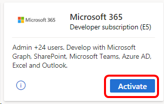
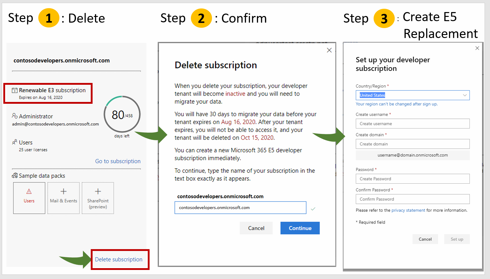

# Microsoft 365 developer subscription in Visual Studio subscriptions
Starting in September 2019, all **new** members of the Office 365 Developer Program (including Visual Studio Professional and Enterprise subscribers) can sign up for a Microsoft 365 E5 developer subscription (Windows not included). This replaces the Office 365 E3 developer subscription that we made available starting in March 2018. It now includes EMS, something our customers have asked us for on User Voice.  Check out the recent [Developer Blog](https://developer.microsoft.com/graph/blogs/new-microsoft-365-e5-subscription-with-ems-now-available-for-developers/) for more information.

Selected Visual Studio Professional or Enterprise standard subscriptions will now have access to the Microsoft 365 developer subscription benefit as long as their subscriptions are active.

## What is different about E5 vs E3?
The Microsoft 365 E5 developer subscription offers new value and expanded access to critical Microsoft 365 workloads and capabilities. Developers with Microsoft 365 E5 sandbox subscriptions can get everything they enjoyed in E3 plus can take advantage of:

- Advanced analytics with Power BI
- Enterprise Mobility + Security  for compliance and information protection
- Office 365 Advanced Threat Protection
- Azure Active Directory for building advanced identity and access management solutions

To see what’s included in the Microsoft 365 E5 developer subscription, see the [Microsoft 365 Developer Program FAQ](/office/developer-program/microsoft-365-developer-program-faq#whats-included-in-the-developer-subscription).

## Activation steps
1. Sign in to [https://my.visualstudio.com/benefits](https://my.visualstudio.com/benefits?wt.mc_id=o~msft~docs).

0. Locate the Microsoft 365 benefit tile in the "Tools" category, and click on **Activate**.

    > [!div class="mx-imgBorder"]
    >
    
0. On the welcome screen, choose your region/country, enter your company name, and click the checkbox to accept the terms of use.  Then click **Next**.

0. On the Program Preferences screen, fill out the various fields to indicate your preferences and areas of interest. When you're finished, click **Activate subscription**.

0. In the **Set up your developer subscription** dialog, choose your region/country, create your username and domain, and set your password.  Then click **Continue**.

0. Specify your country code a phone number that supports SMS messages, and click **Send Code**.  You'll receive a code via an SMS message. 

0. Enter the code you received in the text message and click **Set up**.

0. You'll see the Office Dev Center page, with your subscription information displayed. It's a good idea to take this opportunity to assign subscriptions to your users.  Click **Go to subscription**.

0. Sign in to your account. 

0. Cancel the introduction dialog box.

0. Click **Got it** to close the Office 365 apps dialog. 

0. Click the **Admin** button to open the Microsoft 365 admin center. 

0. Select **Users** in the left nav pane, then choose **Active users**.  

0. A list of your active users will appear.  If you're just setting up your subscription, you will be the only one listed.  Click **Add a user**.

0. You may be asked to personalize your sign-in and email.  Choose the options that work best for you, and click **Next**. 

0. On the **Add new users** page, you'll see a grid you can use to add users who will all have licenses assigned to them.  If you need to add more users click **+ Add another user**.

After you add users, you'll have the option to do things like create teams and install applications.  You can either do any or all of those things now, or come back to the admin center any time to set those up.

## Migrate from Office 365 E3 to Microsoft 365 E5

Visual Studio subscribers can now migrate Office 365 E3 developer sandbox subscriptions to Microsoft 365 E5.

Last August, we made Microsoft 365 E5 subscriptions available to new Developer Program members. We have since heard feedback from our existing members that you would like to take advantage of the same benefits. We also recognize that many Visual Studio subscribers and Microsoft 365 developers need to have the most up-to-date Microsoft 365 technology for their developer sandboxes.

We are pleased to announce that existing members of the Microsoft 365 Developer Program can now get the benefits of a Microsoft 365 E5 subscription. If you would like to migrate to a new Microsoft 365 E5 developer subscription, you can delete your current subscription and replace it now.

To get your new Microsoft 365 E5 developer subscription, go to your [dashboard](https://developer.microsoft.com/office/profile) and do the following: 

1. On your subscription tile, click Delete subscription.
1. Confirm that you want to delete your subscription by typing the name of your domain in the dialog box.
1. The setup process for your new Microsoft 365 E5 subscription will start automatically.

    > [!div class="mx-imgBorder"]
    >

After you delete your Office 365 E3 subscription and create your replacement Microsoft 365 E5 subscription, your Office 365 E3 tenant will be available for 60 days so that you can migrate your data.

For help migrating your data, you can use the free tool [Microsoft Mover](https://mover.io/). See also the following:
- [How to migrate mailboxes from one Microsoft 365 tenant to another](/exchange/mailbox-migration/migrate-mailboxes-across-tenants)
- [Using PowerShell to perform a staged migration to Office 365](/office365/enterprise/powershell/use-powershell-to-perform-a-staged-migration-to-office-365)
- [Office 365 to Microsoft 365 migration guide](/sharepointmigration/mover-o365) 
Thank you for your membership in the Microsoft 365 Developer Program.

## Eligibility

| Subscription Level                                                 |     Channels                                            | Benefit                                                          | Renewable?    |
|--------------------------------------------------------------------|---------------------------------------------------------|------------------------------------------------------------------|---------------|
| Visual Studio Enterprise (Standard)   | VL, Azure, Retail,  selected NFR1 | Included      |  Yes          |
| Visual Studio Enterprise subscription with GitHub Enterprise  | VL | Included      |  Yes          |
| Visual Studio Professional (Standard) | VL, Azure, Retail                                       | Included                                                             |Yes         |
| Visual Studio Professional subscription with GitHub Enterprise | VL | Included     |Yes         |
| Visual Studio Test Professional (Standard)                         | VL, Retail                                              | Not available                                             |  NA         |
| MSDN Platforms (Standard)                                          | VL, Retail                                              | Not available                                              | NA         |
| Visual Studio Enterprise, Visual Studio Professional (monthly cloud) | Azure                                       | Not available                                                           |NA|
||

1  *Includes:  Not for Resale (NFR), Visual Studio Industry Partner (VSIP), FTE, BizSpark,  MCT Software & Services Developer.  
Excludes: MCT Software & Services, Microsoft Partner Network (MPN), Imagine, Most Valuable Professional (MVP), Regional Director (RD), NFR Basic.*

> [!NOTE]
> Microsoft no longer offers Visual Studio Professional Annual subscriptions and Visual Studio Enterprise Annual subscriptions in Cloud Subscriptions. There will be no change to existing customers experience and ability to renew, increase, decrease, or cancel their subscriptions. New customers are encouraged to go to [https://visualstudio.microsoft.com/vs/pricing/](https://visualstudio.microsoft.com/vs/pricing/) to explore different options to purchase Visual Studio.

Not sure which subscription you're using?  Connect to [https://my.visualstudio.com/subscriptions](https://my.visualstudio.com/subscriptions?wt.mc_id=o~msft~docs) to see all the subscriptions assigned to your email address. If you don't see all your subscriptions, you may have one or more assigned to a different email address.  You'll need to sign in with that email address to see those subscriptions.

## Frequently asked questions
### Q: Can I activate a Microsoft 365 developer subscription using an existing tenant, or do I need to create a new one?
A: To activate the Office Developer subscription, a new tenant is required.  

### Q: Can I choose E3 or E5?
As of September 2019, new Developer Program members are only offered E5, which is our flagship version of Office 365.  This version of Office 365 offers even more value than E3, and can normally cost substantially more than our previous E3 subscription.

Existing members with E3, who don’t need the additional capabilities of E5, will have the option to keep their current E3 subscription and continue to renew it. We are not requiring any existing member to move from E3 to E5 if they don’t want to migrate. However each member can only have one subscription.

When we have a migration option for existing Developer Program members, we’ll provide more information about how to choose and how to migrate.

### Q: How do I know which version I have?
You can verify your version now in the subscription tile located on your Office 365 Developer Program dashboard.

Look for the E3 or E5 indication in your tile.

### Q: If Microsoft 365 developer subscription doesn't include Windows, how do I get Windows?
A: The Visual Studio subscriptions that include the Microsoft 365 benefit also include Windows as part of the subscriber downloads.  Visit [downloads](https://my.visualstudio.com/downloads) to download Windows. (If you don't see downloads enabled in your subscription, please [contact your admin](contact-my-admin.md).) 

## Support resources
- Need help with Microsoft 365 developer subscription?  Check out the online [Microsoft 365 documentation](/office/developer-program/office-365-developer-program-faq).
- For assistance with sales, subscriptions, accounts and billing for Visual Studio Subscriptions, contact [Visual Studio subscriptions support](https://my.visualstudio.com/gethelp).
- Have a question about Visual Studio IDE, Azure DevOps Services or other Visual Studio products or services?  Visit [Visual Studio Support](https://visualstudio.microsoft.com/support/).
- Have feedback on the new offer? Please [share your feedback on UserVoice](https://feedback.uservoice.com/). The Microsoft 365 team will personally review each comment.

## See also
- [Visual Studio documentation](/visualstudio/)
- [Azure DevOps documentation](/azure/devops/)
- [Azure documentation](/azure/)
- [Microsoft 365 documentation](/microsoft-365/)

## Next steps
- Sign in to [https://my.visualstudio.com/benefits](https://my.visualstudio.com/benefits) and click on the Microsoft 365 developer subscription tile to get started. 
- If you haven't already done so, we recommend activating these other great benefits in your subscription:
   - [Azure DevTest offer / credits](/azure/devtest/offer/)
   - [Azure DevOps](vs-azure-devops.md)
   - [Visual Studio IDE](vs-ide-benefit.md)
