# Microsoft 365 developer subscription in Visual Studio subscriptions

Starting in September 2019, all **new** members of the Microsoft 365 Developer Program (including Visual Studio Professional and Enterprise subscribers) can sign up for a Microsoft 365 E5 (Enterprise 5) developer subscription (Windows not included). This subscription replaces the Office 365 E3 (Enterprise 3) developer subscription that we made available starting in March 2018. It now includes EMS (Enterprise Mobility + Security), something our customers asked us for on User Voice. Check out the recent [Developer Blog](https://developer.microsoft.com/graph/blogs/new-microsoft-365-e5-subscription-with-ems-now-available-for-developers/) for more information.

Selected Visual Studio Professional or Enterprise standard subscriptions have access to the Microsoft 365 developer subscription benefit as long as their subscriptions are active.

## What is different about E5 vs E3?

The Microsoft 365 E5 developer subscription offers new value and expanded access to critical Microsoft 365 workloads and capabilities. Developers with Microsoft 365 E5 sandbox subscriptions can get everything they enjoyed in E3 plus can take advantage of:

+ Advanced analytics with Power BI
+ Enterprise Mobility + Security  for compliance and information protection
+ Microsoft Defender for Office 365 
+ Microsoft Entra ID for building advanced identity and access management solutions

To see what the Microsoft 365 E5 developer subscription includes, see the [Microsoft 365 Developer Program FAQ](/office/developer-program/microsoft-365-developer-program-faq#whats-included-in-the-developer-subscription).

## How to activate

1. Sign in to [https://my.visualstudio.com/benefits](https://my.visualstudio.com/benefits).

0. Locate the Microsoft 365 developer subscription benefit tile in the "Tools" category, and select **Get Started**.

    > [!div class="mx-imgBorder"]
    >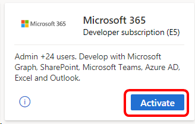
    
0. On the welcome screen, choose your region/country, enter your company name, and select the checkbox to accept the terms of use. Then select **Next**.

    > [!div class="mx-imgBorder"]
    >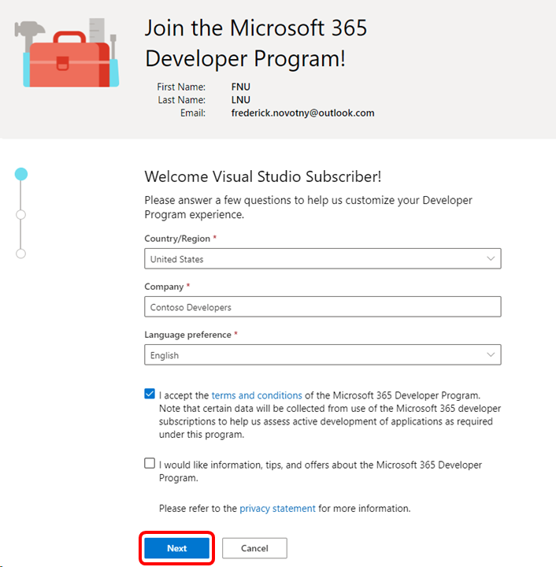

0. Indicate your primary area of interest, and select **Next**.

    > [!div class="mx-imgBorder"]
    >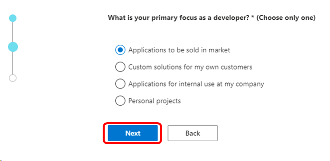

0. You see a list of development areas based on the primary area of interest you previously selected. Choose any areas of interest, and select **Save**.

    > [!div class="mx-imgBorder"]
    >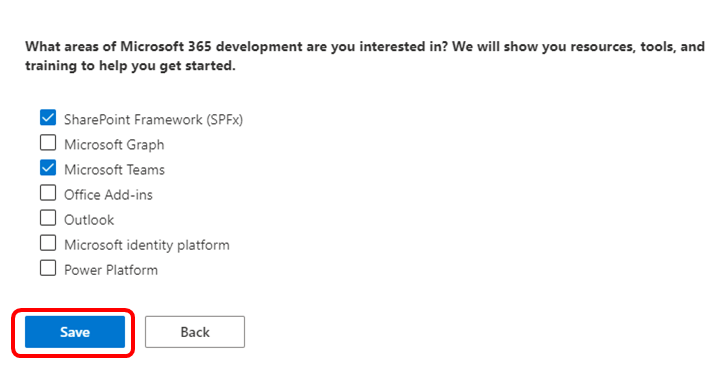

0. Next, you have the opportunity to set up your Microsoft 365 sandbox. (If you choose to skip this step now, you can complete it later by logging in to the dashboard and choosing the **Set up E5 subscription** button.) Choose your preferred type of sandbox - instant or configurable - and select **Next**.

    > [!div class="mx-imgBorder"]
    >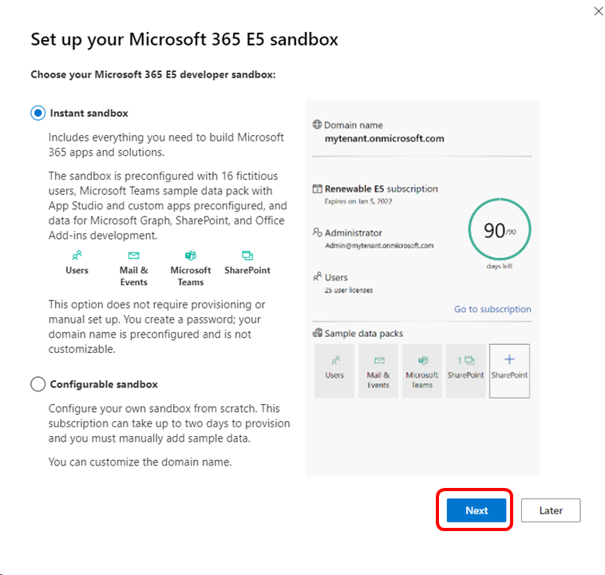

0. In the **Set up your Microsoft 365 E5 instant sandbox** screen, provide your region, admin username, and admin password. You can also choose to provide an alternate password for fictitious users. Select **Continue**.

    > [!div class="mx-imgBorder"]
    >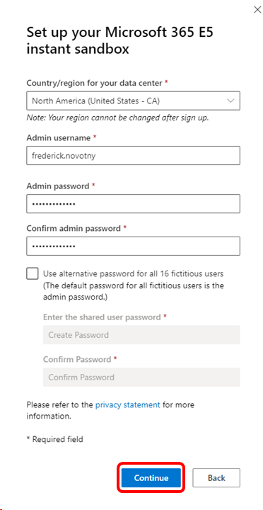

0. In the **Add phone number for security** dialog, provide your country code and phone number, and select **Send Code**.

0. Enter the code you received and select **Setup**.

    > [!div class="mx-imgBorder"]
    >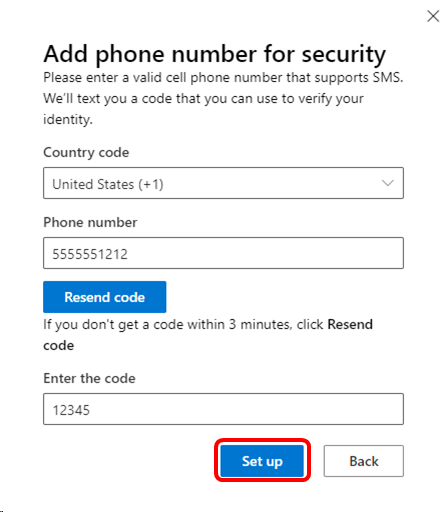

0. After the automated process of setting up your sandbox is complete, you'll see the dashboard. To use your subscription, select the **Go to subscription** link.

    > [!div class="mx-imgBorder"]
    >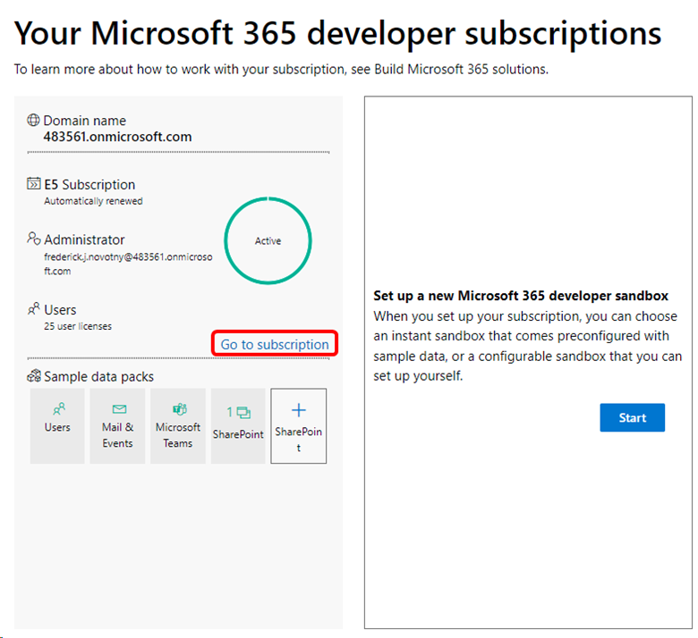

0. You have an opportunity to protect your account by enabling more authentication factors. (For this example, we skip this process and continue to the subscription. If you skip the process now, you have 14 days to complete it.)

    > [!div class="mx-imgBorder"]
    >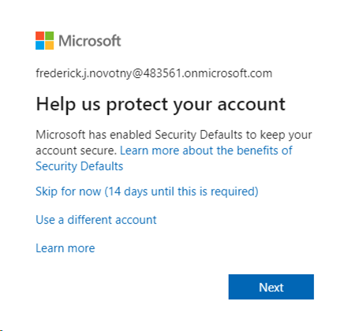

0. Pick an account to sign in. 

0. On your first visit, you see a brief slide show about the benefits of the subscription.  

0. At the completion of the slideshow, you see the www.office.com landing page. In the left navigation pane, select the **Admin** button. 

    > [!div class="mx-imgBorder"]
    >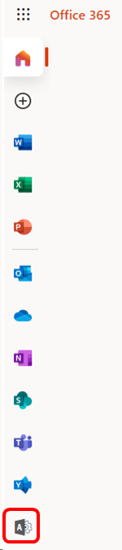

0. In the Microsoft 365 admin center, you can perform a range of tasks, including:
+ Manage Teams to support users
+ Install Office apps
+ Add, edit, or remove user accounts

16. Select the **Go to guided setup** button to walk through installing Office, adding users, and setting up and connecting domains. 

    > [!div class="mx-imgBorder"]
    >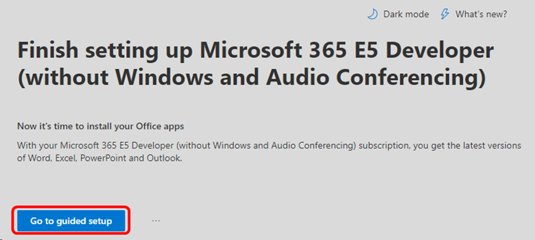

## Migrate from Office 365 E3 to Microsoft 365 E5

Visual Studio subscribers can now migrate Office 365 E3 developer sandbox subscriptions to Microsoft 365 E5.

Last August, we made Microsoft 365 E5 subscriptions available to new Developer Program members. We have since heard feedback from our existing members that you would like to take advantage of the same benefits. We also recognize that many Visual Studio subscribers and Microsoft 365 developers need to have the most up-to-date Microsoft 365 technology for their developer sandboxes.

We're pleased to announce that existing members of the Microsoft 365 Developer Program can now get the benefits of a Microsoft 365 E5 subscription. If you would like to migrate to a new Microsoft 365 E5 developer subscription, you can delete your current subscription and replace it now.

To get your new Microsoft 365 E5 developer subscription, go to your [dashboard](https://developer.microsoft.com/office/profile) and complete these steps: 

1. On your subscription tile, select **Delete subscription**.
1. Confirm that you want to delete your subscription by typing the name of your domain in the dialog box.
1. The setup process for your new Microsoft 365 E5 subscription starts automatically.

    > [!div class="mx-imgBorder"]
    >

After you delete your Office 365 E3 subscription and create your replacement Microsoft 365 E5 subscription, your Office 365 E3 tenant will be available for 60 days to give you time to migrate your data.

For help with migrating your data, you can use the free tool [Microsoft Mover](https://mover.io/). See also the following resources:
+ [How to migrate mailboxes from one Microsoft 365 tenant to another](/exchange/mailbox-migration/migrate-mailboxes-across-tenants)
+ [Using PowerShell to perform a staged migration to Office 365](/office365/enterprise/powershell/use-powershell-to-perform-a-staged-migration-to-office-365)
+ [Office 365 to Microsoft 365 migration guide](/sharepointmigration/mover-o365) 
Thank you for your membership in the Microsoft 365 Developer Program.

## Eligibility

| Subscription Level | Channels  | Benefit  | Renewable? |
|--------------------|-----------|----------|------------|
| Visual Studio Enterprise (Standard)   | VL, Azure, Retail,  selected NFR\* | Included |  Yes |
| Visual Studio Enterprise subscription with GitHub Enterprise  | VL | Included | Yes |
| Visual Studio Professional (Standard) | VL, Azure, Retail | Included | Yes |
| Visual Studio Professional subscription with GitHub Enterprise | VL | Included | Yes |
| Visual Studio Test Professional (Standard) | VL, Retail | Not available | NA |
| MSDN Platforms (Standard) | VL, Retail | Not available | NA |
| Visual Studio Enterprise (monthly cloud), Visual Studio Professional (monthly cloud) | Azure | Not available | NA |

\* *Includes: Not for Resale (NFR), Visual Studio Industry Partner (VSIP), Full time Employee (FTE), Microsoft Certified Trainer (MCT) Software & Services Developer, Student Ambassadors Beta, and Gold.*

*Excludes: Visual Studio Enterprise (Microsoft for Startups), Microsoft AI Cloud Partner Program (MAICPP) formerly known as Microsoft Cloud Partner Program (MCPP) or Microsoft Partner Network (MPN), Imagine, Most Valuable Professional (MVP), Regional Director (RD), Not for Reslare Basic (NFR Basic), Independent Software Vendors (ISV), Student Ambassadors Alpha.*

> [!NOTE]
> Microsoft no longer offers Visual Studio Professional Annual subscriptions and Visual Studio Enterprise Annual subscriptions in Cloud Subscriptions. There will be no change to existing customers experience and ability to renew, increase, decrease, or cancel their subscriptions. New customers are encouraged to go to [https://visualstudio.microsoft.com/vs/pricing/](https://visualstudio.microsoft.com/vs/pricing/) to explore different options to purchase Visual Studio.

Not sure which subscription you're using? Connect to [https://my.visualstudio.com/subscriptions](https://my.visualstudio.com/subscriptions?wt.mc_id=o~msft~docs) to see all the subscriptions assigned to your email address. If you don't see all your subscriptions, you might have one or more assigned to a different email address. You need to sign in with that email address to see those subscriptions.

## Frequently asked questions

### Q: Can I activate a Microsoft 365 developer subscription using an existing tenant, or do I need to create a new one?

A: To activate the Office Developer subscription, a new tenant is required.  

### Q: Can I choose E3 or E5?

As of September 2019, new Developer Program members are only offered E5, which is our flagship version of Office 365. This version of Office 365 offers even more value than E3, and can normally cost substantially more than our previous E3 subscription.

Existing members with E3 who don’t need all the capabilities of E5 can keep their current E3 subscription and continue to renew it. We aren't requiring any existing members to move from E3 to E5. However, each member can only have one subscription at a time.

When we have a migration option for existing Developer Program members, we provide more information about how to choose and how to migrate.

### Q: How do I know which version I have?

You can verify your version now in the subscription tile located on your Microsoft 365 Developer Program dashboard.

Look for the E3 or E5 indication in your tile.

### Q: If Microsoft 365 developer subscription doesn't include Windows, how do I get Windows?

A: The Visual Studio subscriptions that include the Microsoft 365 benefit also include Windows as part of the subscriber downloads. Visit [downloads](https://my.visualstudio.com/downloads) to download Windows. (If you don't see downloads enabled in your subscription, [contact your admin](contact-my-admin.md).) 

### Q:  How many Microsoft 365 Developer Program accounts can I create?

You can only have one Microsoft 365 Developer Program account associated with your phone number. If you need to set up a new Developer Program account, for example to use a different email account or account type, you must delete your existing account first. To delete your account, sign in to your dashboard and choose Delete Profile.

> [!NOTE]
> If you delete your Developer Program account, you can only get a subscription after you have had your existing subscription for more than 60 days.

## Support resources

+ Need help with Microsoft 365 developer subscription? Check out the online [Microsoft 365 documentation](/office/developer-program/office-365-developer-program-faq).
+ For assistance with sales, subscriptions, accounts, and billing for Visual Studio Subscriptions, contact [Visual Studio subscriptions support](https://my.visualstudio.com/gethelp).
+ Have a question about Visual Studio IDE, Azure DevOps Services, or other Visual Studio products or services? Visit [Visual Studio Support](https://visualstudio.microsoft.com/support/).
+ Have feedback on the new offer? [Share your feedback on UserVoice](https://feedback.uservoice.com/). The Microsoft 365 team reviews each comment.

## See also

+ [Visual Studio documentation](/visualstudio/)
+ [Azure DevOps documentation](/azure/devops/)
+ [Azure documentation](/azure/)
+ [Microsoft 365 documentation](/microsoft-365/)

## Next steps

+ Sign in to [https://my.visualstudio.com/benefits](https://my.visualstudio.com/benefits) and select the Microsoft 365 developer subscription tile to get started. 
+ We recommend activating these other great benefits in your subscription:
+ [Azure DevTest offer / credits](/azure/devtest/offer/)
+ [Azure DevOps](vs-azure-devops.md)
+ [Visual Studio IDE](vs-ide-benefit.md)
