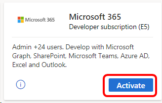
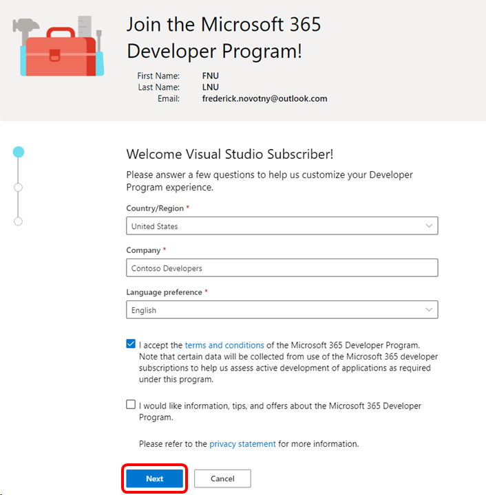
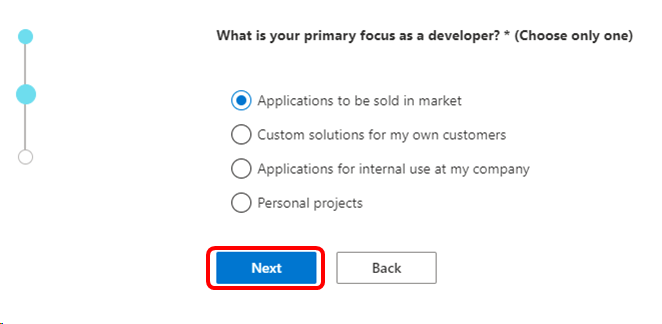
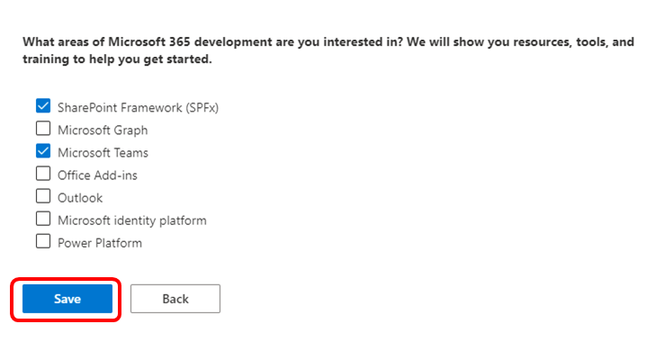

# Microsoft 365 developer subscription in Visual Studio Subscriptions

Activate the Microsoft 365 developer subscription (E5) included with your Visual Studio Subscription benefits and get started with your Microsoft 365 sandbox.

## How to activate

1. Sign in to [https://my.visualstudio.com/benefits](https://my.visualstudio.com/benefits).

2. Locate the Microsoft 365 developer subscription benefit tile in the **Tools** category, and select **Activate**.

    > [!div class="mx-imgBorder"]
    >
    
3. On the welcome screen, choose your country/region, enter your company name, and select the checkbox to accept the terms of use. Then select **Next**.

    > [!div class="mx-imgBorder"]
    >

4. Indicate your primary area of interest, and select **Next**.

    > [!div class="mx-imgBorder"]
    >

5. You see a list of development areas based on the primary area of interest you previously selected. Choose any areas of interest, and select **Save**.

    > [!div class="mx-imgBorder"]
    >

You can now set up your Microsoft 365 sandbox. Follow the [Microsoft 365 sandbox setup instructions](https://learn.microsoft.com/office/developer-program/microsoft-365-developer-program-get-started) to complete these steps.

## Eligibility

| Subscription Level | Channels  | Benefit  | Renewable? |
|--------------------|-----------|----------|------------|
| Visual Studio Enterprise (Standard)   | VL, Azure, Retail,  selected NFR\* | Included |  Yes |
| Visual Studio Enterprise subscription with GitHub Enterprise  | VL | Included | Yes |
| Visual Studio Professional (Standard) | VL, Azure, Retail | Included | Yes |
| Visual Studio Professional subscription with GitHub Enterprise | VL | Included | Yes |
| Visual Studio Test Professional (Standard) | VL, Retail | Not available | NA |
| MSDN Platforms (Standard) | VL, Retail | Not available | NA |
| Visual Studio Enterprise (monthly cloud), Visual Studio Professional (monthly cloud) | Azure | Not available | NA |

\* *Includes: Not for Resale (NFR), Visual Studio Industry Partner (VSIP), Microsoft Certified Trainer (MCT) Software & Services Developer, Student Ambassadors Beta, and Gold.*

*Excludes: Full time Employee (FTE), Visual Studio Enterprise (Microsoft for Startups), Microsoft AI Cloud Partner Program (MAICPP) formerly known as Microsoft Cloud Partner Program (MCPP) or Microsoft Partner Network (MPN), Imagine, Most Valuable Professional (MVP), Regional Director (RD), Not for Resale Basic (NFR Basic), Independent Software Vendors (ISV), Student Ambassadors Alpha.*

> [!NOTE]
> Microsoft no longer offers Visual Studio Professional Annual Subscriptions and Visual Studio Enterprise Annual Subscriptions in Cloud Subscriptions. There are no change to existing customers experience and ability to renew, increase, decrease, or cancel their subscriptions. New customers are encouraged to go to [https://visualstudio.microsoft.com/vs/pricing/](https://visualstudio.microsoft.com/vs/pricing/) to explore different options to purchase Visual Studio.

Not sure which subscription you're using? Connect to [https://my.visualstudio.com/subscriptions](https://my.visualstudio.com/subscriptions?wt.mc_id=o~msft~docs) to see all the subscriptions assigned to your email address. If you don't see all your subscriptions, you might have one or more assigned to a different email address. You need to sign in with that email address to see those subscriptions.

## Frequently asked questions

### Q: Can I activate a Microsoft 365 developer subscription using an existing tenant, or do I need to create a new one?

A: To activate the Office Developer subscription, a new tenant is required.  

### Q: How do I know which version I have?

You can verify your version now in the subscription tile located on your Microsoft 365 Developer Program dashboard.

Look for the E3 or E5 indication in your tile.

### Q: If Microsoft 365 developer subscription doesn't include Windows, how do I get Windows?

A: The Visual Studio subscriptions that include the Microsoft 365 benefit also include Windows as part of the subscriber downloads. Visit [downloads](https://my.visualstudio.com/downloads) to download Windows. (If you don't see downloads enabled in your subscription, [contact your admin](contact-my-admin.md).) 

### Q:  How many Microsoft 365 Developer Program accounts can I create?

You can only have one Microsoft 365 Developer Program account associated with your phone number. If you need to set up a new Developer Program account, for example to use a different email account or account type, you must delete your existing account first. To delete your account, sign in to your dashboard and choose Delete Profile.

> [!NOTE]
> If you delete your Developer Program account, you can only get a subscription after you have had your existing subscription for more than 60 days.

## Support resources

+ Need help with Microsoft 365 developer subscription? Check out the online [Microsoft 365 documentation](/office/developer-program/office-365-developer-program-faq).
+ For assistance with sales, subscriptions, accounts, and billing for Visual Studio Subscriptions, contact [Visual Studio subscriptions support](https://my.visualstudio.com/gethelp).
+ Have a question about Visual Studio IDE, Azure DevOps Services, or other Visual Studio products or services? Visit [Visual Studio Support](https://visualstudio.microsoft.com/support/).

## See also

+ [Visual Studio documentation](/visualstudio/)
+ [Azure DevOps documentation](/azure/devops/)
+ [Azure documentation](/azure/)
+ [Microsoft 365 documentation](/microsoft-365/)

## Next steps

+ Sign in to [https://my.visualstudio.com/benefits](https://my.visualstudio.com/benefits) and select the Microsoft 365 developer subscription tile to get started. 
+ We recommend activating these other great benefits in your subscription:
+ [Azure DevTest offer / credits](/azure/devtest/offer/)
+ [Azure DevOps](vs-azure-devops.md)
+ [Visual Studio IDE](vs-ide-benefit.md)
