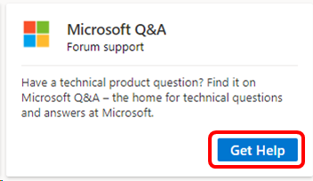

# Microsoft Q&A forum support in Visual Studio subscriptions
Have a technical product question? Find it on Microsoft Q&A – the home for technical questions and answers at Microsoft.

You can questions and answers on a wide range of supported products, including:
- .NET
- Azure
- C++
- Enterprise Mobility + Security
- Microsoft 365
- Microsoft Advertising
- Microsoft Edge
- Microsoft Robotics
- Open Specifications
- Power Query 
- Small Basic
- SQL Server
- System Center
- Visual Studio
- Windows 
- Windows Sysinternals

You'll also find "how-to" guides to help you ask great questions and craft quality answers for other users. 

## Access Microsoft Q&A
Accessing Microsoft Q&A is simple. 
1. Sign in to the Visual Studio subscriptions portal at <https://my.visualstudio.com/benefits>
0. Find the Microsoft Q&A tile in the Support section, and click **Get help**.

   > [!div class="mx-imgBorder"]
   > 

## Eligibility
The Microsoft Q&A forum is freely available.  No subscription is required. 

## Support Resources
- Need assistance with sales, subscriptions, accounts and billing for Visual Studio Subscriptions?  Contact [Visual Studio subscriptions support](https://my.visualstudio.com/gethelp).
- Have a question about Visual Studio IDE, Azure DevOps Services or other Visual Studio products or services?  Visit [Visual Studio Support](https://visualstudio.microsoft.com/support/).

## See also
- [Visual Studio documentation](/visualstudio/)
- [Azure DevOps documentation](/azure/devops/)
- [Azure documentation](/azure/)
- [Microsoft 365 documentation](/microsoft-365/)

## Next steps
Check out the other support resources available, including:
- [Concierge Chat](vs-concierge-chat.md)
- [Developer Community](vs-developer-community.md)
- [Microsoft Tech Community](vs-microsoft-tech-community.md)
- [Azure Community](vs-azure-community.md)