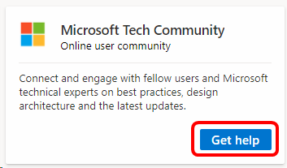

# Microsoft Tech Community forum support in Visual Studio subscriptions
Connect and engage with fellow users and Microsoft technical experts on best practices, design architecture and the latest updates.

## Access the Microsoft Tech Community 
Accessing the community forum is simple.  

1. Sign in to <https://my.visualstudio.com/benefits>
0. Locate the **Microsoft Tech Community** tile and click **Get help**

    > [!div class="mx-imgBorder"]
    > 

0. If you haven't previously registered for the community, click **Get started**
0. In the **Step 1: Setup your profile** section:
   - Select your preferred language
   - Enter your work email address
   - Create your profile name 
0. In the section entitled **Step 2: Select Communities to join**, you can select various communities by clicking on the **Join** button listed on the information card for each one.  You can also use the search box at the far right to filter the list of available communities.  To see the complete list of 90 communities, click the **View All (90)** link below the information cards. 
0. For **Step 3: Code of Conduct**, please read the Code of Conduct and then click the checkbox to indicate your acceptance of the Code of Conduct and Terms of Service.
0. Click **Register** to finish setting up your profile.

That's all there is to it.  You're now ready to use the community portal.  The home page has news about the community.  To see content specific to the communities you joined, click on the **Community Hubs** drop-down at the top of the page and choose a community from your list.  You can always add communities to the list by clicking **Browse All Community Hubs** clicking on the hub of your choice, and then clicking the **Join** button. 

## Eligibility
Availability of the Azure Community benefit depends on your subscription level as shown below:

|                                          Subscription Level                                           |     Channels      |    Benefit    | Renewable? |
|-------------------------------------------------------------------------------------------------------|-------------------|---------------|------------|
|                           Visual Studio Enterprise (Standard), NFR1                            | VL, Azure, Retail |   Available    |    Yes     |
|                           Visual Studio Enterprise subscription with GitHub Enterprise                           | VL, Azure, Retail |   Available    |    Yes     |
|                          Visual Studio Professional (Standard)                          | VL, Azure, Retail |   Available    |    Yes     |
|                          Visual Studio Professional subscription with GitHub Enterprise                          | VL, Azure, Retail |   Available    |    Yes     |
|                              Visual Studio Test Professional (Standard)                               |    VL, Retail     |   Available    |    Yes     |
|                                       MSDN Platforms (Standard)                                       |    VL, Retail     |   Available    |    Yes     |
| Visual Studio Enterprise (monthly cloud), Visual Studio Professional (monthly cloud)|        All        | Not available |     No     |

1  *Includes:  Not for Resale (NFR), Microsoft FTE, Most Valuable Professional (MVP), Regional Director (RD), Visual Studio Industry Partner (VSIP), BizSpark, Imagine, Microsoft Certified Trainer (MCT).  Excludes NFR Basic.*

> [!NOTE]
> Microsoft no longer offers Visual Studio Professional Annual subscriptions and Visual Studio Enterprise Annual subscriptions in Cloud Subscriptions. There will be no change to existing customers experience and ability to renew, increase, decrease, or cancel their subscriptions. New customers are encouraged to go to [https://visualstudio.microsoft.com/vs/pricing/](https://visualstudio.microsoft.com/vs/pricing/) to explore different options to purchase Visual Studio.

Not sure which subscription you're using?  Connect to [https://my.visualstudio.com/subscriptions](https://my.visualstudio.com/subscriptions?wt.mc_id=o~msft~docs) to see all the subscriptions assigned to your email address. If you don't see all your subscriptions, you may have one or more assigned to a different email address.  You'll need to sign in with that email address to see those subscriptions.

## Support Resources
- Need assistance with sales, subscriptions, accounts and billing for Visual Studio Subscriptions?  Contact [Visual Studio subscriptions support](https://my.visualstudio.com/gethelp).
- Have a question about Visual Studio IDE, Azure DevOps Services or other Visual Studio products or services?  Visit [Visual Studio Support](https://visualstudio.microsoft.com/support/).

## See also
- [Visual Studio documentation](/visualstudio/)
- [Azure DevOps documentation](/azure/devops/)
- [Azure documentation](/azure/)
- [Microsoft 365 documentation](/microsoft-365/)

## Next steps
Check out the other support resources available, including:
- [Concierge Chat](vs-concierge-chat.md)
- [Developer Community](vs-developer-community.md)
- [Microsoft Q&A](vs-microsoft-qa.md)
- [Azure Community](vs-azure-community.md)