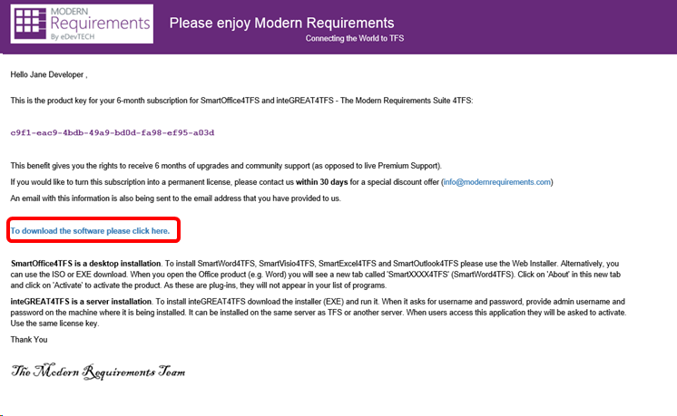
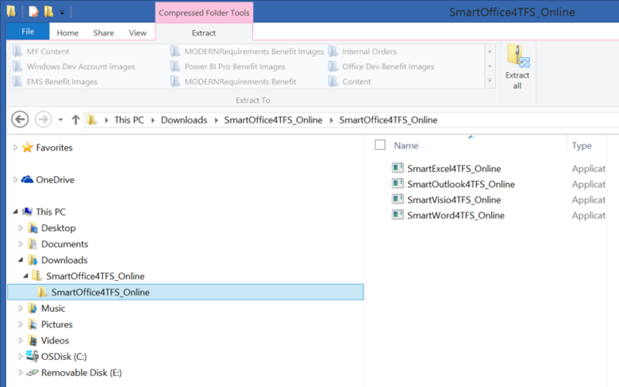

# The MODERNRequirements4TFS benefit in Visual Studio subscriptions

Selected Visual Studio subscriptions include a six month subscription for MODERNRequirements SmartOffice 4TFS and ModernRequirements4TFS.  MODERNRequirements SmartOffice4TFS extends the capabilities of TFS or Azure DevOps Services with Microsoft Word-based reporting, and quick, simplified rich text authoring.  ModernRequirements4TFS provides work item baselining and HTML5 simulation capabilities.

## Activation steps
1. To use your MODERNRequirementsTFS benefit, sign in to [https://my.visualstudio.com/benefits](https://my.visualstudio.com/benefits?wt.mc_id=o~msft~docs).
2. Locate the MODERNRequirements4TFS tile in the Tools section, and click on the **Get Code** link at the bottom left of the tile.
   > [!div class="mx-imgBorder"]
   > 

3. You’ll receive a notification that the code was successfully retrieved.  Click **Activate**.

4. You’ll be redirected to the ModernRequirements website to create your account and download the software.  On the landing page, provide the requested contact information, and click **Get License Key and Download**.
   > [!div class="mx-imgBorder"]
   > 

5. The next page contains your license key.  Please review the information about the installations provided on the page, then click on the blue **To download the software please click here** link in the middle of the page.
   > [!div class="mx-imgBorder"]
   > 

6. On the Download Page, you have the option to install the MODERNRequirements suites, or install individual modules from the SMARTOffice4TFS suite.  The right options for you will depend on your preferences, as well as which version of TFS you have installed.  Be sure to familiarize yourself with the information on the page to help you select the right version of the products for you.
   > [!div class="mx-imgBorder"]
   > 

7. For this example, we’ll choose SMARTOffice4TFS.  The download dialog will appear, providing three options for downloading and saving the .zip file.  We’ll choose **Save** so that we have a copy of the package in the Downloads folder of the PC.

8. When the download of **SmartOffice4TFS_Online.zip** has completed, click **Open folder**.

9. Open the “SmartOffice4TFS_Online” folder.

10. Open the “SmartOffice4TFS_Online” subfolder.

11. The folder will contain four installer applications, one each for:
    - SmartExcel4TFS_Online
    - SmartOutlook4TFS_Online
    - SmartVisio4TFS_Online
    - SmartWord4TFS_Online

    > [!div class="mx-imgBorder"]
    > 

12. Right click in the folder and choose **Extract All**.  Specify a location where you would like the files to be extracted, and click **Extract**.

13. To install any of the products, launch the corresponding application from the downloads folder.  For our example, we will install SmartWord4TFS.  When the User Account Control dialog opens, click **Yes** to start the application.

14. The Setup Wizard will start.  Click **Next** to continue.

15. Click the **I agree** radio button to accept the terms, then click **Next**.

16. Choose where you would like to install the application, and specify whether you want it to be available to all users, or just yourself.  Click **Next**.

17. Choose whether you want SmartWord to install in Author Mode or Reviewer Mode.  For more information on these modes, contact [MODERNRequirements Support](http://www.modernrequirements.com/support-2/).  Click **Next**.

18. Next, choose whether you wish to install templates and click **Next**.

19. Click **Next** again to begin the installation.

20. When the User Account Control dialog appears, click **Yes**.

21. When the installation is completed, click **Close**.

22. The next time you start Microsoft Word, you’ll see a Microsoft Office Customization Installer dialog that asks you to confirm you want to install the SmartWord4TFS add-in.  Click **Install**.

23. When Word opens, you’ll see that a SmartWord4TFS tab has been added. Click the tab to display the SmartWord4TFS toolset.

## Eligibility

| Subscription Level                                                 |     Channels                                            | Benefit                                                          | Renewable?    |
|--------------------------------------------------------------------|---------------------------------------------------------|------------------------------------------------------------------|---------------|
| Visual Studio Enterprise (Standard)   | VL, Azure, Retail,  selected NFR1 | 6 months       |  No.  Available to new subscribers only          |
| Visual Studio Professional (Standard) | VL, Azure, Retail                                       | Not available                                                          |NA     |
| Visual Studio Test Professional (Standard)                         | VL, Retail                                              | Not available                                                          |NA     |
| MSDN Platforms (Standard)                                          | VL, Retail                                              | Not available                                                          |NA     |
| Visual Studio Dev Essentials | NA  |Not available                                                          |NA     |
| Visual Studio Enterprise, Visual Studio Professional (monthly cloud) | Azure                                       | Not available                                                           |NA|

1  *Includes:  Not for Resale (NFR), Visual Studio Industry Partner (VSIP), Microsoft Partner Network (Enterprise), FTE.  Excludes:  Microsoft Partner Network (Professional), MCT Software & Services Developer, BizSpark, Imagine, Most Valuable Professional (MVP), Regional Director (RD).  MCT Software & Services.*

> [!NOTE]
> Microsoft no longer offers Visual Studio Professional Annual subscriptions and Visual Studio Enterprise Annual subscriptions in Cloud Subscriptions. There will be no change to existing customers experience and ability to renew, increase, decrease, or cancel their subscriptions. New customers are encouraged to go to [https://visualstudio.microsoft.com/vs/pricing/](https://visualstudio.microsoft.com/vs/pricing/) to explore different options to purchase Visual Studio.

Not sure which subscription you're using?  Connect to [https://my.visualstudio.com/subscriptions](https://my.visualstudio.com/subscriptions?wt.mc_id=o~msft~docs) to see all the subscriptions assigned to your email address. If you don't see all your subscriptions, you may have one or more assigned to a different email address.  You'll need to sign in with that email address to see those subscriptions.

## Support resources
-  Need help with ModernRequirements products?  Please visit https://www.modernrequirements.com/support-2/.
-  For assistance with sales, subscriptions, accounts and billing for Visual Studio Subscriptions, contact Visual Studio [Subscriptions Support](https://visualstudio.microsoft.com/subscriptions/support/).
-  Have a question about Visual Studio IDE, Azure DevOps Services or other Visual Studio products or services?  Visit [Visual Studio Support](https://visualstudio.microsoft.com/support/).