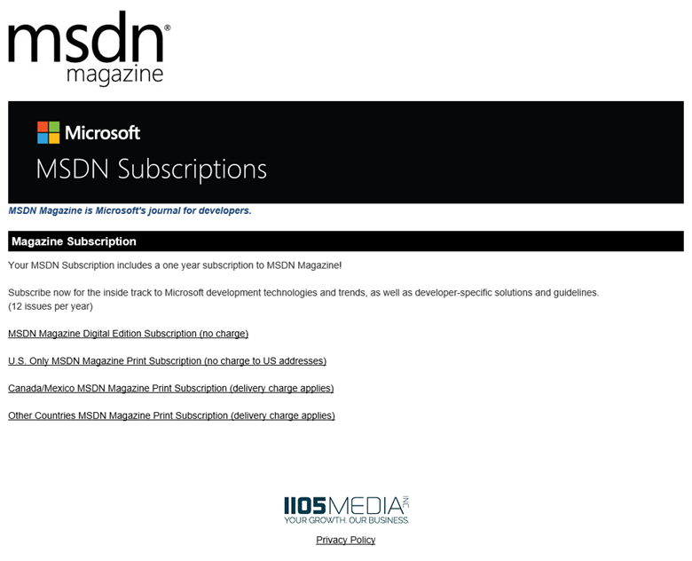

# The MSDN Magazine benefit in Visual Studio subscriptions

Comprehensive coverage of Microsoft technologies for practical solutions to real-world problems.  Depending on your subscription, you are entitled to either the printed magazine, or early access to the digital version.

## Activation steps
The steps to activate your benefit depend on the edition you choose.

### Digital edition
The Digital Edition is available to Visual Studio Dev Essentials members.

1. To access the Digital Edition of MSDN Magazine, sign in to [https://my.visualstudio.com/benefits](https://my.visualstudio.com/benefits?wt.mc_id=o~msft~docs).
2. Locate the MSDN Magazine tile in the Professional Development section, and click **Access**.

### Printed edition
1. To begin receiving your MSDN Magazine subscription, sign in to [https://my.visualstudio.com/benefits](https://my.visualstudio.com/benefits?wt.mc_id=o~msft~docs)
2. Locate the MSDN Magazine tile in the Professional Development section, and click on **Subscribe** on the MSDN Magazine subscription tile. (Click on the "!" in the lower right corner of the tile to access the digital edition.)
   > [!div class="mx-imgBorder"]
   > 

3. On the MSDN Magazine page, choose your preferred subscription type.  You can choose the digital edition at no charge, no matter where you live.  The printed version is available at no charge to US residents.  Shipping charges apply for printed versions sent to non-US addresses.
   > [!div class="mx-imgBorder"]
   > 

4. Provide the contact information requested, and click **Submit**.  (The version of the magazine you selected will appear in the Magazine Subscription section.  If you chose the printed edition, the first option will read **Yes!  I want to receive 1 year (12 issues) of MSDN Magazine for FREE**.)
   > [!div class="mx-imgBorder"]
   > 

5. That’s all there is to it.  Depending on which version of the magazine you chose, you’ll either begin receiving printed magazines or emails with links to the latest online versions with the next edition.  Enjoy!

## Eligibility

| Subscription Level                                                 |     Channels                                            | Benefit                                                          | Renewable?    |
|--------------------------------------------------------------------|---------------------------------------------------------|------------------------------------------------------------------|---------------|
| Visual Studio Enterprise (Standard)   | VL, Azure, Retail,  selected NFR1 |Printed edition       |  No.  Available to new subscribers only          |
| Visual Studio Professional (Standard) | VL, Azure, Retail                                       | Printed edition                                                            |No.  Available to new subscribers only         |
| Visual Studio Test Professional (Standard)                         | VL, Retail                                              | Printed edition                                             |  No.  Available to new subscribers only         |
| MSDN Platforms (Standard)                                          | VL, Retail                                              | Printed edition                                              | No.  Available to new subscribers only         |
|Visual Studio Enterprise, Visual Studio Professional (monthly cloud)   | Azure |Not available      |  NA         |
|Visual Studio Dev Essentials| NA |Digital edition       |  Yes|

1  *Printed edition:  Not for Resale (NFR), Visual Studio Industry Partner (VSIP), FTE, Microsoft Partner Network (Enterprise), Imagine (Premium).*

*Digital Edition: MCT Software & Services, Most Valuable Professional (MVP), Regional Director (RD).*

*Excludes:  Imagine (Standard), BizSpark, MCT Software & Services Developer*

> [!NOTE]
> Microsoft no longer offers Visual Studio Professional Annual subscriptions and Visual Studio Enterprise Annual subscriptions in Cloud Subscriptions. There will be no change to existing customers experience and ability to renew, increase, decrease, or cancel their subscriptions. New customers are encouraged to go to [https://visualstudio.microsoft.com/vs/pricing/](https://visualstudio.microsoft.com/vs/pricing/) to explore different options to purchase Visual Studio.

Not sure which subscription you're using?  Connect to [https://my.visualstudio.com/subscriptions](https://my.visualstudio.com/subscriptions?wt.mc_id=o~msft~docs) to see all the subscriptions assigned to your email address. If you don't see all your subscriptions, you may have one or more assigned to a different email address.  You'll need to sign in with that email address to see those subscriptions.

## Support resources
- For assistance with sales, subscriptions, accounts and billing for Visual Studio Subscriptions, contact Visual Studio [Subscriptions Support](https://visualstudio.microsoft.com/subscriptions/support/).
- Have a question about Visual Studio IDE, Azure DevOps Services or other Visual Studio products or services?  Visit [Visual Studio Support](https://visualstudio.microsoft.com/support/).