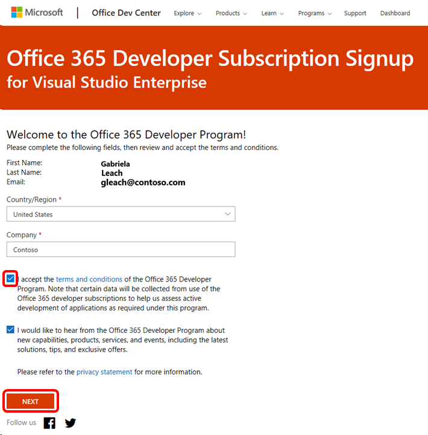
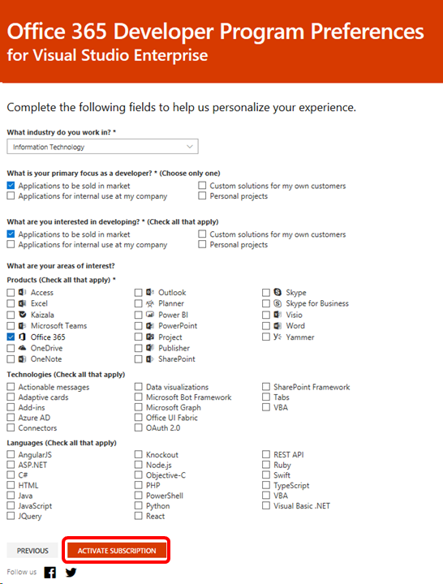
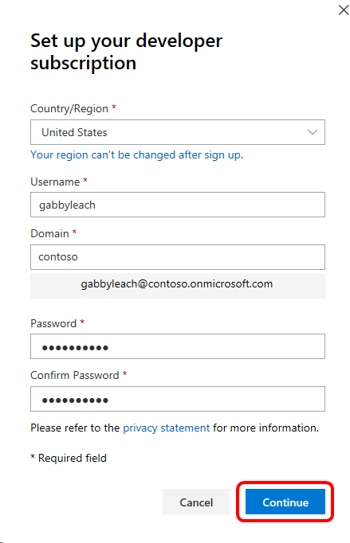
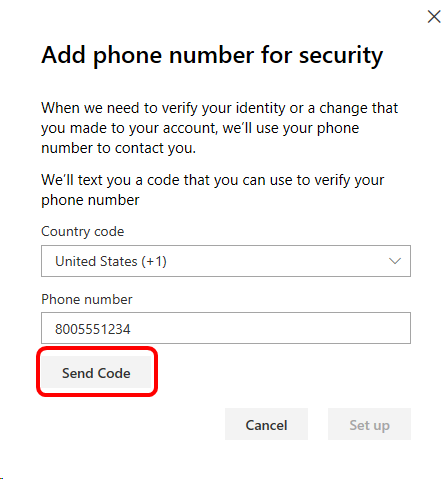
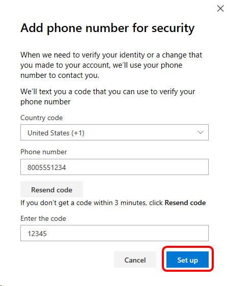

# The Office 365 Developer subscription benefit in Visual Studio subscriptions

Subscribers with selected Visual Studio Enterprise subscriptions receive the Office 365 Developer Subscription benefit.  The Office 365 Developer Subscription allows you to develop, test, and deploy add-ins for Microsoft Office and Microsoft SharePoint.  This benefit allows for one tenant and up to 25 users.

## Activation steps

1. Visit [https://my.visualstudio.com/benefits](https://my.visualstudio.com/benefits?wt.mc_id=o~msft~docs) to sign in to the subscriber portal.

2. Depending on your account, you will either be redirected to your Organization’s sign-in page, or the Microsoft Account sign-in page.   In either case, please enter your username and password, and click **Next**.

3. Once the sign-in process is complete, you should see the Subscriptions Benefits page.  If you have more than one subscription, you can switch between the subscriptions by clicking the drop-down arrow in the top right corner, below the black ribbon.  The Office 365 Developer Subscription benefit tile is in the Tools category.  Use the arrow to the right of the row of tiles to scroll until the Office tile is visible.

4. Click on the **Activate** link at the bottom of the benefit tile.
   > [!div class="mx-imgBorder"]
   > 

5. The next step is to create an account.  Your name and sign-in email address will be displayed.
6. Choose your country.
7. Enter your company name.
8. Click the first check box to accept the terms and conditions.
9. Click **Next**.
   > [!div class="mx-imgBorder"]
   > 

10. Indicate your preferences and areas of interest, and click **Activate subscription**.
    > [!div class="mx-imgBorder"]
    > 

11. Next, you'll verify your country/region, and create your username, domain, and password.
    > [!div class="mx-imgBorder"]
    > 

12. Enter your phone number, and click **Send Code**.  This helps us ensure the account is being created by a real person.
    > [!div class="mx-imgBorder"]
    > 

13. Enter the code you receive and click **Set up**.
    > [!div class="mx-imgBorder"]
    > 

That's it!  You'll see a page displaying information tailored to your preferences.

## Next steps

To access your developer subscription, go to [office.com](https://www.office.com) and sign in with the user ID and password you just created.

To learn more about the Office 365 Developer subscription, check out the [Office 365 Developer Program FAQ](/office/developer-program/office-365-developer-program-faq).

## Eligibility

| Subscription Level                                                 |     Channels                                            | Benefit                                                          | Renewable?    |
|--------------------------------------------------------------------|---------------------------------------------------------|------------------------------------------------------------------|---------------|
| Visual Studio Enterprise (Standard)   | VL, Azure, Retail,  selected NFR1 | Included      |  Yes          |
| Visual Studio Professional (Standard) | VL, Azure, Retail                                       | Not available                                                            |NA         |
| Visual Studio Test Professional (Standard)                         | VL, Retail                                              | Not available                                             |  NA         |
| MSDN Platforms (Standard)                                          | VL, Retail                                              | Not available                                              | NA         |
| Visual Studio Dev Essentials | NA  | Not available |NA |
| Visual Studio Enterprise, Visual Studio Professional (monthly cloud) | Azure                                       | Not available                                                           |NA|

1  *Includes:  Not for Resale (NFR), Visual Studio Industry Partner (VSIP), FTE, BizSpark,  MCT Software & Services Developer, MCT Software & Services.  Excludes:  Microsoft Partner Network (MPN), Imagine, Most Valuable Professional (MVP), Regional Director (RD).*

> [!NOTE]
> Microsoft no longer offers Visual Studio Professional Annual subscriptions and Visual Studio Enterprise Annual subscriptions in Cloud Subscriptions. There will be no change to existing customers experience and ability to renew, increase, decrease, or cancel their subscriptions. New customers are encouraged to go to [https://visualstudio.microsoft.com/vs/pricing/](https://visualstudio.microsoft.com/vs/pricing/) to explore different options to purchase Visual Studio.

Not sure which subscription you're using?  Connect to [https://my.visualstudio.com/subscriptions](https://my.visualstudio.com/subscriptions?wt.mc_id=o~msft~docs) to see all the subscriptions assigned to your email address. If you don't see all your subscriptions, you may have one or more assigned to a different email address.  You'll need to sign in with that email address to see those subscriptions.

## Support resources

-  Need help with your Office Developer subscription? Check out the [support](https://developer.microsoft.com/office/support) resources on the [Office Dev Center](https://developer.microsoft.com/office).
-  For assistance with sales, subscriptions, accounts and billing for Visual Studio Subscriptions, contact Visual Studio [Subscriptions Support](https://visualstudio.microsoft.com/subscriptions/support/).
-  Have a question about Visual Studio IDE, Azure DevOps Services or other Visual Studio products or services?  Visit [Visual Studio Support](https://visualstudio.microsoft.com/support/).