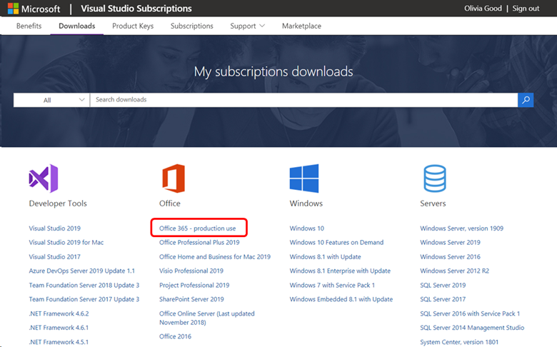
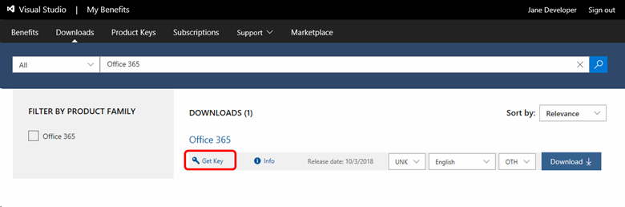
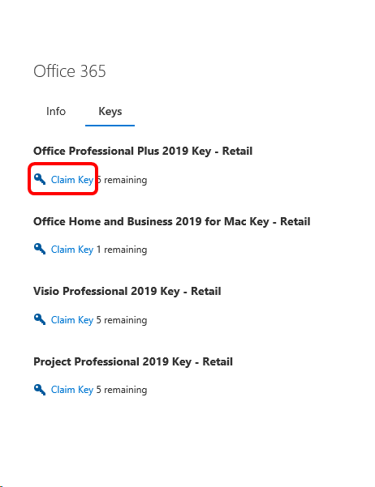
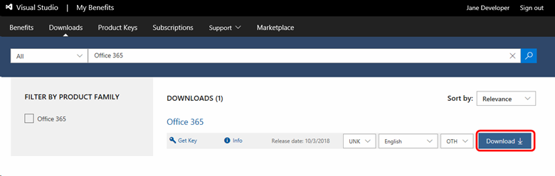
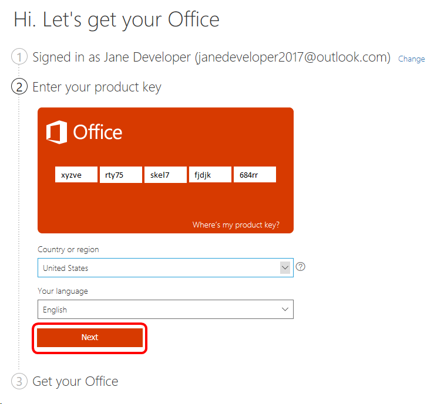

# Office 365 Pro Plus in Visual Studio Subscriptions

Create your best work. Work anywhere with apps that are always updated. Office 365 Pro Plus is a subscription that comes with premium apps like Word, Excel, PowerPoint, OneNote, Outlook, Publisher, and Access (Publisher and Access available on PC only). The apps can be installed on multiple devices, including PCs, Macs, iPads, iPhones, Android tablets, and Android phones. With a subscription, you get the latest versions of the apps and automatically receive updates when they happen.

> [!NOTE]
> Your Visual Studio subscription entitles you to use Office 365 Pro Plus for production use.  

> [!IMPORTANT]
> We have become aware of an issue with obtaining product keys for Office 365 Pro Plus.  We are working on the issue and will provide an update when the issue is resolved. 

## Getting started with Office 365 Pro Plus

Follow these steps to download and activate Office 365 Pro Plus:
1. Sign in to your Visual Studio Enterprise subscription.
2. Click on **Downloads** tab.
3. You'll see a list of featured downloads. In the Office list, choose **Office 365 Pro Plus**.
   > [!div class="mx-imgBorder"]
   > 
0. To install Office 365 Pro Plus, you'll need a product key.  Click on the **Get key** link under the Office 365 Pro Plus listing.
   > [!div class="mx-imgBorder"]
   > 
0. A fly-out window will show you any keys you've already claimed as well as those that are available to you.  To obtain a new key, click **Claim key** under the **Office Professional Plus 2019** listing.
   > [!div class="mx-imgBorder"]
   > 
0. Record the key you just claimed. (You can always return to this list to see it again.)
0. Close the fly-out window.
0. Click the **Download** button.
   > [!div class="mx-imgBorder"]
   > 
0. Sign in with your Microsoft account. (If you're already signed in, click **Next**.)
0. Enter your product key, country or region, and language, then click **Next**.
   > [!div class="mx-imgBorder"]
   > 
0. Click **Next** again.
0. Click **Install** to install the Office applications.

## Eligibility

| Subscription Level                                                 |     Channels                                            | Benefit                                                          | Renewable?    |
|--------------------------------------------------------------------|---------------------------------------------------------|------------------------------------------------------------------|---------------|
| Visual Studio Enterprise (Standard)   | VL, Azure, Retail| Available       |  Yes          |
| Visual Studio Enterprise with GitHub Enterprise  | VL | Available       |  Yes          |
| Visual Studio Enterprise (Standard)   | NFR1 | Not available       |  N/A          |
| Visual Studio Professional (Standard) | VL, Azure, Retail                                       | Not available                                                            |  N/A          |
| Visual Studio Professional with GitHub Enterprise | VL | Not available         |  N/A          |
| Visual Studio Test Professional (Standard)                         | VL, Retail                                              | Not available                                             |  N/A          |
| MSDN Platforms (Standard)                                          | VL, Retail                                              | Not available                                              |  N/A          |
| Visual Studio Enterprise, Visual Studio Professional (monthly cloud) | Azure | Not available | N/A |
|  |

1  *Includes:  Not for Resale (NFR), Visual Studio Industry Partner (VSIP), Microsoft Partner Network (MPN), FTE, MCT Software & Services Developer, BizSpark, Most Valuable Professional (MVP), Regional Director (RD), MCT Software & Services, Imagine, Microsoft Partner Network.*

> [!NOTE]
> Microsoft no longer offers Visual Studio Professional Annual subscriptions and Visual Studio Enterprise Annual subscriptions in Cloud Subscriptions. There will be no change to existing customers experience and ability to renew, increase, decrease, or cancel their subscriptions. New customers are encouraged to go to [https://visualstudio.microsoft.com/vs/pricing/](https://visualstudio.microsoft.com/vs/pricing/) to explore different options to purchase Visual Studio.

Not sure which subscription you're using?  Connect to [https://my.visualstudio.com/subscriptions](https://my.visualstudio.com/subscriptions?wt.mc_id=o~msft~docs) to see all the subscriptions assigned to your email address. If you don't see all your subscriptions, you may have one or more assigned to a different email address.  You'll need to sign in with that email address to see those subscriptions.

## Support resources
- For technical support with any component of EMS, please visit https://support.microsoft.com/allproducts and select the product.
- For assistance with sales, subscriptions, accounts and billing for Visual Studio Subscriptions, contact Visual Studio [Subscriptions Support](https://visualstudio.microsoft.com/subscriptions/support/).
- Have a question about Visual Studio IDE, Azure DevOps or other Visual Studio products or services?  Visit [Visual Studio Support](https://visualstudio.microsoft.com/support/).

## See also
- [Visual Studio documentation](https://docs.microsoft.com/visualstudio/)
- [Azure DevOps documentation](https://docs.microsoft.com/azure/devops/)
- [Azure documentation](https://docs.microsoft.com/azure/)
- [Microsoft 365 documentation](https://docs.microsoft.com/microsoft-365/)

## Next steps
Be sure to activate these great benefits to make the most of your Visual Studio subscription:
- [Visual Studio](vs-ide-benefit.md)
- [Azure DevOps](vs-azure-devops.md)
- [Azure DevTest individual credit](vs-azure.md)
If you're planning to develop applications for Office, you'll want to activate your [Office Developer Subscription](vs-office-dev.md)

