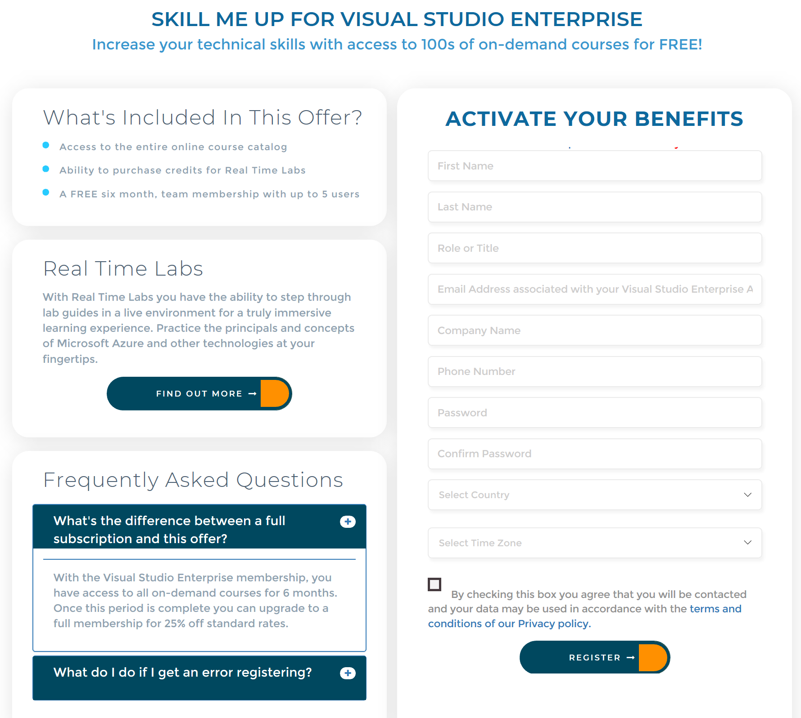

# The Skill Me Up - Powered by Opsgility training benefit in Visual Studio subscriptions

Selected Visual Studio subscriptions include up to six months of access to expert, on-demand training with access to live lab environments and certification learning paths.

## Activation steps
1. Sign in to [https://my.visualstudio.com/benefits](https://my.visualstudio.com/benefits?wt.mc_id=o~msft~docs).

2. To use your Skill Me Up benefit, click on the **Get Code** link at the bottom of the benefit tile.   You’ll receive a notification that the coupon code has been successfully retrieved.  Click **Activate** to proceed.
   > [!div class="mx-imgBorder"]
   > 

3. You’ll be redirected to the appropriate Skill Me UP landing page for your subscription.  (You may be offered an opportunity to start a chat session with a Support Specialist.  If you don’t wish to start a chat, you can minimize that window.)  Fill out the requested contact information, check the box to accepts the terms and conditions, then click **Register**.
   > [!div class="mx-imgBorder"]
   > 

4. That’s all there is to it!  You’re ready to start learning!

## Eligibility

| Subscription level                                                 |     Channels                                            | Benefit                                                          | Renewable?    |
|--------------------------------------------------------------------|---------------------------------------------------------|------------------------------------------------------------------|---------------|
| Visual Studio Enterprise (Standard)   | VL, Azure, Retail | 6 months       |  No.  Available to new subscribers only          |
| Visual Studio Professional (Standard) | VL, Azure, Retail                                       | 3 months                                                            |No.  Available to new subscribers only         |
| Visual Studio Test Professional (Standard)                         | VL, Retail                                              | 3 months                                             |  No.  Available to new subscribers only         |
| MSDN Platforms (Standard)                                          | VL, Retail                                              | 3 months                                              | No.  Available to new subscribers only         |
| Visual Studio Dev Essentials | NA  | Not available | NA  |
| Visual Studio Enterprise, Visual Studio Professional (monthly cloud) | Azure                                       | Not available                                                           |NA|

*Excludes:  Microsoft Partner Network (MPN), Most Valuable Professional (MVP), Regional Director (RD), Microsoft Certified Trainer, BizSpark, Imagine, NFR, FTE*

> [!NOTE]
> Microsoft no longer offers Visual Studio Professional Annual subscriptions and Visual Studio Enterprise Annual subscriptions in Cloud Subscriptions. There will be no change to existing customers experience and ability to renew, increase, decrease, or cancel their subscriptions. New customers are encouraged to go to [https://visualstudio.microsoft.com/vs/pricing/](https://visualstudio.microsoft.com/vs/pricing/) to explore different options to purchase Visual Studio.

Not sure which subscription you're using?  Connect to [https://my.visualstudio.com/subscriptions](https://my.visualstudio.com/subscriptions?wt.mc_id=o~msft~docs) to see all the subscriptions assigned to your email address. If you don't see all your subscriptions, you may have one or more assigned to a different email address.  You'll need to sign in with that email address to see those subscriptions.

## Support resources
-  Need help with Opsgility?  Submit a support ticket via the [Contact Us](https://www.opsgility.com/SupportTicket) page.
-  For assistance with sales, subscriptions, accounts and billing for Visual Studio Subscriptions, contact Visual Studio [Subscriptions Support](https://visualstudio.microsoft.com/subscriptions/support/).
-  Have a question about Visual Studio IDE, Azure DevOps Services or other Visual Studio products or services?  Visit [Visual Studio Support](https://visualstudio.microsoft.com/support/).
