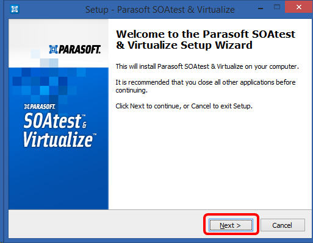

# Parasoft Virtualize/SOAtest Professional Desktop in Visual Studio subscriptions

Test earlier and more often.  Simulate and test the behavior of unavailable evolving applications and systems.  Your benefit includes a free six-month subscription.  At the end of your six-month subscription, you qualify for a 25% discount on the price of an annual subscription.

## How to activate

1. To use your Parasoft Virtualize/SOAtest Professional Desktop benefit, sign in to [https://my.visualstudio.com/benefits](https://my.visualstudio.com/benefits?wt.mc_id=o~msft~docs).

2. Locate the Parasoft tile in the Tools section and select the **Get Code** link at the bottom of the benefit tile.   You receive a notification that the code was successfully retrieved.  Select **Activate**.
   > [!div class="mx-imgBorder"]
   > 

3. You're redirected to the Parasoft website, where you create an account.  Just provide your contact information and select **Submit**.

4. Once you’ve created your account, you see a notification that you've been sent an email with download instructions.  (Remember to check your spam or junk mail folders if you don’t see the email in your inbox.)

5. Open the email and copy the **Activation Code** to your clipboard.

6. Select on the link that corresponds to your operating system.
   > [!div class="mx-imgBorder"]
   > 

7. Depending on which browser you use, you may see different dialogs providing you with the opportunity to run the installer.  In Internet Explorer, for example, you see a list of recent downloads with parasoft_soavirt_9.10.2_win32_x86_64.exe listed at the top. Select **Run** to start the installer.

8. When the User Account Control dialog opens, select **Yes**.

9. Choose your desired language, and select **OK**.

10. The Parasoft SOAtest & Virtualize Setup Wizard starts.  Select **Next**.
    > [!div class="mx-imgBorder"]
    > 

11. Select **I accept the agreement**, then select **Next**.

12. Choose where you would like to install the files, and select **Next**.

13. Next, you can choose which components to install, or install them all (default).  Make your selections and select **Next**.

14. Specify where you would like the shortcut for the application installed, and select **Next**.

15. The SOAtest Web Root Certificate Authority certificate is required for certain functional tests on HTTPS sites.  Choose whether to install the Root CA certificate and select **Next**.
    > [!NOTE]
    > Parasoft strongly recommends you choose to install the certificate.

16. Choose whether you want desktop and quick launch icons created during installation, and select **Next**.

17. Confirm the options you've selected, and select **Install** to begin installing the software.

18. When the setup is complete, select **Finish**. You're now ready to start using your Parasoft Virtualize/SOAtest Professional Desktop benefit!

## Eligibility

| Subscription Level | Channels | Benefit | Renewable?    |
|--------------------|----------|---------|---------------|
| Visual Studio Enterprise (Standard)   | VL, Azure, Retail,  selected NFR\* | Six months |  Yes |
| Visual Studio Enterprise subscription with GitHub Enterprise | VL | Six months | Yes |
| Visual Studio Professional (Standard) | VL, Azure, Retail | Not available | NA |
| Visual Studio Professional subscription with GitHub Enterprise | VL | Not available | NA |
| Visual Studio Test Professional (Standard) | VL, Retail | Not available | NA |
| MSDN Platforms (Standard) | VL, Retail | Not available | NA |
| Visual Studio Enterprise, Visual Studio Professional (monthly cloud) | Azure | Not available | NA |
||

\*  *Includes: Microsoft Cloud Partner Program (Enterprise).  
Excludes:  Not for Resale (NFR), Visual Studio Industry Partner (VSIP), FTE, MCT Software & Services Developer, BizSpark, Imagine, Most Valuable Professional (MVP), Regional Director (RD).  MCT Software & Services, NFR Basic*

> [!NOTE]
> Microsoft no longer offers Visual Studio Professional Annual subscriptions and Visual Studio Enterprise Annual subscriptions in Cloud Subscriptions. There will be no change to existing customers experience and ability to renew, increase, decrease, or cancel their subscriptions. New customers are encouraged to go to [https://visualstudio.microsoft.com/vs/pricing/](https://visualstudio.microsoft.com/vs/pricing/) to explore different options to purchase Visual Studio.

## Support resources

+ Need help with Parasoft products?  Check out these resources:
  + Technical Support:  https://www.parasoft.com/support/
  + Parasoft Resource Center:  https://www.parasoft.com/resources/
+ For assistance with sales, subscriptions, accounts and billing for Visual Studio Subscriptions, contact [Visual Studio subscriptions support](https://my.visualstudio.com/gethelp).
+ Have a question about Visual Studio IDE, Azure DevOps Services or other Visual Studio products or services?  Visit [Visual Studio Support](https://visualstudio.microsoft.com/support/).

## See also

+ [Visual Studio documentation](/visualstudio/)
+ [Azure DevOps documentation](/azure/devops/)
+ [Azure documentation](/azure/)
+ [Microsoft 365 documentation](/microsoft-365/)

## Next steps

Take advantage of your own development sandbox by activating your [Azure DevTest individual credit](/azure/devtest/offer/quickstart-individual-credit).