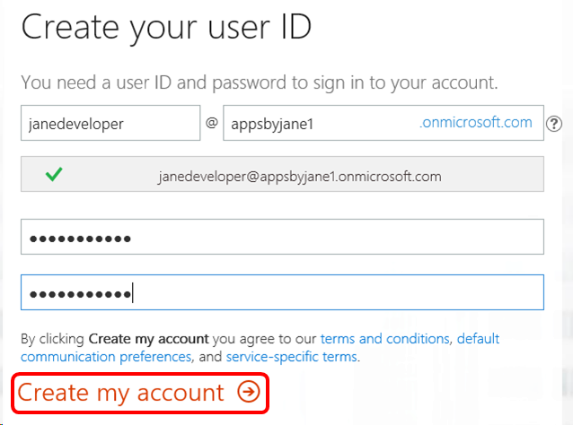
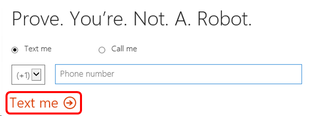
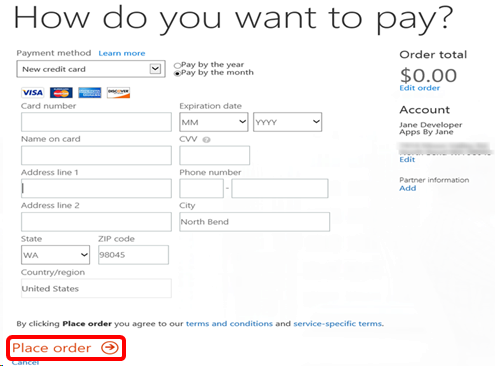

# Power BI Pro in Visual Studio subscriptions

Transform your data into rich visuals for you to collect and organize.

> [!Note]
> This Power BI license is made available to learn about and experiment with Power BI capabilities, in a safe place, without impacting larger Production/Dev/Test environments.  To enforce separation, the current offer of Power BI requires the subscriber to add Power BI to their own tenant or create a new one. If you need to have a Power BI license associated with your corporate credentials in your company tenant please work with your company admin to purchase and assign a license.

## Activation steps

To use Power BI Pro, you need to set up an account or sign in using an existing account.
1. Sign in to [https://my.visualstudio.com/benefits](https://my.visualstudio.com/benefits?wt.mc_id=o~msft~docs).

2. Locate the Power BI Pro tile in the Tools section on the Benefits page. Select the **Get Code** link at the bottom of the benefit tile.   You receive a notification that the code was successfully retrieved.  Select **Activate**.
   > [!div class="mx-imgBorder"]
   > 

3. You may already have an account if you’ve activated certain other subscription benefits, such as Microsoft 365 Developer Subscription or Enterprise Mobility + Security.  If an existing account is found, you have the choice to add your Power BI Pro subscription to your existing account or sign up for a new account.  We highly recommend adding it to your existing account so you can access your various benefits with a single user ID.
   > [!div class="mx-imgBorder"]
   > 

4. To create a new account, provide your contact information, then select **Next**.

5. Next, create your user ID and password.  If you already have an account and you’re creating a new one, provide a different company name than you used on the existing account.  Select **Create my account**.
   > [!div class="mx-imgBorder"]
   > 

6. To make sure a real person is creating an account, we ask you to enter a confirmation code.  Provide a phone number and choose whether to receive your code via a phone call or text message.  Select **Text me** or **Call me**.
   > [!div class="mx-imgBorder"]
   > 

7. Enter the code you receive, and select **Next**.

8. Provide your contact information, then select **Next**.
   > [!div class="mx-imgBorder"]
   > 

9. The next page will confirm your Power BI Pro Developer (MSDN) subscription has a $0.00 price.  Select **Next**.

10. Finally, we collect some payment information.  Don’t worry – you aren't charged anything.  Notice that the price is still $0.00.  You can choose a credit card, bank account, or invoice as a form of payment.  If you choose **Invoice**, you may be asked for some feedback on why you prefer that payment method.  Provide the information requested for your preferred payment method, and select **Place order**.
    > [!div class="mx-imgBorder"]
    > 

11. The next page confirms you’re all set to start using Power BI Pro.  The page provides a link to the sign-in page.  We recommend recording the link to the sign-in page and your user ID.  (You also receive a welcome email at the address you provided when you set up the account.)  You may also see an automated Microsoft 365 Assistant window, which you can use if you have questions.  Select **Let’s get started** to continue.

12. Now that your Power BI Pro account is set up, you see the Microsoft 365 admin center, where you can manage users and domains, install Office software, and learn about Microsoft 365.  That’s it!  You’re ready to go.

## Eligibility

| Subscription Level | Channels | Benefit | Renewable? |
|--------------------|----------|---------|------------|
| Visual Studio Enterprise (Standard)   | VL, Azure, Retail,  selected NFR\* | Available | Yes |
| Visual Studio Enterprise subscription with GitHub Enterprise | VL | Available | Yes |
| Visual Studio Professional (Standard, monthly cloud) | VL, Azure, Retail | Not available | NA |
| Visual Studio Professional subscription with GitHub Enterprise | VL | Not available | NA |
| Visual Studio Test Professional (Standard) | VL, Retail | Not available | NA |
| MSDN Platforms (Standard) | VL, Retail | Available | Yes |
| Visual Studio Enterprise (monthly cloud) | Azure | Not available | NA |
||

\*  *Includes: Not for Resale (NFR), Visual Studio Industry Partner (VSIP), MCT Software & Services Developer, Most Valuable Professional (MVP), Regional Director (RD).  Excludes: Microsoft Cloud Partner Program, FTE, Imagine, NFR Basic.*

> [!NOTE]
> Microsoft no longer offers Visual Studio Professional Annual subscriptions and Visual Studio Enterprise Annual subscriptions in Cloud Subscriptions. There will be no change to existing customers experience and ability to renew, increase, decrease, or cancel their subscriptions. New customers are encouraged to go to [https://visualstudio.microsoft.com/vs/pricing/](https://visualstudio.microsoft.com/vs/pricing/) to explore different options to purchase Visual Studio.

Not sure which subscription you're using?  Connect to [https://my.visualstudio.com/subscriptions](https://my.visualstudio.com/subscriptions?wt.mc_id=o~msft~docs) to see all the subscriptions assigned to your email address. If you don't see all your subscriptions, you may have one or more assigned to a different email address.  You need to sign in with that email address to see those subscriptions.

## Frequently asked questions

### Q:  If the benefit is free, why do I have to supply a credit card number?

A:  The benefit is free, but activation uses the same system used to process paid orders.  There are two payment types available.
+ Credit card.  If you provide a credit card number, your card isn't charged.
+ Invoice.  If you select "Invoice" as the payment type, you don't need to provide a credit card number.  You can also set the interval to "annual".  That way, you receive a single email letting you know that an invoice is ready for you.  The invoice amount is $0.00.

### Q:  Is the Power BI Pro benefit included in my subscription licensed for use in a production environment?

A:  Yes, you can use it in a production, with two important caveats:
+ This offer requires installation on its own tenant.  If you need to have a Power BI license associated with your corporate credentials in your company tenant, work with your company admin to purchase and assign a license.
+ This Power BI Pro benefit can't be used on government tenants.

### Q:  When I try to activate Power BI Pro, I get a message "You already have an account through work".  Can I still use the benefit?

A:  Yes.  The message indicates that you're logged on to a domain that already has active Microsoft 365 tenants on which you're not an admin.  To add Power BI Pro to a tenant, you must be an admin on that tenant.  To resolve this issue, follow these steps to create your own tenant.
1. When you see the message that you already have an account through work, select **Create a new account**.

2. On the next screen, provide your contact information, and select **Next**.

3. Create your user ID and password.  To take advantage of the free offer, make sure you select **.onmicrosoft.com** as the domain. Select **Create my account**.
    > [!div class="mx-imgBorder"]
    > 

4. The rest of the steps in the process are identical to the steps listed in the body of the article, beginning with step 6.

### Q:  I'm on a government tenant.  Can I use the benefit?

A:  No.  The Power BI Pro benefit can't be added to government tenants.

## Support resources

+ Need help with Power BI Pro?
  + Check out the [online documentation](/power-bi/).
  + Problems signing up?  Check out [Signing up for Power BI as an Individual](/power-bi/service-self-service-signup-for-power-bi)
  + Explore top issues, get help from the community or submit a support ticket on the [Support page](https://powerbi.microsoft.com/support/).
+ For assistance with sales, subscriptions, accounts and billing for Visual Studio Subscriptions, contact [Visual Studio subscriptions support](https://my.visualstudio.com/gethelp)
+ Have a question about Visual Studio IDE, Azure DevOps Services or other Visual Studio products or services?  Visit [Visual Studio Support](https://visualstudio.microsoft.com/support/).

## See also

+ [Visual Studio documentation](/visualstudio/)
+ [Azure DevOps documentation](/azure/devops/)
+ [Azure documentation](/azure/)
+ [Microsoft 365 documentation](/microsoft-365/)

## Next steps

+ To activate your Power BI Pro benefit, visit [https://my.visualstudio.com/benefits](https://my.visualstudio.com/benefits?wt.mc_id=o~msft~docs).
+ Take advantage of your own development sandbox by activating your [Azure DevTest individual credit](/azure/devtest/offer/quickstart-individual-credit).
