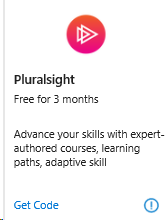

# Pluralsight training benefits in Visual Studio subscriptions

Advance your skills with expert-authored courses, learning paths, adaptive skill measurement, and more!  Depending on which Visual Studio subscription or program membership you have, you may be eligible for up to six months of free, unlimited access to the entire Pluralsight catalog.

The table below details what Pluralsight subscription benefits are available to each Visual Studio subscription type.  Some subscribers will also be able to take advantage of limited courses after their full catalog access subscription expires. Pluralsight will guide you through that process when your full catalog subscription expires.

 Depending on the type of subscription they have, not all subscribers who have previously used a Pluralsight subscription provided through a Visual Studio subscription will be able to redeem new Pluralsight benefit offers. If you are not eligible to redeem additional Pluralsight training benefits, you'll receive a notification when you attempt to activate the benefit on the Pluralsight website.

## Activation steps
1. To activate your subscription, connect to [https://my.visualstudio.com/benefits](https://my.visualstudio.com/benefits?wt.mc_id=o~msft~docs) and click on the **Get code** link on the Pluralsight benefit tile, located in the Professional Development section.
   > [!div class="mx-imgBorder"]
   > 
   >
   > [!IMPORTANT]
   > When you click on the "Get Code" link on the Pluralsight benefit tile, you may receive the following message:
   >
   > **"Please note:   If you have previously activated a different Pluralsight offer through your Visual Studio subscription, this code may not enable you to create a new Pluralsight account."**

2. You’ll receive a notification that the coupon code has been successfully retrieved.  Click **Activate**.

3. You'll be redirected to the Pluralsight page for the benefit that's included with your Visual Studio subscription.
   - Provide the contact information requested on the form
   - Click the checkbox to accept the terms of use and privacy policy
   - Click **I agree, activate benefit**.
   > [!div class="mx-imgBorder"]
   > 

5. It may take a moment to set up your account.  Once that's complete, you'll see a confirmation on the page, and will receive an email with your login information.  The email will be sent to the alias you specified when you created the account.  Be sure to check your junk or spam mail folders if you have trouble finding the message.

   > [!NOTE]
   > If your account is not eligible to redeem new offers, the email you receive will explain that there was a problem creating your account because it's not eligible.  It will also contain information to help you contact Pluralsight's support team, who can answer any questions you may have about your account.
   

6. After your account has been successfully created, the email you receive will contain your username, and ask you to create a password.  Provide your password, enter it again to confirm it, and click **Log in to Pluralsight**.

7. Enter the username provided in the welcome email, and the password you just created, and click **Sign in**.

8. That's it!  You're now ready to start learning with thousands of Pluralsight courses!

## Eligibility

|                          Subscription Level                          |     Channels      |    Benefit    |   Renewable?   |
|----------------------------------------------------------------------|-------------------|---------------|----------------|
|          Visual Studio Enterprise (Standard)           | VL, Azure, Retail |   6 months    | Yes2 |
|          Visual Studio Enterprise with GitHub Enterprise          | VL  |   6 months    | Yes2 |
|         Visual Studio Professional (Standard)          | VL, Azure, Retail |   3 months    | Yes2 |
|         Visual Studio Professional with GitHub Enterprise          | VL  |   3 months    | Yes2 |
|              Visual Studio Test Professional (Standard)              |    VL, Retail     |   3 months    | Yes2  |
|                      MSDN Platforms (Standard)                       |    VL, Retail     |   3 months    | Yes2  |
| Visual Studio Enterprise, Visual Studio Professional (monthly cloud) |       Azure       | Not available |       NA       |
|             Visual Studio Enterprise (NFR1 )              |      Program      | Not available |       NA       |
||

1  *Includes:  Not for Resale (NFR), Visual Studio Industry Partner (VSIP), BizSpark, MCT Software & Services Developer, MCT Software & Service, Most Valuable Professional (MVP), Regional Director (RD), Microsoft Partner Network (MPN), FTE, Imagine.*

2  *The Pluralsight benefit in selected Visual Studio subscriptions renews when your subscription renews. For example, if you have an annual subscription that you renew each year, the benefit is available to you each year when you renew. If you have a multi-year subscription, the Pluralsight benefit is available to you once during the term of the subscription.  If you renew a multi-year subscription, the benefit will be available again following the renewal.*

> [!NOTE]
> Microsoft no longer offers Visual Studio Professional Annual subscriptions and Visual Studio Enterprise Annual subscriptions in Cloud Subscriptions. There will be no change to existing customers experience and ability to renew, increase, decrease, or cancel their subscriptions. New customers are encouraged to go to [https://visualstudio.microsoft.com/vs/pricing/](https://visualstudio.microsoft.com/vs/pricing/) to explore different options to purchase Visual Studio.

Not sure which subscription you're using?  Connect to [https://my.visualstudio.com/subscriptions](https://my.visualstudio.com/subscriptions?wt.mc_id=o~msft~docs) to see all the subscriptions assigned to your email address. If you don't see all your subscriptions, you may have one or more assigned to a different email address.  You'll need to sign in with that email address to see those subscriptions.

## Frequently asked questions

### Q: I have a Visual Studio Enterprise subscription, but I don't see the Pluralsight tile on the Benefits page. What's wrong?
A: Not all Visual Studio Enterprise subscriptions include the Pluralsight benefit.  Check the [eligibility table](#eligibility) to see whether your subscription is eligible.

### Q: Do I have access to any customized learning  playlists or channels?
A: Yes, as a Visual Studio subscriber you get access to expert channels as part of your Pluralsight training benefit. These channels have been specially curated by Microsoft experts and are geared towards learning in the areas of .Net, Azure, DevOps and Mobility. Activate your Pluralsight benefit through your Visual Studio subscription portal [https://my.visualstudio.com](https://my.visualstudio.com?wt.mc_id=o~msft~docs) to get access to these channels on your Pluralsight landing page –

•   Scott Hanselmann (.Net, Azure) - [https://go.pluralsight.com/scott-hanselman](https://go.pluralsight.com/scott-hanselman)

•   Donovan Brown (DevOps) - [https://go.pluralsight.com/donovan-brown](https://go.pluralsight.com/donovan-brown)

•   James Montemagno (Mobility) - [https://go.pluralsight.com/james-montemagno](https://go.pluralsight.com/james-montemagno)

### Q: What happens when my Pluralsight subscription runs out?
A:  At the end of your free Pluralsight subscription, you may choose to purchase a subscription directly from Pluralsight.  Please contact [Pluralsight](https://www.pluralsight.com) for full details.

## Support resources
- [Pluralsight Help Center](https://help.pluralsight.com/help) provides assistance with taking Pluralsight courses or using the Pluralsight website.
- For assistance with sales, subscriptions, accounts and billing for Visual Studio Subscriptions, contact Visual Studio [Subscriptions Support](https://visualstudio.microsoft.com/subscriptions/support/).
- Have a question about Visual Studio IDE, Azure DevOps Services or other Visual Studio products or services?  Visit [Visual Studio Support](https://visualstudio.microsoft.com/support/).

## Next steps
Once you've created your account, you're ready to start training.  Visit [https://www.pluralsight.com](https://www.pluralsight.com) and tap **log in** at the top right corner of the page to start a new course, or return to a course already in progress.

Take advantage of your own development sandbox by activating your [Azure DevTest individual credit](vs-azure.md). 