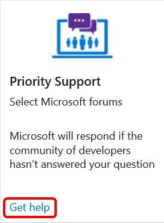
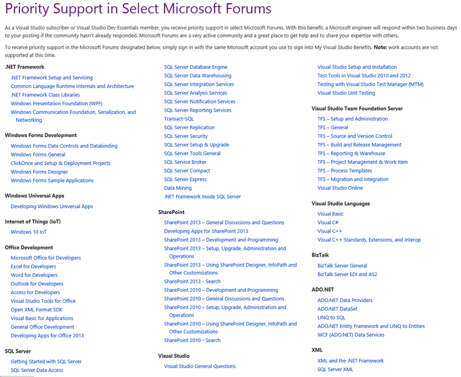
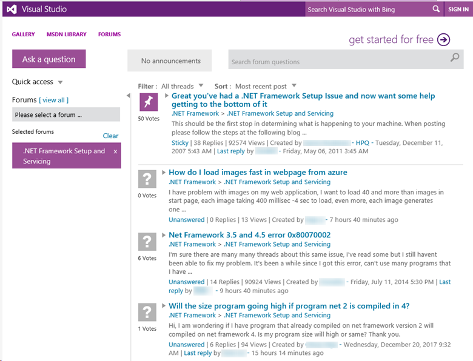

# Priority Support in Visual Studio subscriptions

The Priority Support benefit provides you with access to a variety of support community forums where you can search existing posts or asks new questions.  If the community does not respond to your question within two days, Microsoft's support team will provide a response.  

Subscribers with selected Visual Studio subscriptions are eligible to receive priority support via a large number of forums covering a variety of topics.

## Included forums

### .NET Framework
   - .NET Framework Setup and Servicing 

   - Common Language Runtime Internals and Architecture 

   - .NET Framework Class Libraries 

   - Windows Presentation Foundation (WPF) 

   - Windows Communication Foundation, Serialization, and Networking 

### Windows Forms Development
   - Windows Forms Data Controls and Databinding 

   - Windows Forms General 

   - ClickOnce and Setup & Deployment Projects 

   - Windows Forms Designer 

   - Windows Forms Sample Applications 

### Windows Universal Apps
   - Developing Windows Universal Apps 

### Internet of Things (IoT)
   - Windows 10 IoT 

### Office Development
   - Microsoft Office for Developers 

   - Excel for Developers 

   - Word for Developers 

   - Outlook for Developers 

   - Access for Developers 

   - Visual Studio Tools for Office 

   - Open XML Format SDK 

   - Visual Basic for Applications 

   - General Office Development 

   - Developing Apps for Office 2013 

### SQL Server
   - Getting Started with SQL Server 

   - SQL Server Data Access 

   - SQL Server Database Engine 

   - SQL Server Data Warehousing 

   - SQL Server Integration Services 

   - SQL Server Analysis Services 

   - SQL Server Notification Services 

   - SQL Server Reporting Services 

   - Transact-SQL 

   - SQL Server Replication 

   - SQL Server Security 

   - SQL Server Setup & Upgrade 

   - SQL Server Tools General 

   - SQL Service Broker 

   - SQL Server Compact 

   - SQL Server Express 

   - Data Mining 

   - .NET Framework Inside SQL Server 

### SharePoint
   - SharePoint 2013 – General Discussions and Questions 

   - Developing Apps for SharePoint 2013 

   - SharePoint 2013 – Development and Programming 

   - SharePoint 2013 – Setup, Upgrade, Administration and Operations 

   - SharePoint 2013 – Using SharePoint Designer, InfoPath and Other Customizations 

   - SharePoint 2013 - Search 

   - SharePoint 2010 – Development and Programming 

   - SharePoint 2010 – General Discussions and Questions 

   - SharePoint 2010 – Setup, Upgrade, Administration and Operations 

   - SharePoint 2010 – Using SharePoint Designer, InfoPath and Other Customizations 

   - SharePoint 2010 - Search 

### Visual Studio
   - Visual Studio General Questions 

   - Visual Studio Setup and Installation 

   - Test Tools in Visual Studio 2010 and 2012 

   - Testing with Visual Studio Test Manager (MTM) 

   - Visual Studio Unit Testing 

### Visual Studio Team Foundation Server
   - TFS – Setup and Administration 

   - TFS – General 

   - TFS – Source and Version Control 

   - TFS – Build and Release Management 

   - TFS – Reporting & Warehouse 

   - TFS – Project Management & Work Item 

   - TFS – Process Templates 

   - TFS – Migration and Integration 

   - Visual Studio Online 

### Visual Studio Languages
   - Visual Basic 

   - Visual C# 

   - Visual C++ 

   - Visual C++ Standards, Extensions, and Interop 

### BizTalk
   - BizTalk Server General 

   - BizTalk Server EDI and AS2 

### ADO.NET
   - ADO.NET Data Providers 

   - ADO.NET DataSet 

   - LINQ to SQL 

   - ADO.NET Entity Framework and LINQ to Entities 

   - WCF (ADO.NET) Data Services 

### XML
   - XML and the .NET Framework 

   - SQL Server XML 

## Activation steps
Getting access to Prior Support is very simple. 
1. Sign in to [https://my.visualstudio.com/benefits](https://my.visualstudio.com/benefits?wt.mc_id=o~msft~docs).

2. Locate the Priority Support tile in the Support section.  Click on **Get help**.

    

3. Browse the forum list, and select your desired forum. 

    

4. You can read recent answers, search previous posts, or submit a new question.  

    

## Eligibility
| Subscription Level                                                 |     Channels                                            | Benefit                                                          | Renewable?    |
|--------------------------------------------------------------------|---------------------------------------------------------|------------------------------------------------------------------|---------------|
| Visual Studio Enterprise (Standard, annual cloud)   | VL, Azure, Retail,  selected NFR1 | Included       |  Yes          |
| Visual Studio Professional (Standard, annual cloud) | VL, Azure, Retail                                       | Included                                                            |Yes |
| Visual Studio Test Professional (Standard)                         | VL, Retail                                              | Included                                                            |Yes |
| MSDN Platforms (Standard)                                          | VL, Retail                                              | Included                                                            |Yes |
| Visual Studio Dev Essentials | NA  | Included                                                            |Yes |
| Visual Studio Enterprise, Visual Studio Professional (monthly cloud) | Azure                                       | Not available                                                           |NA|

1  *Includes:  Not for Resale (NFR), FTE, Visual Studio Industry Partner (VSIP), Imagine.  Excludes:  Microsoft Partner Network (MPN), MCT Software & Services, MCT Software & Services Developer, BizSpark, Microsoft Valued Partner (MVP), Region Director (RD).*

Not sure which subscription you're using?  Connect to [https://my.visualstudio.com/subscriptions](https://my.visualstudio.com/subscriptions?wt.mc_id=o~msft~docs) to see all the subscriptions assigned to your email address. If you don't see all your subscriptions, you may have one or more assigned to a different email address.  You'll need to sign in with that email address to see those subscriptions. 

## Support resources
-  For assistance with sales, subscriptions, accounts and billing for Visual Studio Subscriptions, contact Visual Studio [Subscriptions Support](https://www.visualstudio.com/subscriptions/support/).
-  Have a question about Visual Studio IDE, Visual Studio Team Services or other Visual Studio products or services?  Visit [Visual Studio Support](https://www.visualstudio.com/support/). 