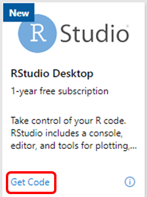
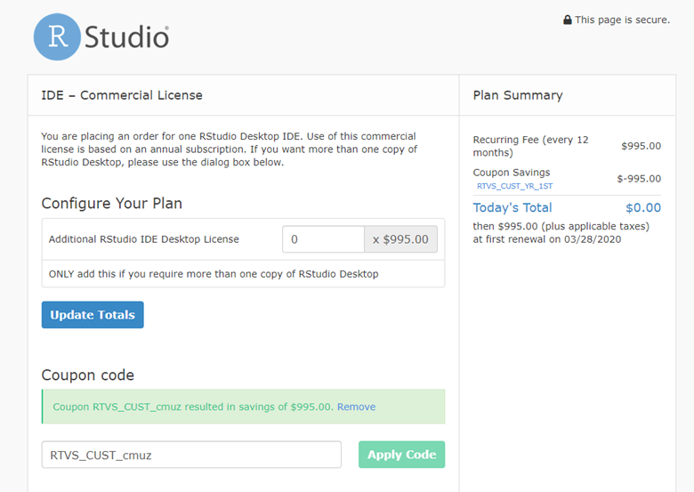
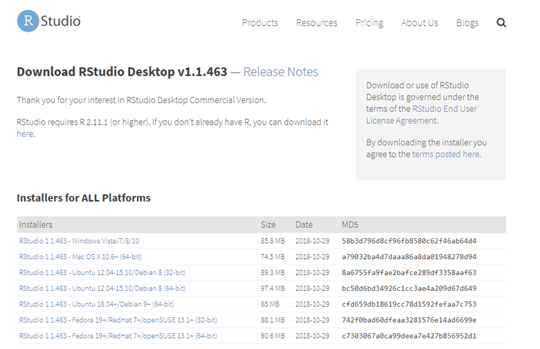
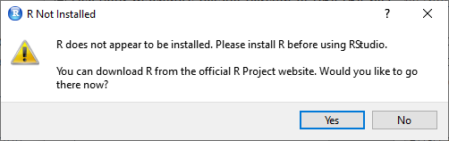
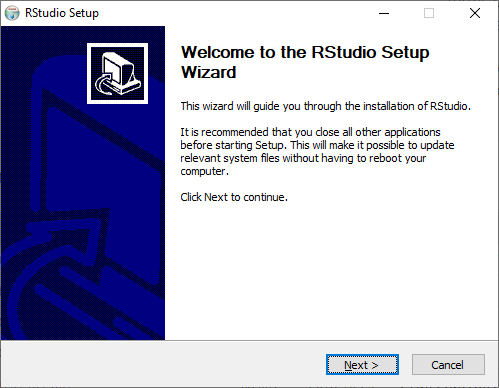
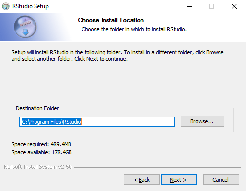
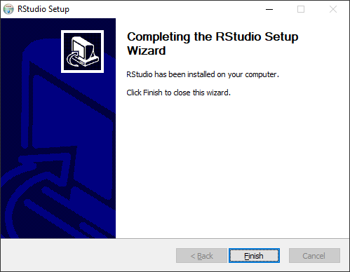
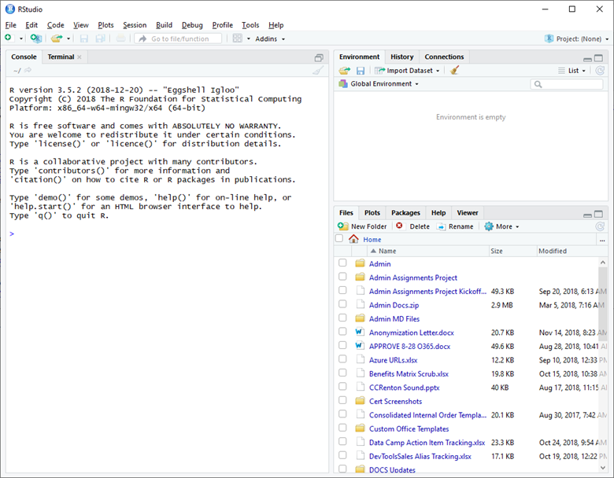

# The RStudio Desktop benefit included in Visual Studio Enterprise subscriptions

Take control of your R code.  RStudio is an integrated development environment (IDE) for R. It includes a console, syntax-highlighting editor that supports direct code execution, as well as tools for plotting, history, debugging and workspace management. See more [RStudio features](https://www.rstudio.com/products/rstudio/features/).

RStudio is available in open source and commercial editions and runs on the desktop (Windows, Mac, and Linux) or in a browser connected to RStudio Server or RStudio Server Pro (Debian/Ubuntu, RedHat/CentOS, and SUSE Linux).  The RStudio Desktop benefit included in Visual Studio Enterprise subscriptions includes one year of access to the commercial edition.

> [!IMPORTANT]
> The RStudio Desktop benefit is available for a limited time only.  To use the benefit, you must activate it before July 1, 2019.

## Activation steps
1. To activate your subscription, connect to [https://my.visualstudio.com/benefits](https://my.visualstudio.com/benefits?wt.mc_id=o~msft~docs) and click on the **Get code** link on the RStudio benefit tile, located in the tools section.
   > [!div class="mx-imgBorder"]
   > 

2. You’ll receive a notification that the coupon code has been successfully retrieved.  Click **Activate**.  If you choose **Cancel**, you can still activate your RStudio benefit later.  After you get the code, the link on the tile will change to **Activate**, and you can click it later to continue the activation process.

3. You'll be redirected to the RStudio page for the benefit that's included with your Visual Studio subscription.

    > [!NOTE]
    > At the top of the landing page you'll see a section called Configure Your Plan in which you'll have an opportunity to purchase additional licenses for RStudio Desktop commercial edition.  Your subscription includes one license.  Enter a quantity in the blank **ONLY** if you wish to purchase an additional licese.

    > [!div class="mx-imgBorder"]
    > 

4. The coupon code for your benefit will be automatically populated on the page.  If the code is not automatically applied, click the **Apply Code** button. After you have applied the code, the Plan Summary in the upper right corner of the page will reflect the discount and show **Today's Total** as $0.00.

5. Complete the "Customer Information", "Shipping Information", "Billing Information", "Billing Address" and "Additional Information" sections of the page.

    > [!IMPORTANT]
    > When you sign up for the RStudio Desktop benefit, you'll be signed up on a recurring annual subscription.  The purchase price of the annual subscription will be billed to your credit card unless you cancel your subscription prior to the renewal date.

6. Click the checkbox to accept the **Terms and Conditions**.

7. Click **Place My Order**

    After placing your order, you'll receive several important emails, including details on managing your account, accessing support, and other important account information.

8. After your order has been placed, you can proceed to the installation of RStudio.  Follow the prompts in the wizard to complete the installation.

    > [!div class="mx-imgBorder"]
    > 

    > [!NOTE]
    > You must have a valid installation of R on your computer in order to start RStudio.  If you don't have R installed, you'll receive the error following message.  Click **Yes** to download R from the official R Project website, or download and install R from another source before using RStudio.

   > [!div class="mx-imgBorder"]
   > 

9. On the "Welcome to the RStudio Setup Wizard", click **Next**.

    > [!div class="mx-imgBorder"]
    > 

10. Choose the destination folder or accept the default proposed by the wizard, and click **Next**.
    > [!div class="mx-imgBorder"]
    > 

11. Choose the Start Menu Folder or accept the default, and click **Install**.
    > [!div class="mx-imgBorder"]
    > 

12. After setup is completed, click **Finish** to exit the installer.
    > [!div class="mx-imgBorder"]
    > 

13. Locate RStudio in the Start Menu Folder you specified, or type "RStudio" in the Windows search box to locate the app and start RStudio.
    > [!div class="mx-imgBorder"]
    > 

## Eligibility

|                          Subscription Level                          |     Channels      |    Benefit    |   Renewable?   |
|----------------------------------------------------------------------|-------------------|---------------|----------------|
|          Visual Studio Enterprise (Standard)           | VL, Retail |   12 months    | No|
|         Visual Studio Professional (Standard)          | VL, Retail |   Not available    | NA |
|              Visual Studio Test Professional (Standard)              |    VL, Retail     |   Not available    | NA |
|                      MSDN Platforms (Standard)                       |    VL, Retail     |   Not available   | NA |
| Visual Studio Enterprise, Visual Studio Professional (monthly cloud) |       Azure       | Not available |       NA       |
|             Visual Studio Enterprise (NFR1 )              |      Program      | Not available |       NA       |
||

1  *NFR Includes:  Not for Resale (NFR), Visual Studio Industry Partner (VSIP), BizSpark, MCT Software & Services Developer, MCT Software & Service, Most Valuable Professional (MVP), Regional Director (RD), Microsoft Partner Network (MPN), FTE, Imagine.*

> [!NOTE]
> Microsoft no longer offers Visual Studio Professional Annual subscriptions and Visual Studio Enterprise Annual subscriptions in Cloud Subscriptions. There will be no change to existing customers experience and ability to renew, increase, decrease, or cancel their subscriptions. New customers are encouraged to go to [https://visualstudio.microsoft.com/vs/pricing/](https://visualstudio.microsoft.com/vs/pricing/) to explore different options to purchase Visual Studio subscriptions.

Not sure which subscription you're using?  Connect to [https://my.visualstudio.com/subscriptions](https://my.visualstudio.com/subscriptions?wt.mc_id=o~msft~docs) to see all the subscriptions assigned to your email address. If you don't see all your subscriptions, you may have one or more assigned to a different email address.  You'll need to sign in with that email address to see those subscriptions.

## Frequently asked questions

### Q: If I claim my coupon code by clicking on the "Get code" button but I don't activate until after June 1, 2019, will I still be able to use the benefit?

A:  No.  The offer will expire on June 1, 2019. You must complete the entire activation process before the expiration date in order to use the benefit.

### Q: I don't want to sign up for a recurring subscription.  Can I opt out?

A:  You'll be automatically signed up for the recurring subscription, but you can cancel any time before the renewal date and still take advantage of the first year of RStudio that's included with your Visual Studio subscription at no charge.

After you complete the signup for RStudio, you'll receive several emails, including one inviting you to manage your subscription for RStudio on BillingPortal.com.  Accepting the invitation will allow you to change plans, manage stored credit card information, and manage your account details.

### Q:  If I don't have "R" installed, where can I get it?

A:  If you receive an error that you don't have "R" installed, the error message will contain a link to the "Comprehensive R Archive Network (CRAN)" at https://cran.rstudio.com/.  You can also perform an internet search for other download locations.

## Support resources

- RStudio self-help: https://support.rstudio.com/hc/
- RStudio Community: https://community.rstudio.com/
- Assisted support:  https://support.rstudio.com/hc/requests/new
- For assistance with sales, subscriptions, accounts and billing for Visual Studio Subscriptions, contact Visual Studio [Subscriptions Support](https://visualstudio.microsoft.com/subscriptions/support/).
- Have a question about Visual Studio IDE, Azure DevOps Services or other Visual Studio products or services?  Visit [Visual Studio Support](https://visualstudio.microsoft.com/support/).

## Next steps

The RStudio benefit is available for a very limited time.  Remember to claim your code and create your RStudio account before July 1, 2019.
