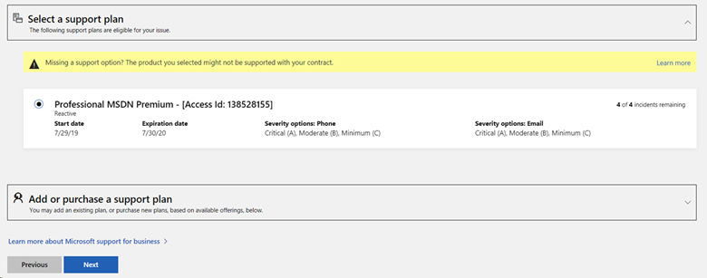
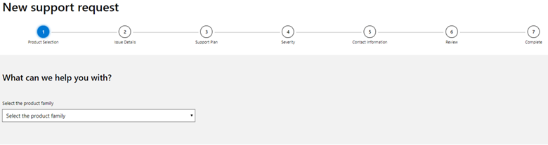
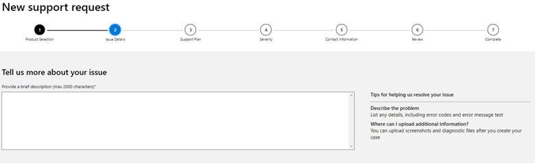
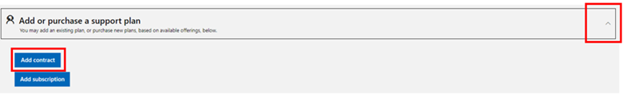
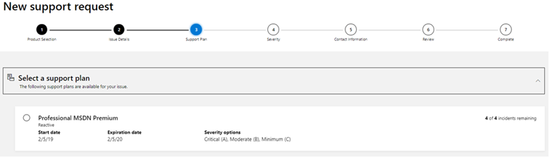

# Activate and use the Technical Support benefit in Visual Studio subscriptions
The Technical Support benefit in Visual Studio subscriptions is for resolving break-fix issues in **non-production environments** for products that are still in the mainstream support phase of the [support lifecycle](https://support.microsoft.com/lifecycle/search). Visual Studio Enterprise standard and annual cloud subscriptions receive four incidents, while Visual Studio Professional standard and annual cloud subscriptions receive two incidents, for up to 1 year from benefit activation. Benefit activation must occur while the subscription is current.

> [!NOTE]
> Microsoft no longer offers Visual Studio Professional Annual subscriptions and Visual Studio Enterprise Annual subscriptions in Cloud Subscriptions. There will be no change to existing customers experience and ability to renew, increase, decrease, or cancel their subscriptions. New customers are encouraged to go to https://visualstudio.microsoft.com/vs/pricing/ to explore different options to purchase Visual Studio subscriptions.

> [!NOTE]
> Not all subscriptions at a given level are eligible to receive support incidents. Subscriptions acquired through FTE, NFR, MPN, MCT and other programs do not receive support incidents. If your subscription is not eligible to receive technical support incidents, the Technical Support tile will not appear in your available benefits.

**To submit a support request using the benefit, you must first activate it.  Follow the steps in the next section to complete the activation.**

## Supported products 
Developer Tools such as the Visual Studio IDE and Azure DevOps Server will receive both mainstream and extended support through Visual Studio subscriptions.

Non-developer products (such as SQL, Windows, SharePoint) downloaded from Visual Studio subscriptions are eligible only for mainstream support. These products are only licensed for development environments to design, develop, test, or demonstrate applications. These products are not licensed for production environments.

Product level descriptions: Expand **Unavailable support plans**. If you see **Support plan cannot be used for support on the specified product (Code: 8)**, your support contract cannot be used for the product version you selected.

## How to activate the benefit
1. Go to https://my.visualstudio.com/Benefits, scroll down to the Support section and on the Technical Support tile click **Chat to activate**.
    > [!div class="mx-imgBorder"]
    > 
2. This will initiate a chat session with a representative who can create your **Contract ID** and **Access ID** and provide those to you via email so you will have them for your records.

3. To complete the process, you will need to provide the representative with:
   - Your country
   - Company name
   - Your full name
   - The email address you use to sign in to your subscription
   - Your phone number
   - The Subscription ID, which can be found on the [Subscriptions](https://my.visualstudio.com/subscriptions) tab.

   > [!div class="mx-imgBorder"]
   > 

4. After the process is completed, you will receive an email containing your **Contract ID** and **Access ID** you will use when creating a support incident.  It will also provide instructions for submitting support incidents using your new Access ID and Contract ID. 

> [!NOTE]
> To activate your support account in a language other than English, choose your country from [this list](https://support.microsoft.com/help/14084/activate-support-contract).

## How to submit an incident using your benefit
Once you have your **Contract ID** and **Access ID** set up, you can use it to submit a Tech Support incident [online](https://support.microsoft.com/oas/) (sign-in required), or via the [Azure portal](https://ms.portal.azure.com/#blade/Microsoft_Azure_Support/HelpAndSupportBlade/overview) , or by calling the technical support number for your country. If you submit your incident online, you have the option to have a Microsoft Support Professional call you back.

### Already have your Contract ID and Access ID associated with the account used to sign in to submit a Tech Support incident online?
When submitting an incident online, you will first be prompted to sign in. Sign in with the account you know is associated with your Contract ID and Access ID. Your existing Support Plan benefit associated to your account will appear on Step 3 in the support workflow. Simply select that plan and continue to submit your case. You can submit incidents up to the limit indicated on the plan or until the expiration date of the plan, whichever comes first. Once remaining incidents show “0” or if your plan expires, it is no longer active.

   > [!div class="mx-imgBorder"]
   > 

### Using your Contract ID and Access ID when submitting an incident (initial use)

#### Submitting an incident online
When submitting an incident online, you will first be prompted to sign in. Using the dropdown list, select the product you need help with. For example, to submit an incident for Visual Studio Enterprise 2019 select the **Developer Tools** family, then select **Visual Studio 2019** as the product, and then choose **Visual Studio Enterprise 2019** as the version.

1. After choosing the product for which you need support, click **Next**.

   > [!div class="mx-imgBorder"]
   > 

2. Describe your issue and click **Next**.

   > [!div class="mx-imgBorder"]
   > 

3. On the “Support Plan” page, scroll down to **Add or purchase a support plan**, expand it using the arrow at the right and click **Add contract**.

   > [!div class="mx-imgBorder"]
   > 

4. Enter your **Access ID** and **Contract ID**.  Click **Add**.

   > [!div class="mx-imgBorder"]
   > 

5. After your contract has been added, it will appear under **Select a support plan** at the top. Your plan will contain the term “MSDN” in the title. Choose it, scroll down, and click **Next**.

   > [!div class="mx-imgBorder"]
   > 

   > [!NOTE]
   > If you do not see your support plan, go back to the previous page and click **Next** again.  If that fails to display the support plan, copy the text of your support issue to your clipboard, refresh the page and recreate the support issue.

6. Complete the remaining steps (severity, contact information, review).   After you submit your incident, you’ll see a confirmation that your incident has been successfully submitted and you can upload files to the case. A Support Professional will be assigned to your incident and will reach out to you to resolve your issue using the contact method you selected.

#### Submit an incident by phone
If you would like to create a support incident over the phone, please locate the [Customer Service](https://support.microsoft.com/help/13948/global-customer-service-phone-numbers) phone number for your country. Please ensure you have your Contract ID and Access ID available when you call.

#### Submit an incident within the Azure portal
To use your Visual Studio subscription technical support benefit for issues relating to Azure, you will need to link your Contract ID and Access ID to your Azure subscription.

1. Visit https://portal.azure.com and sign in
2. From the left-hand navigation click **Help + Support**
3. Under “Support” click **New Support Request**

## Eligibility

| Subscription Level                                                 |     Channels                                            | Benefit                                                          | Renewable?    |
|--------------------------------------------------------------------|---------------------------------------------------------|------------------------------------------------------------------|---------------|
| Visual Studio Enterprise (Standard)   | VL, Azure, Retail, selected NFR1 | 4 incidents       |  Yes|
| Visual Studio Enterprise with GitHub Enterprise | VL | 4 incidents       |  Yes|
| Visual Studio Professional (Standard) | VL, Azure, Retail, selected NFR2                                        | 2 incidents                                                          |Yes         |
| Visual Studio Professional with GitHub Enterprise | VL                                     | 2 incidents                                                          |Yes         |
| Visual Studio Test Professional (Standard)                         | VL, Retail                                              | 2 incidents                                             |  Yes         |
| MSDN Platforms (Standard)                                          | VL, Retail                                              | 2 incidents                                               | Yes         |
| Visual Studio Enterprise, Visual Studio Professional (monthly cloud) | Azure                                       | Not available                                                           |NA|
||

1 *Includes: Imagine Premium, BizSpark. Excludes: Not for Resale (NFR), Visual Studio Industry Partner (VSIP), Microsoft Partner Network (MPN), FTE, MCT Software & Services Developer, Imagine Standard, Most Valuable Professional (MVP), Regional Director (RD), MCT Software & Services.*

2 *Includes: Imagine Standard.*

Not sure which subscription you're using?  Connect to [https://my.visualstudio.com/subscriptions](https://my.visualstudio.com/subscriptions?wt.mc_id=o~msft~docs) to see all the subscriptions assigned to your email address. If you don't see all your subscriptions, you may have one or more assigned to a different email address.  You'll need to sign in with that email address to see those subscriptions.

## Next steps
Be sure to activate these great benefits to make the most of your Visual Studio subscription:
- [Visual Studio](vs-ide-benefit.md)
- [Azure DevOps](vs-azure-devops.md)
- [Azure DevTest individual credit](vs-azure.md)