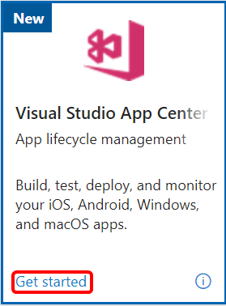
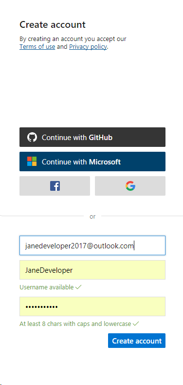
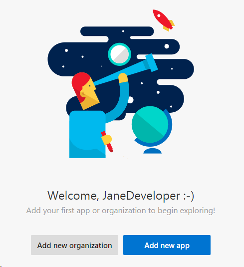

# Visual Studio App Center in Visual Studio subscriptions

> [!NOTE]
> Visual Studio App Center is scheduled for retirement on March 31, 2025. After that date, it will not be possible to sign in with your user account nor make API calls. App Center will continue to be supported until March 31, 2025, with critical bug fixes and technical support.

App Center is mission control for apps.

+ Automatically build your app, test it on real devices, and distribute it to beta testers
+ Collect crash reports and user analytics, including custom events.
+ Add push notifications to your app in minutes

## Get started with Visual Studio App Center

Getting started with Visual Studio App Center is easy.
1. Sign in to [https://my.visualstudio.com/benefits](https://my.visualstudio.com/benefits?wt.mc_id=o~msft~docs).

2. Locate the Visual Studio App Center tile, and select **Get started**.
    > [!div class="mx-imgBorder"]
    > 

3. Next, create an account. You can use existing accounts for Microsoft, Google, GitHub or Facebook to sign in, or create a new account by providing your username, email, and password. Select **Create account** to continue.
    > [!div class="mx-imgBorder"]
    > 

4. You're done. Select **Add new organization** or **Add new app** to get started!
    > [!div class="mx-imgBorder"]
    > 

## Eligibility

| Subscription Level |  Channels | Benefit | Renewable? |
|--------------------|-----------|---------|------------|
| Visual Studio Enterprise (Standard, annual cloud) | VL, Azure, Retail,  NFR* | Included | Yes |
| Visual Studio Enterprise (monthly cloud) | Azure | Not available | NA |
| Visual Studio Enterprise subscription with GitHub Enterprise | VL | Included | Yes |
| Visual Studio Professional (Standard, annual cloud) | VL, Azure, Retail | Included | Yes |
| Visual Studio Professional (monthly cloud) | Azure | Not available | NA |
| Visual Studio Professional subscription with GitHub Enterprise | VL | Included | Yes |
| Visual Studio Test Professional (Standard) | VL, Retail | Included | Yes |
| MSDN Platforms (Standard) | VL, Retail | Included | Yes |
||

\*  *Includes:  Not for Resale (NFR), FTE, Visual Studio Industry Partner (VSIP), Imagine, Microsoft Cloud Partner Program, MCT Software & Services, MCT Software & Services Developer, BizSpark, Most Valuable Professional (MVP), Regional Director (RD). Excludes:  NFR Basic*

> [!NOTE]
> Microsoft no longer offers Visual Studio Professional Annual subscriptions and Visual Studio Enterprise Annual subscriptions in Cloud Subscriptions. There will be no change to existing customers experience and ability to renew, increase, decrease, or cancel their subscriptions. New customers are encouraged to go to [https://visualstudio.microsoft.com/vs/pricing/](https://visualstudio.microsoft.com/vs/pricing/) to explore different options to purchase Visual Studio.

Not sure which subscription you're using? Connect to [https://my.visualstudio.com/subscriptions](https://my.visualstudio.com/subscriptions?wt.mc_id=o~msft~docs) to see all the subscriptions assigned to your email address. If you don't see all your subscriptions, you may have one or more assigned to a different email address. You need to sign in with that email address to see those subscriptions.

## Frequently asked questions

### Q:  I get an error that my browser is unsupported. What's wrong?

A:  App Center requires newer capabilities that some older browsers may not provide. If your browser isn't supported, follow these steps:
1. Open a different browser, such as Microsoft Edge or the latest versions of Google Chrome or Firefox, or Safari.
2. Connect to the Visual Studio [https://my.visualstudio.com/benefits](https://my.visualstudio.com/benefits?wt.mc_id=o~msft~docs) and sign in.
3. Now select on the **Get started** link on the Visual Studio App Center tile.

You should now be able to access the App Center portal and create your account.

## Support Resources

+ Need help with App Center?
  + Get advice and answers from the App Center Team in the [App Center Help Center](https://intercom.help/appcenter/).
  + Check out complete [App Center documentation](/appcenter/)
+ For assistance with sales, subscriptions, accounts and billing for Visual Studio Subscriptions, contact Visual Studio [Visual Studio subscriptions support](https://my.visualstudio.com/gethelp).
+ Have a question about Visual Studio IDE, Azure DevOps Services, or other Visual Studio products or services? Visit [Visual Studio Support](https://visualstudio.microsoft.com/support/).

## See also

+ [Visual Studio documentation](/visualstudio/)
+ [Azure DevOps documentation](/azure/devops/)
+ [Azure documentation](/azure/)
+ [Microsoft 365 documentation](/microsoft-365/)

## Next steps

Be sure to activate these great benefits to make the most of your Visual Studio subscription:
+ [Visual Studio](vs-ide-benefit.md)
+ [Azure DevOps](vs-azure-devops.md)
+ [Azure DevTest offer / credits](/azure/devtest/offer/)