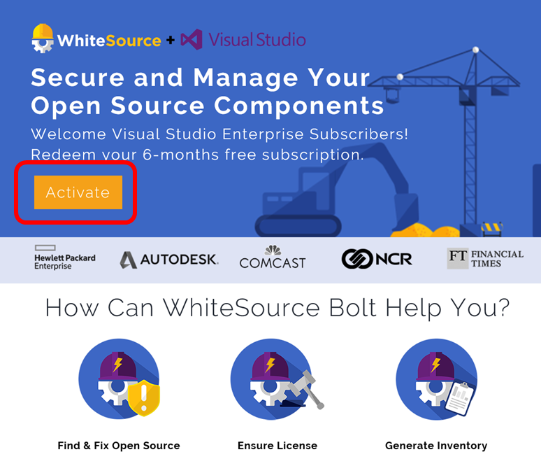
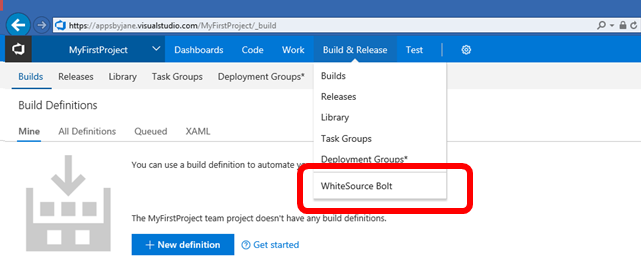
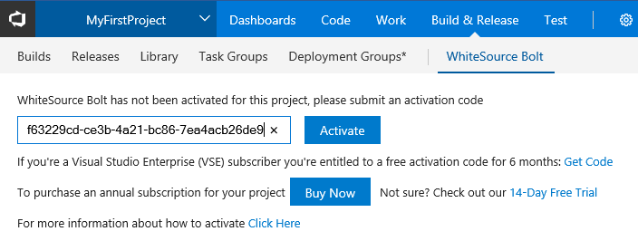

# WhiteSource Bolt in Visual Studio subscriptions

Find and fix open source vulnerabilities and generate comprehensive inventory and license reports of all open source components in your build. Some Visual Studio subscriptions include six months of free access.

## Activation steps

1. To activate your WhiteSource Bolt benefit, sign in to [https://my.visualstudio.com/benefits](https://my.visualstudio.com/benefits?wt.mc_id=o~msft~docs) .

2. Locate the WhiteSource Bolt tile in the Tools section, and click on the **Get Code** link at the bottom of the benefit tile.
   > [!div class="mx-imgBorder"]
   > 

3. You’ll receive a notification displaying your activation code.  **Copy the code to your clipboard**, then click **Activate**.
   > [!div class="mx-imgBorder"]
   > 

4. On the WhiteSource web page, click on the **Activate** button or scroll down to the **Activate your account** section of the page.
   > [!div class="mx-imgBorder"]
   > 

5. In the **Activate your account** section of the page, you’ll be guided through four steps:

   - [Install](https://marketplace.visualstudio.com/items?itemName=whitesource.ws-bolt) the WhiteSource Bolt extension from Microsoft Visual Studio marketplace. If you don’t have permissions to install extensions, see [Install free extensions for Azure DevOps Services](/azure/devops/marketplace/install-vsts-extension?view=vsts).

Click the green **Install** button if you are using Azure DevOps Services, or the **Download** button for Team Foundation Server.  For this example, we will use Azure DevOps Services.
> [!div class="mx-imgBorder"]
> 

- Next, select the Azure DevOps organization you want to use and click **Confirm**.  (If you have not yet set up Azure DevOps Services, visit the [Benefits](https://my.visualstudio.com/benefits) page and activate your Azure DevOps Services benefit.)

> [!div class="mx-imgBorder"]
> 

- You’ll receive a confirmation that the extension is installed and ready to use.  Click **Get started** to return to the WhiteSource Bolt page and continue.
> [!div class="mx-imgBorder"]
> 

5. Open your Azure DevOps project dashboard, click on the **Azure Pipelines** menu and choose **WhiteSource Bolt**.
   > [!div class="mx-imgBorder"]
   > 

6. Paste the activation code from the WhiteSource Bolt benefit tile and click **Activate**. Each of your activation codes can be used to activate only one project.
   > [!div class="mx-imgBorder"]
   > 

7. Your activation is now complete, and you will have 180 days remaining on your subscription.

8. You’ll need to add the WhiteSource Bolt extension as one of your build steps.  A video is available on the [WhiteSource Bolt page](https://www.whitesourcesoftware.com/whitesource_bolt_visualstudio_2017/#activate) to show you how.

9. Once you’ve run your build, the following comprehensive reports and dashboards will be generated automatically:
    - Security vulnerabilities dashboard
    - Security vulnerabilities report
    - Outdated libraries report
    - License risks and compliance dashboard
    - Inventory report

## Eligibility

| Subscription Level                                                 |     Channels                                            | Benefit                                                          | Renewable?    |
|--------------------------------------------------------------------|---------------------------------------------------------|------------------------------------------------------------------|---------------|
| Visual Studio Enterprise (Standard)   | VL, Azure, Retail,  selected NFR1 | 6 months       |  Yes          |
| Visual Studio Professional (Standard) | VL, Azure, Retail                                       | Not Available                                                           |NA         |
| Visual Studio Test Professional (Standard)                         | VL, Retail                                              | Not available                                             |  NA         |
| MSDN Platforms (Standard)                                          | VL, Retail                                              | Not available                                              | NA         |
| Visual Studio Enterprise, Visual Studio Professional (monthly cloud) | Azure                                       | Not available                                                           |NA|
||

1  *Includes:  Microsoft Partner Network (Enterprise).  Excludes: Other Not for Resale (NFR), Visual Studio Industry Partner (VSIP), FTE, MCT Software & Services Developer, BizSpark, Imagine, Most Valuable Professional (MVP), Regional Director (RD), MCT Software & Services, Microsoft Partner Network (Professional).*

> [!NOTE]
> Microsoft no longer offers Visual Studio Professional Annual subscriptions and Visual Studio Enterprise Annual subscriptions in Cloud Subscriptions. There will be no change to existing customers experience and ability to renew, increase, decrease, or cancel their subscriptions. New customers are encouraged to go to [https://visualstudio.microsoft.com/vs/pricing/](https://visualstudio.microsoft.com/vs/pricing/) to explore different options to purchase Visual Studio.

Not sure which subscription you're using?  Connect to [https://my.visualstudio.com/subscriptions](https://my.visualstudio.com/subscriptions?wt.mc_id=o~msft~docs) to see all the subscriptions assigned to your email address. If you don't see all your subscriptions, you may have one or more assigned to a different email address.  You'll need to sign in with that email address to see those subscriptions.

## Support resources

- Need help with WhiteSource Bolt?  Chat with a WhiteSource Bolt representative live at https://www.whitesourcesoftware.com/vse_whitesource_bolt/
- For assistance with sales, subscriptions, accounts and billing for Visual Studio Subscriptions, contact Visual Studio [Subscriptions Support](https://visualstudio.microsoft.com/subscriptions/support/).
- Have a question about Visual Studio IDE, Azure DevOps Services or other Visual Studio products or services?  Visit [Visual Studio Support](https://visualstudio.microsoft.com/support/).
