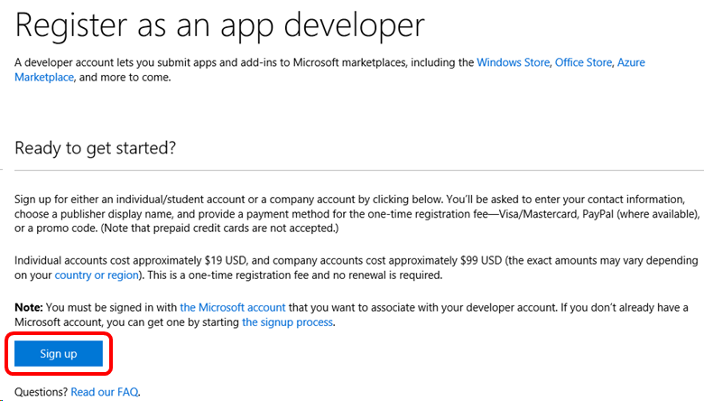

# Windows Developer account in Visual Studio subscriptions

Your Windows Developer Account, included with selected Visual Studio subscription, lets you submit free and paid Windows apps to the Windows Store.

## Activation steps

To use your Windows Developer Account, you need to set up an account or sign in using an existing account.

> [!IMPORTANT]
> Creation of a Windows Developer account requires the use of a Microsoft Account (MSA).  Use of Microsoft Entra accounts is not supported.  

We recommend that you create a "private" browser window for this process.  For example, in Google Chrome, create a new "incognito" window.  In Internet Explorer, create a new "InPrivate" window.

1. Sign in to [https://my.visualstudio.com/benefits](https://my.visualstudio.com/benefits?wt.mc_id=o~msft~docs).
2. Locate the Windows Developer Account tile in the Tools section and select on the **Get Code** link at the bottom of the benefit tile.  Copy the code to your clipboard, then select **Activate**.
   > [!div class="mx-imgBorder"]
   > 
3. On the [https://developer.microsoft.com/microsoft-store/register/](https://developer.microsoft.com/microsoft-store/register/) site, you can begin the registration process.  Select **Sign up** to continue.
   > [!div class="mx-imgBorder"]
   > 
4. Sign in to your subscription.  If you have multiple accounts, choose the one associated with your Enterprise subscription.
0. Enter your email address, select your preferred language, and select **Save**.
0. On the next page, select the country or region where you live or where your business is located, and then select **Next**.
0. Select **Individual** as your account type.
0. Create your publisher display name.  This name is the unique name your customers see associated with your apps, add-ins, and services.
0. Provide your contact information and preferred email language, then select **Next**.
0. You might be asked to verify your password.  Enter it and select **Sign in**.
0. On the Registration – Payment page, paste the code you copied earlier into the Promo Code field.  The page updates to show that *no payment is required*.  Select **Next**.
0. Review your account information, review the App Developer Agreement, and select the checkbox to indicate your acceptance of the terms and conditions.  Then select **Finish**.
0. Select **Go to dashboard** to begin using your Windows Developer Account!

## Eligibility

| Subscription Level | Channels | Benefit | Renewable? |
|--------------------|----------|---------|------------|
| Visual Studio Enterprise (Standard)   | VL, Azure, Retail,  selected NFR* | Included | Yes |
| Visual Studio Enterprise subscription with GitHub Enterprise | VL | Included | Yes |
| Visual Studio Professional (Standard) | VL, Azure, Retail | Included | Yes |
| Visual Studio Professional subscription with GitHub Enterprise | VL | Included | Yes |
| Visual Studio Test Professional (Standard) | VL, Retail | Not available | NA |
| MSDN Platforms (Standard) | VL, Retail | Not available | NA |
| Visual Studio Enterprise, Visual Studio Professional (monthly cloud) | Azure | Not available | NA |
||

\*  *Includes:  Not for Resale (NFR), FTE, Visual Studio Industry Partner (VSIP), BizSpark, MCT Software & Services Developer, Most Valuable Professional (MVP), Regional Director (RD).
Excludes:  Microsoft Cloud Partner Program, Imagine, MCT Software & Services, NFR Basic.*

> [!NOTE]
> Microsoft no longer offers Visual Studio Professional Annual subscriptions and Visual Studio Enterprise Annual subscriptions in Cloud Subscriptions. There will be no change to existing customers experience and ability to renew, increase, decrease, or cancel their subscriptions. New customers are encouraged to go to [https://visualstudio.microsoft.com/vs/pricing/](https://visualstudio.microsoft.com/vs/pricing/) to explore different options to purchase Visual Studio.

Not sure which subscription you're using?  Connect to [https://my.visualstudio.com/subscriptions](https://my.visualstudio.com/subscriptions?wt.mc_id=o~msft~docs) to see all the subscriptions assigned to your email address. If you don't see all your subscriptions, you might have one or more assigned to a different email address.  You need to sign in with that email address to see those subscriptions.

## Support resources

+ Need help with using your Windows Developer account?  Check out the [support](https://developer.microsoft.com/windows/support) resources on the [Windows Dev Center](https://developer.microsoft.com/windows).
+ [Windows Development](/windows/)
+ For assistance with sales, subscriptions, accounts and billing for Visual Studio Subscriptions, contact Visual Studio [Visual Studio subscriptions support](https://my.visualstudio.com/gethelp).
+ Have a question about Visual Studio IDE, Azure DevOps Services or other Visual Studio products or services?  Visit [Visual Studio Support](https://visualstudio.microsoft.com/support/).

## See also

+ [Visual Studio documentation](/visualstudio/)
+ [Azure DevOps documentation](/azure/devops/)
+ [Azure documentation](/azure/)
+ [Microsoft 365 documentation](/microsoft-365/)

## Next steps

Be sure to activate these great benefits to make the most of your Visual Studio subscription:
+ [Visual Studio](vs-ide-benefit.md)
+ [Azure DevOps](vs-azure-devops.md)
+ [Azure DevTest offer / credits](/azure/devtest/offer/)
