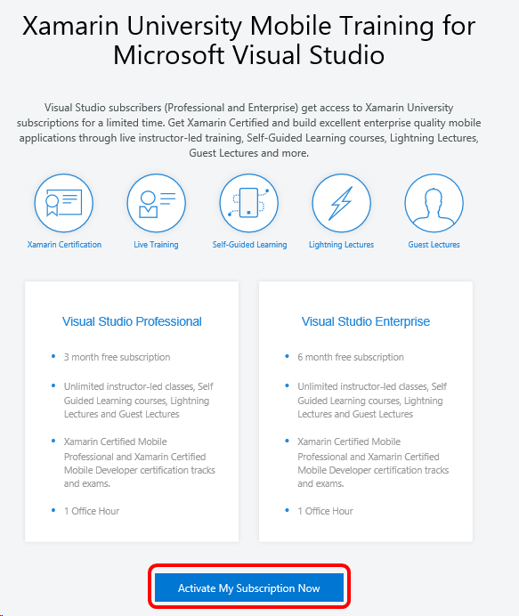
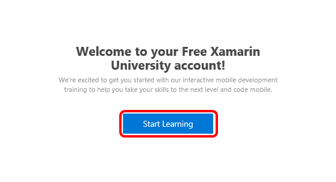
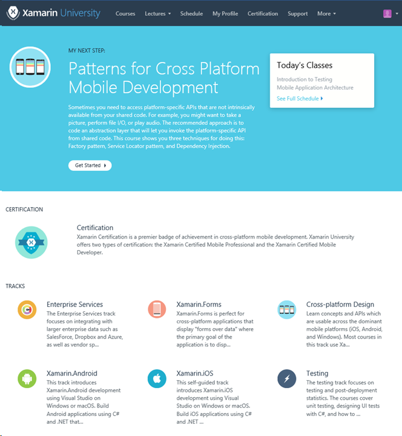

# Xamarin University training benefit in Visual Studio subscriptions

Build native iOS and Android apps in C# with advanced training by mobile development experts. 

Visual Studio Enterprise subscribers receive six months of unlimited access to the full Xamarin University catalog.  Visual Studio Professional subscribers receive three months of access.  

Visual Studio Dev Essentials members are eligible to create a free account that includes access to selected free courses, guest lectures, two live classes, Lightning Lecture recordings and more.  

## Activation steps
1.  Sign in to [https://my.visualstudio.com/benefits](https://my.visualstudio.com/benefits?wt.mc_id=o~msft~docs). 
2.  Locate the Xamarin University Training tile in the Professional Development section and click on the **Activate** link at the bottom left of the benefit tile.    

    
 
3.	You will be redirected to a Xamarin University web page entitled "Xamarin University Mobile Training for Microsoft Visual Studio".  Click **Activate My Subscription Now**. 

    

    > [!NOTE]
    > Depending on your screen resolution and zoom level, you may need to scroll down to see the **Activate My Subscription Now** button.
    
    > [!NOTE]
    > If you receive an error that you must be signed in as the person who received the benefit, follow these steps:
    > 1. Close the browser window with Xamarin University.
    > 2. In the my.visualstudio.com portal, click **Sign out**.
    > 3. Close all browser windows. 
    > 4. Open a new browser and connect to [https://my.visualstudio.com](https://my.visualstudio.com).
    > 5. Activate the Xamarin University Training benefit again. 

4.	You'll see a sign-in page, with a notice that Xamarin recently moved to Microsoft authentication.  Click **Connect with Microsoft**. 

    

5. Next, you'll be asked to grant permission for Xamarin University to sign you in and access your email address and basic profile.  Click **Yes** to continue. You can change the application permissions later if you wish.

    

    > [!NOTE]
    > Since signing in is necessary to use the Xamarin University benefit, clicking **No** will return you to the previous page and you will not be able to continue to the training. 

6. You'll see a welcome message about your new account.  Click **Start Learning**.

    

7. That's it!  You'll see the Xamarin University portal, and you're ready to start learning.  

     

## Eligibility
| Subscription Level                                                 |     Channels                                            | Benefit                                                          | Renewable?    |
|--------------------------------------------------------------------|---------------------------------------------------------|------------------------------------------------------------------|---------------|
| Visual Studio Enterprise (Standard, annual cloud)   | VL, Azure, Retail,  selected NFR1 | 6 months       |  Yes |
| Visual Studio Professional (Standard, annual cloud) | VL, Azure, Retail                                       | 3 months       |  Yes |
| Visual Studio Test Professional (Standard)                         | VL, Retail                                              | Not available                                             |  NA        |
| MSDN Platforms (Standard)                                          | VL, Retail                                              | Not available                                             |  NA        |
| Visual Studio Dev Essentials | NA  | Free plan                                             |  Yes        |
| Visual Studio Enterprise, Visual Studio Professional (monthly cloud) | Azure                                       | Not available                                                           |NA|

1  *Includes:  Not for Resale (NFR), Visual Studio Industry Partner (VSIP).  Microsoft Partner Network (MPN), FTE, MCT Software & Services Developer, BizSpark, Imagine, Microsoft Valued Partner (MVP), Region Director (RD).   Excludes: MCT Software & Services.*

Not sure which subscription you're using?  Connect to [https://my.visualstudio.com/subscriptions](https://my.visualstudio.com/subscriptions?wt.mc_id=o~msft~docs) to see all the subscriptions assigned to your email address. If you don't see all your subscriptions, you may have one or more assigned to a different email address.  You'll need to sign in with that email address to see those subscriptions. 

## Frequently asked questions
### Q:  What happens when my free subscription expires?
A:  Your Xamarin University account and progress will remain intact but your subscription will transition to a Free Account, which has limited access to our materials. If you want to continue to keep all the benefits of a subscription, you can [purchase a monthly subscription](https://aka.ms/buy-xamarin-university).

## Support resources
-  Need help with Xamarin University?  You can find a variety of support resources at [https://university.xamarin.com/support](https://university.xamarin.com/support).
-  For assistance with sales, subscriptions, accounts and billing for Visual Studio Subscriptions, contact Visual Studio [Subscriptions Support](https://www.visualstudio.com/subscriptions/support/).
-  Have a question about Visual Studio IDE, Visual Studio Team Services or other Visual Studio products or services?  Visit [Visual Studio Support](https://www.visualstudio.com/support/). 
