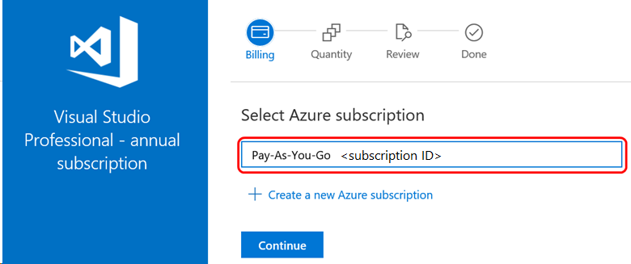
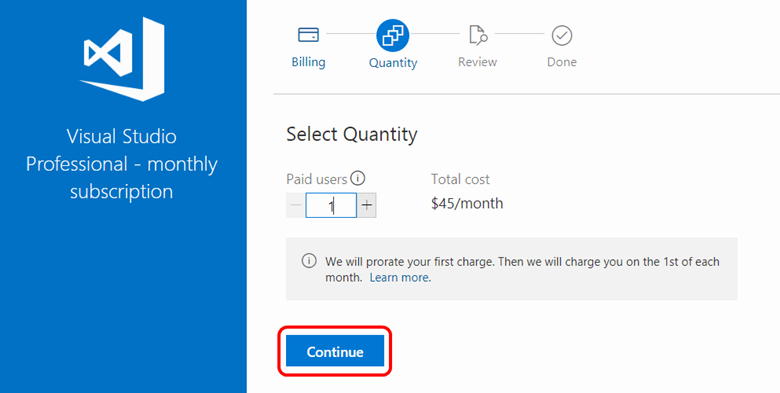
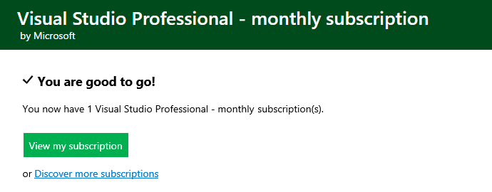
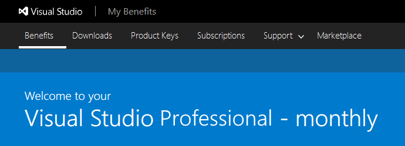
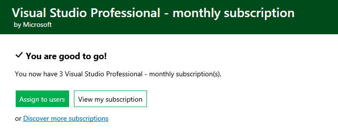
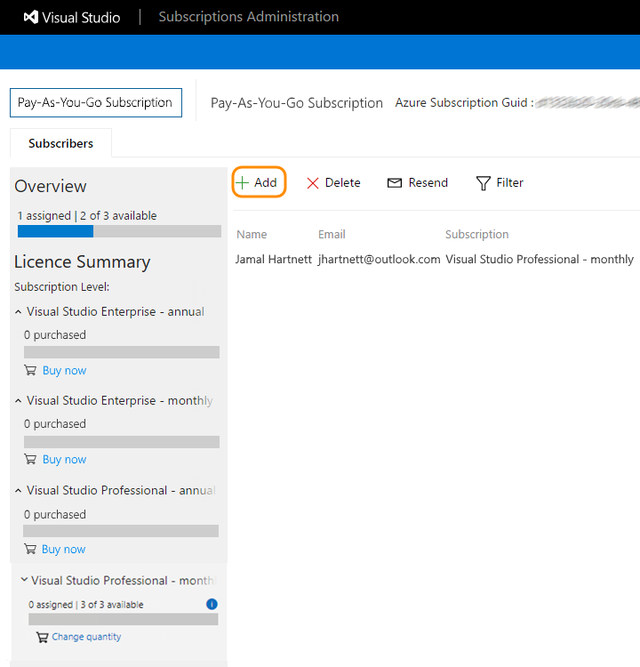
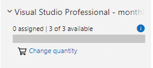

# Buy Visual Studio Professional and Visual Studio Enterprise cloud subscriptions
You can buy [Visual Studio Professional and Visual Studio Enterprise subscriptions](https://visualstudio.microsoft.com/subscriptions/) from the [Visual Studio Marketplace](https://marketplace.visualstudio.com). These are called **"cloud subscriptions"**.

[Compare cloud subscription benefits and pricing](https://visualstudio.microsoft.com/vs/pricing/)

> [!NOTE]
> Microsoft no longer offers Visual Studio Professional Annual subscriptions and Visual Studio Enterprise Annual subscriptions in Cloud Subscriptions. There will be no change to existing customers experience and ability to renew, increase, decrease, or cancel their subscriptions. New customers are encouraged to go to [https://visualstudio.microsoft.com/vs/pricing/](https://visualstudio.microsoft.com/vs/pricing/) to explore different options to purchase Visual Studio. You can still purchase new monthly cloud subscriptions.

## Before you start
To bill your purchases, you need an [Azure subscription](https://azure.microsoft.com/pricing/purchase-options/). You can [sign up](https://portal.azure.com) before your first purchase or during your first purchase in the Visual Studio Marketplace.

## Who can buy Visual Studio cloud subscriptions?
Anyone with [owner](https://docs.microsoft.com/azure/role-based-access-control/built-in-roles#owner), [service admin or co-admin](https://docs.microsoft.com/azure/billing/billing-add-change-azure-subscription-administrator#assign-a-subscription-administrator) access to the Azure subscription can purchase cloud subscriptions.

## How to buy cloud subscriptions

1. Sign in to the [Visual Studio Marketplace > Subscriptions](https://marketplace.visualstudio.com/subscriptions).

2. Choose the subscription that you want to buy, for example - Visual Studio Professional - monthly subscription.

3. Select the Azure subscription to use for billing. You can create a new Azure subscription if you don't have one.
    > [!div class="mx-imgBorder"]
    > 

4. Select the number of subscriptions to buy.
    > [!div class="mx-imgBorder"]
    > 

    If you don't want subscriptions assigned to yourself, clear **Assign this subscription to me**.

5. Confirm and finish your purchase. If you assigned a subscription to yourself, you can visit the [Visual Studio subscriber portal](https://my.visualstudio.com)
to start downloading software and using other subscriber benefits.

> [!div class="mx-imgBorder"]
> 

> [!div class="mx-imgBorder"]
> 

If you purchased more than one subscription, proceed to the
    [Visual Studio Subscriptions Administration portal](https://manage.visualstudio.com) to assign subscriptions to others.

> [!div class="mx-imgBorder"]
> 

> [!div class="mx-imgBorder"]
> 

## Cancel renewals of cloud subscriptions you've purchased

* To change the number of purchased subscriptions:

> [!div class="mx-imgBorder"]
> 

* To cancel these subscriptions, reduce the number of subscriptions to zero (0). They won't renew at the start of the next billing period (the first of the next month for monthly cloud subscriptions; 12 months later for annual cloud subscriptions).

## Frequently asked questions

### For new customers:
#### Q:  I was considering the Annual Cloud subscription, and now I can’t find it.  What should I do?
A: Please go to [https://visualstudio.microsoft.com/vs/pricing/](https://visualstudio.microsoft.com/vs/pricing/) for other purchasing options.

#### Q: What purchasing options are available to me?
A:  We provide monthly subscriptions and standard subscriptions in our direct sales channels. For more information, check out [https://visualstudio.microsoft.com/vs/pricing/](https://visualstudio.microsoft.com/vs/pricing/).
There are also many options through our volume licensing program. You can research the options and prices on
[https://www.microsoft.com/en-us/licensing/how-to-buy/how-to-buy](https://www.microsoft.com/en-us/licensing/how-to-buy/how-to-buy).

#### Q: The price for a retail subscription is higher. What additional benefits am I receiving?
A:  You will receive perpetual license rights for the Visual Studio IDE that came with the subscription. When it is time to renew, you only pay the software assurance price, which is significantly less.

### For existing annual cloud subscribers
#### Q:  How will this change impact me?
A:  This change will not impact existing subscribers.

#### Q:  Do I need to do anything as a result of these changes?
A:  No.  Your subscriptions will remain in place and you will be able to manage them as you do today.

#### Q: What if I want to increase the number of subscriptions for my customers?
A: Annual subscriptions that are purchased during a given month are charged immediately for a full year and are valid for a full year. For that reason, you can modify the number of licenses only in the current month of purchase (they will be valid for one year and charged for one year). Outside of the month of purchase, it is no longer possible to increase the number of subscriptions.

#### Q: What if I want to decrease the number of subscriptions for my customers?
A: Your administrator can still decrease the number of subscriptions by visiting https://manage.visualstudio.com and following the instructions in this article to decrease subscription counts. The system will *not* generate a pro-rated credit. For a refund you will need to contact the Azure billing team.

#### Q: If I cancel my subscription, will I be able to buy another Annual Cloud subscription later?
A:  Although you will not be able to buy another Cloud Annual subscription, there are many options to purchase Visual Studio Subscriptions.  Learn more at [https://visualstudio.microsoft.com/vs/pricing/](https://visualstudio.microsoft.com/vs/pricing/).

### For Cloud Solution Providers (CSP)
#### Q: How will this change impact my customers?
A:  Your customers will not be able to purchase new Visual Studio Cloud Annual subscriptions.

#### Q: Do my customers need to do anything because of these changes?
A:  Existing customers will not be impacted. New customers will need to decide whether they want to purchase Visual Studio Monthly subscriptions or go to another channel such as volume licensing to purchase Visual Studio Subscriptions.

#### Q: What if I want to increase the number of subscriptions for my customers?
A: Annual subscriptions purchased during a given month are charged immediately for a full year and are valid for a full year. For that reason, your administrator can only modify the number of licenses in the current month of purchase (they will be valid for 1 year and charged for 1 year). Outside of the month of purchase it is no longer possible to increase the number of subscriptions.

#### Q: What if I want to decrease the number of subscriptions for my customers?
A:  Your administrator can still decrease the number of subscriptions by visiting [https://manage.visualstudio.com](https://manage.visualstudio.com) and following the instructions in this article to decrease subscription counts. The system will **not** generate a pro-rated credit. For a refund you will need to contact the Azure billing team.

#### Q: If my customers cancel their subscriptions, will they be able to buy more Annual Cloud subscriptions later?
A:  Although they will not be able to buy another Cloud Annual subscription, there are many options to purchase Visual Studio Subscriptions.  Learn more at [https://visualstudio.microsoft.com/vs/pricing/](https://visualstudio.microsoft.com/vs/pricing/).

## Related resources
- [Visual Studio Subscriptions Administration portal](https://manage.visualstudio.com/)
- [Visual Studio subscription support](https://visualstudio.microsoft.com/vs/support/)
- [Visual Studio cloud subscription billing FAQ](vscloud-billing-faq.md)
- [Visual Studio cloud subscription purchasing for CSPs](vscloud-csp.md)

## Next steps
Buy cloud subscriptions
- [Visual Studio Professional monthly](https://marketplace.visualstudio.com/items?itemName=ms.vs-professional-monthly)
- [Visual Studio Enterprise monthly](https://marketplace.visualstudio.com/items?itemName=ms.vs-enterprise-monthly)
