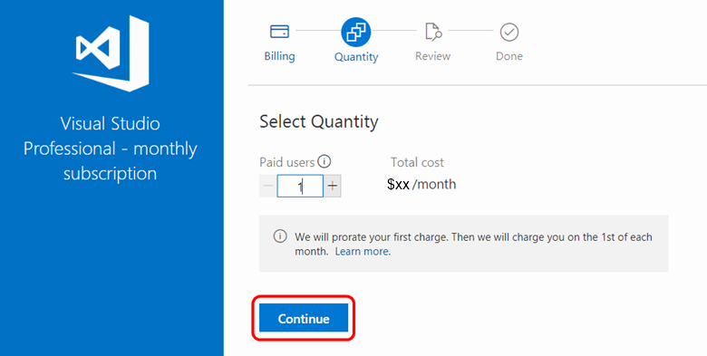

# Buy Visual Studio Professional and Visual Studio Enterprise cloud subscriptions

You can buy [Visual Studio Professional and Visual Studio Enterprise subscriptions](https://www.visualstudio.com/subscriptions/)
from the [Visual Studio Marketplace](https://marketplace.visualstudio.com). These are what we call cloud subscriptions.

[Compare cloud subscription benefits and pricing](https://www.visualstudio.com/vs/pricing/)

## Before you start

*	To bill your purchases, you'll need an [Azure subscription](https://azure.microsoft.com/pricing/purchase-options/).
You can [sign up](https://portal.azure.com) before your first purchase or during your first purchase in the Visual Studio Marketplace.

## How to buy cloud subscriptions

0.	Sign in to the [Visual Studio Marketplace > Subscriptions](https://marketplace.visualstudio.com/subscriptions).

0.	Choose the subscription that you want to buy, for example:

	

0.	Select the Azure subscription to use for billing. You can create a new Azure subscription if you don't have one.

	

0.	Select the number of subscriptions to buy.

	

	If you don't want subscriptions assigned to yourself, clear **Assign this subscription to me**.

0.	Confirm and finish your purchase. If you assigned a subscription to yourself, you can visit the [Visual Studio subscriber portal](https://my.visualstudio.com)
to start downloading software and using other subscriber benefits.

	

	

	If you purchased more than one subscription, proceed to the
	[Visual Studio Subscriptions Administration portal](https://manage.visualstudio.com/) to assign subscriptions to others.

	

	

##  Cancel renewals of cloud subscriptions you've purchased

*   To change the number of purchased subscriptions:

    

*   To cancel these subscriptions, reduce the number of subscriptions to zero (0).
They won't renew at the start of the next billing period (the first of the next month for monthly cloud subscriptions; 12 months later for annual cloud subscriptions).

## Buy cloud subscriptions now

* [Visual Studio Professional monthly](https://marketplace.visualstudio.com/items?itemName=ms.vs-professional-monthly)
* [Visual Studio Professional annual](https://marketplace.visualstudio.com/items?itemName=ms.vs-professional-annual)
* [Visual Studio Enterprise monthly](https://marketplace.visualstudio.com/items?itemName=ms.vs-enterprise-monthly)
* [Visual Studio Enterprise annual](https://marketplace.visualstudio.com/items?itemName=ms.vs-enterprise-annual)

## Related resources

* [Visual Studio Subscriptions Administration portal](https://manage.visualstudio.com/)
* [Visual Studio subscription support](https://www.visualstudio.com/vs/support/)
* [Visual Studio cloud subscription billing FAQ](vscloud-billing-faq.md)
* [Visual Studio cloud subscription purchasing for CSPs](vscloud-csp.md)
