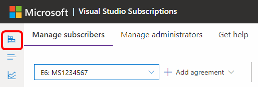

# Buy Visual Studio Professional and Visual Studio Enterprise cloud subscriptions

You can buy [Visual Studio Professional and Visual Studio Enterprise subscriptions](https://visualstudio.microsoft.com/subscriptions/) from the [Visual Studio Marketplace](https://marketplace.visualstudio.com). These subscriptions are called **"cloud subscriptions"**.

[Compare cloud subscription benefits and pricing](https://visualstudio.microsoft.com/vs/pricing/).

> [!NOTE]
> Microsoft no longer offers Visual Studio Professional Annual subscriptions and Visual Studio Enterprise Annual subscriptions in Cloud Subscriptions. There's no change to existing customers experience and ability to renew, increase, decrease, or cancel their subscriptions. New customers are encouraged to go to [https://visualstudio.microsoft.com/vs/pricing/](https://visualstudio.microsoft.com/vs/pricing/) to explore different options to purchase Visual Studio. You can still purchase new monthly cloud subscriptions.

## Before you start

To bill your purchases, you need an [Azure subscription](https://azure.microsoft.com/pricing/purchase-options/). You can [sign up](https://portal.azure.com) before your first purchase or during your first purchase in the Visual Studio Marketplace.

## Who can buy Visual Studio cloud subscriptions?

You need to be a contributor or higher for an Azure subscription that was created for your EA subscription to purchase cloud subscriptions.

## How to buy cloud subscriptions

1. Sign in to the [Visual Studio Marketplace > Subscriptions](https://marketplace.visualstudio.com/subscriptions).

2. Choose the subscription that you want to buy, for example - Visual Studio Professional - monthly subscription.

3. Select the Azure subscription to use for billing. You can create a new Azure subscription if you don't have one.
    > [!div class="mx-imgBorder"]
    > 

4. Select the number of subscriptions to buy.
    > [!div class="mx-imgBorder"]
    > 

   If you don't want subscriptions assigned to yourself, clear **Assign this subscription to me**.

5. Confirm and finish your purchase. If you assigned a subscription to yourself, you can visit the [Visual Studio subscription portal](https://my.visualstudio.com)
to start downloading software and using other subscriber benefits.

> [!div class="mx-imgBorder"]
> 

6. Select **View my subscription** to open the subscription portal and begin using your subscription.

If you purchased more than one subscription, you can proceed to the
    [Visual Studio Subscriptions Admin portal](https://manage.visualstudio.com) to assign subscriptions to others. You might need to [add your new subscriptions](add-monthly-subs.md) to the Admin Portal if this purchase is your first.

> [!div class="mx-imgBorder"]
> 

> [!div class="mx-imgBorder"]
> 

## Cancel renewals of cloud subscriptions you previously purchased

To cancel subscriptions, you just need to set the number of subscriptions for your agreement to zero (0). Follow these steps to reduce the number of subscriptions:
1. Sign in to <https://manage.visualstudio.com>.
1. If you have more than one agreement, choose the desired agreement from the drop-down list.
1. Select the **Overview** icon at the top left to display information about your subscriptions. 
> [!div class="mx-imgBorder"]
> 

1. Locate the entry for the subscriptions you wish to cancel, and select **Change quantity**.
1. Set the quantity to zero (0). 
Your subscriptions remain in place until their scheduled billing date, but don't renew when the billing date is reached. 

## Frequently asked questions

This section discusses questions related to the fact that Microsoft is no longer offering annual cloud subscriptions. 

### For new customers:

#### Q: I was considering the Annual Cloud subscription, and now I can’t find it. What should I do?

A: Microsoft is no longer offering annual cloud subscriptions. Go to [https://visualstudio.microsoft.com/vs/pricing/](https://visualstudio.microsoft.com/vs/pricing/) for other purchasing options.

#### Q: What purchasing options are available to me?

A: We provide monthly subscriptions and standard subscriptions in our direct sales channels. For more information, check out [https://visualstudio.microsoft.com/vs/pricing/](https://visualstudio.microsoft.com/vs/pricing/).
There are also many options through our volume licensing program. You can research the options and prices on
[https://www.microsoft.com/licensing/how-to-buy/how-to-buy](https://www.microsoft.com/licensing/how-to-buy/how-to-buy).

#### Q: The price for a retail subscription is higher. What extra benefits am I receiving?

A: You receive perpetual license rights for the Visual Studio IDE that came with the subscription. When it's time to renew, you only pay the software assurance price, which is lower.

### For existing annual cloud subscribers

#### Q: How does the end of annual cloud subscription sales affect me?

A: This change doesn't affect existing subscribers.

#### Q: Do I need to do anything as a result of these changes?

A: No. Your subscriptions remain in place and you're able to manage them as you do today.

#### Q: What if I want to increase the number of subscriptions for my customers?

A: Annual subscriptions that are purchased during a given month are charged immediately for a full year and are valid for a full year. So, you can modify the number of licenses only in the current month of purchase (they're valid for one year and charged for one year). Outside of the month of purchase, it's no longer possible to increase the number of subscriptions.

#### Q: What if I want to decrease the number of subscriptions for my customers?

A: Your admin can still decrease the number of subscriptions by visiting https://manage.visualstudio.com and following the instructions in this article to decrease subscription counts. The system *doesn't* generate a prorated credit. To request a refund, contact the Azure billing team.

#### Q: If I cancel my subscription, can I buy another Annual Cloud subscription later?

A: Although you aren't able to buy another Cloud Annual subscription, there are many options to purchase Visual Studio Subscriptions. Learn more at [https://visualstudio.microsoft.com/vs/pricing/](https://visualstudio.microsoft.com/vs/pricing/).

### For Cloud Solution Providers (CSP)

#### Q: How does this change affect my customers?

A: Your customers aren't able to purchase new Visual Studio Cloud Annual subscriptions.

#### Q: Do my customers need to do anything because of these changes?

A: Existing customers aren't impacted. New customers need to decide whether they want to purchase Visual Studio Monthly subscriptions or go to another channel such as volume licensing to purchase Visual Studio Subscriptions.

#### Q: What if I want to increase the number of subscriptions for my customers?

A: Annual subscriptions purchased during a given month are charged immediately for a full year and are valid for a full year. For that reason, your admin can only modify the number of licenses in the current month of purchase (they're valid for one year and charged for one year). Outside of the month of purchase it's no longer possible to increase the number of subscriptions.

#### Q: What if I want to decrease the number of subscriptions for my customers?

A: Your admin can still decrease the number of subscriptions by visiting [https://manage.visualstudio.com](https://manage.visualstudio.com) and following the instructions in this article to decrease subscription counts. The system **won't** generate a pro-rated credit. For a refund, you need to contact the Azure billing team.

#### Q: If my customers cancel their subscriptions, can more Annual Cloud subscriptions later?

A: Although they aren't able to buy another Cloud Annual subscription, there are many options to purchase Visual Studio Subscriptions. Learn more at [https://visualstudio.microsoft.com/vs/pricing/](https://visualstudio.microsoft.com/vs/pricing/).

## Related resources

+ [Visual Studio Subscriptions Admin portal](https://manage.visualstudio.com/)
+ [Visual Studio cloud subscription billing FAQ](vscloud-billing-faq.yml)
+ [Visual Studio cloud subscription purchasing for CSPs](vscloud-csp.md)
+ For assistance with sales, subscriptions, accounts, and billing for Visual Studio Subscriptions, see Visual Studio [Subscriptions Support](https://visualstudio.microsoft.com/subscriptions/support/)

## See also

+ [Visual Studio documentation](/visualstudio/)
+ [Azure DevOps Services documentation](/azure/devops/)
+ [Azure documentation](/azure/)
+ [Microsoft 365 documentation](/microsoft-365/)

## Next steps

Buy cloud subscriptions.
+ [Visual Studio Professional monthly](https://marketplace.visualstudio.com/items?itemName=ms.vs-professional-monthly)
+ [Visual Studio Enterprise monthly](https://marketplace.visualstudio.com/items?itemName=ms.vs-enterprise-monthly)