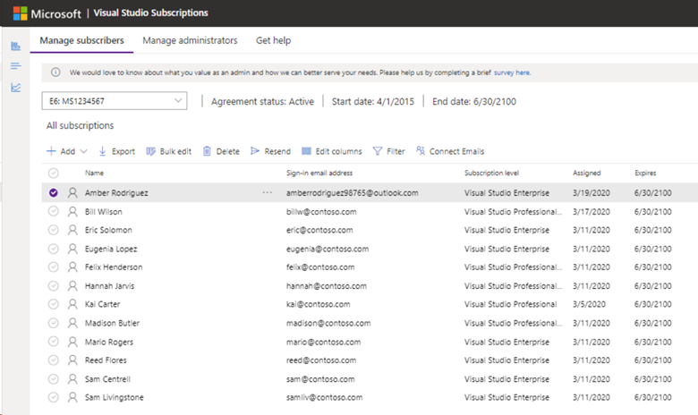
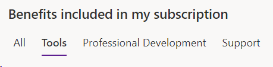
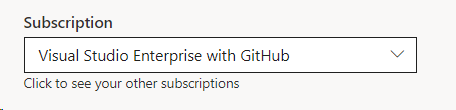
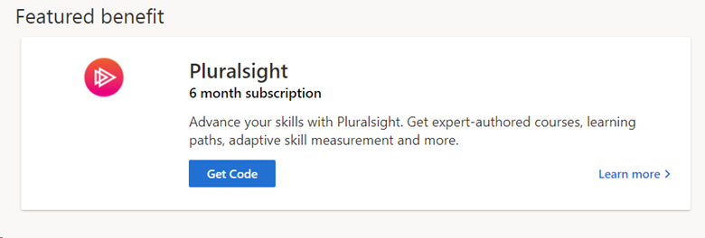

# What&#39;s new in Visual Studio subscriptions

We update the Subscription benefits package often to make it more useful to you. We'll also make enhancements to our subscriber and subscription management portals to provide you the best possible experience.  Read on to learn about the latest features and updates, sorted quarterly.

## 2020 Q1 (January-March)

### Subscriptions Administration Portal
The first quarter of 2020 saw a new look and some new features for the Visual Studio Subscriptions Administration Portal at https://manage.visualstudio.com. The changes to the portal included a new color scheme and the rearrangement of some of the tools.  The overview of your subscription allocations, agreement details, and maximum usage are now controlled by buttons at the top left.  This helps maximize available screen space for the management tasks you do most frequently, like assigning and editing subscriptions.  

We've also combined the options to add invididual subscribers and perform bulk additions in a drop down **+ Add** menu. 

   > [!div class="mx-imgBorder"]
   > 

#### Connect Emails
We've made it easy to match subscribers who are using Microsoft Accounts (MSA) to your Azure Active Directory (Azure AD), so you can quickly link the two identities.  Using Azure AD identities provides increased security and easier subscription management.  Check out our [personal sign-ins article](personal-email-sign-ins.md) for more details. 

#### Add subscribers using Azure Active Directory groups
If your organization uses Azure Active Directory (Azure AD), you can now manage subscriptions using Azure AD groups.  Assigning subscriptions to groups gives you the ability to very quickly provide subscriptions of the same type to multiple users.  When new users are added to the Azure AD group, they're automatically assigned a subscription.  If a user is removed from the Azure AD group, their subscription is also removed.  This helps your organization automate your subscription management, saving adminstrators time and effort.  Check out the [Add multiple users](./assign-license-bulk.md#use-azure-active-directory-groups-to-assign-subscriptions) article in our documentation for the details. 

### CAST Highlight
We're pleased to announce an expansion of the benefits offered by our partner, CAST Highlight. 
- The length of the benefit included in Visual Studio Enterprise subscriptions has been extended to six months.  
- Visual Studio Professional subscribers can now receive a subscription allowing them to assess a single application for three months. 

## 2020 Q2 (April-June)

### Visual Studio Subscriptions Portal

The Visual Studio Subscriptions Portal underwent significant changes in appearance and ease of use.  

- Benefits tiles have been resized and are all displayed in the window so you don't need to scroll left or right to see all of the tiles in a given category. 
- You can choose to display all your available benefits, or display only one category using the Category Picker.
   > [!div class="mx-imgBorder"]
   > 
- We've also moved the Subscription Picker from the top right corner of the window to a more accessible location.
   > [!div class="mx-imgBorder"]
   > 
- We've added a "Featured benefit" at the top of the benefits list to call out new or popular benefits.  
   > [!div class="mx-imgBorder"]
   > 

## Next steps
- Check out the new [Subscriptions Administration portal](https://manage.visualstudio.com) UI with its new features
- Learn more about [CAST Highlight](vs-cast.md)
- Be sure to check back here for the latest information on what's new in Visual Studio subscriptions!