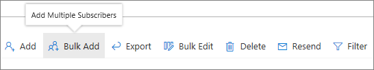
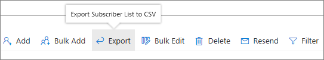
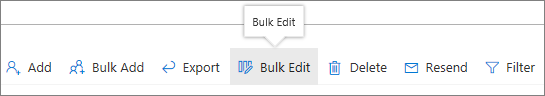
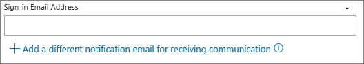
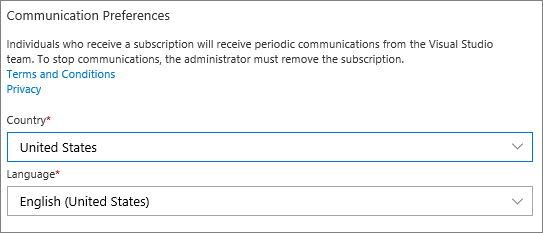
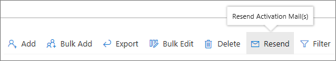
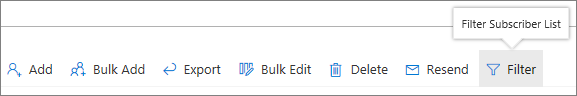

# What&#39;s new in Visual Studio subscriptions

We update the Subscription benefits package often to make it more useful to you. Read on to learn about the latest features, sorted quarterly.

## 2018 Q2 (April-June)

Here's a quick recap of what's new in Q2.

### Cloud administrators

We've added new functionality for cloud admins that makes it easier to manage cloud subscriptions:

* [**Bulk assignments**](/visualstudio/subscriptions/assign-license#bulk-assignments): Add and upload multiple subscribers, in bulk.

  

* [**Export**](/visualstudio/subscriptions/exporting-subscriptions): Export a list of your users and details about their assignments. A list such as this can prove useful when you want to track assignments and expiration dates.

   

* [**Bulk edit**](/visualstudio/subscriptions/edit-license#editing-multiple-subscribers-by-using-bulk-edit): Edit the subscription information of multiple subscribers, in bulk.

  

* Explore the new fields that are available in the [**Add Subscription** experience](assign-license.md):

  * **Notification email**: If your organization is not using Azure AD and you want to use a different email for notifications other than the sign-in email, you can add it.

    

  * **Communication preferences**: Choose the language that you want to use to send assignment emails.

    

  * **Add reference**: Add reference notes to the subscriptions that you manage.

    

* [**Resend assignment email**](resend-assignment-email.md): Send a notification email again to anyone on your subscriber list, and for as many times as you want to.

  

* [**Filter**](search-license.md): Organize and filter your subscriber data to best suit your needs.

  

And that's it for now!

## See also

* [Subscriber benefits](subscriber-benefits.md)
